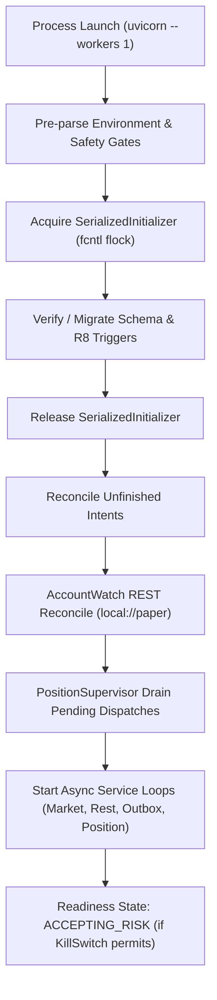

# v0.6 B-Line G3 Operational Readiness R1 Runbook & Architecture

**TASK_ID:** `V06_B_LINE_G3_OPERATIONAL_READINESS_R1`  
**BASELINE_SHA:** `a56cc413d87a71111f2be02f10052dced9ff0275`  
**TARGET_BRANCH:** `feature/v06-bline-g3-operational-readiness-r1`  
**RUNTIME_SPECIFICATION:** Linux CPython 3.12.3 POSIX Single-Worker  

---

## 1. Process Model and Concurrency Boundary

### 1.1 Single-Worker Invariant
The canonical production deployment topology mandates a single canonical Python 3.12 process:
```bash
uvicorn btc_quant_agent.api:app --host 0.0.0.0 --port 8787 --workers 1
```
Multi-worker deployments (e.g. Gunicorn with multiple workers or speculative auto-scaling replicas) are **strictly forbidden**. Position state, outbox dispatch, and reconciliation loops must be owned by exactly one operational worker to prevent split-brain execution or race conditions in order placement.

### 1.2 Initializer Process Serialization (POSIX fcntl)
The `SerializedInitializer` boundary guarantees that concurrent startup attempts are mechanically serialized:
- A filesystem lock file (`<db_path>.init.lock`) is acquired using `fcntl.flock(fd, fcntl.LOCK_EX | fcntl.LOCK_NB)`.
- If another process holds the initialization lock, a competing process waiting past its timeout fails closed immediately with `TimeoutError("INITIALIZER_PROCESS_LOCK_TIMEOUT")`.
- Once the active initializer finishes creating tables, columns, indexes, and triggers, it releases the lock. Subsequent workers acquire the lock, discover the schema already initialized, and proceed safely without performing redundant or conflicting migrations.

---

## 2. Durable Storage and Schema Architecture

### 2.1 SQLite Configuration
All Live V1 persistent state uses a durable SQLite database configured with strict isolation:
- `PRAGMA journal_mode=WAL` (Write-Ahead Logging for non-blocking concurrent reads and durable writes)
- `PRAGMA synchronous=FULL` (guarantees fsync on checkpoints)
- `PRAGMA foreign_keys=ON` (referential integrity enforcement)
- `PRAGMA recursive_triggers=ON` (required for R8 trigger cascades)
- `PRAGMA busy_timeout=10000` (10-second wait before failing busy connections)

### 2.2 R8 Defensive Trigger Guards
Every initialization automatically installs and verifies 8 mechanical database triggers:
1. `trg_live_position_events_immutable_update`: blocks updates to existing position events.
2. `trg_live_position_events_immutable_delete`: blocks deletion of position events.
3. `trg_live_position_dispatches_immutable_authority`: ensures dispatch authority cannot be mutated.
4. `trg_live_position_dispatch_blank_insert`: requires inserted dispatches to start in blank PENDING state.
5. `trg_live_position_dispatch_admission_immutable`: seals analysis admission hashes.
6. `trg_live_position_analysis_completion_guard`: ensures analysis completion invariants.
7. `trg_live_position_dispatch_done_requires_completion`: prevents marking dispatches DONE without completion.
8. `trg_live_position_dispatches_immutable_delete`: blocks deletion of position dispatch rows.

---

## 3. Cold Start and Recovery Lifecycle



### 3.1 Unfinished Intent Reconciliation
On cold start or restart:
- The runtime calls `reconcile_unfinished_intents()`.
- Unfinished trade intents stored in `live_trade_intents` are reconciled against order execution records.
- Unapproved proposals remain in `WAITING_APPROVAL` or transition to `EXPIRED` if the TTL has passed.
- Under no circumstances can an unapproved proposal or intent convert into an active order.

### 3.2 SIGTERM Graceful Shutdown
Upon receiving `SIGTERM`:
1. The process signals its async cancellation event `_stop_event.set()`.
2. Market stream and account watch user streams are stopped.
3. Background tasks drain active in-flight operations without leaving detached exchange reads.
4. The database connection commits and closes cleanly.
5. On restart, the process resumes from exact durable receipts with zero state corruption.

---

## 4. Negative Safety Invariants

| Failure Condition | System Response | Mechanical Enforcement |
|:---|:---|:---|
| Duplicate Approval Callback | Idempotent HTTP 200 with `replay: true` | `LiveStore.record_callback` checks event_id and hash |
| Differing Action on Same Event ID | Rejection HTTP 400 (`callback event collision`) | Integrity validation in `record_callback` |
| Expired Proposal TTL | State transitions to `EXPIRED`, raises `ValueError` | `now_ms >= min(case.expires_at_ms, proposal.expires_at_ms)` |
| Forged Case/Proposal Hash | Rejection HTTP 400 (`stale or mismatched identity`) | Foreign key and hash equality check in `live_cases` |
| Unauthorized Approver ID | HTTP 403 Forbidden | `create_callback_app` verifies `actor in approvers` |
| Tripped Kill Switch | Rejects new risk, remains `TRIPPED` across restarts | `live_kill_switch_state.is_killed == 1` |
| Corrupt SQLite File | Fails closed immediately, refuses to start | `sqlite3.DatabaseError` raised during initialization |
| Forbidden Mainnet Credentials | Process startup aborted with `ValueError` | `_validate_env_pre_parse` rejects mainnet env vars |
| LIVE Execution Mode | Aborted with `ValueError` | `LIVE_WRITE_AUTHORITY` is strictly `None` |

---

## 5. Operational Verification and Monitoring

### 5.1 Readiness Inspection Endpoint
The `/health` endpoint exposes the canonical `live_v1_readiness` report:
```json
{
  "service_started": true,
  "database_ready": true,
  "migration_ready": true,
  "market_source_ready": true,
  "analysis_backend_ready": true,
  "approval_backend_state": "READY",
  "account_stream_state": "NOT_REQUIRED_DRY_RUN",
  "execution_mode": "DRY_RUN",
  "kill_switch_state": "ARMED",
  "startup_contract": "SERIALIZED_SINGLE_RUNTIME_INITIALIZER",
  "runtime_mode": "B4_RUNTIME",
  "accepting_risk": true
}
```

### 5.2 Verification Commands
To execute the complete G3 operational readiness suite on Linux Python 3.12:
```bash
# 1. Lint container specs
python scripts/ops_g3/lint_container_spec.py

# 2. Run G3 operational readiness suite and generate evidence
python scripts/ops_g3/run_operational_readiness.py

# 3. Focused pytest validation
pytest tests/test_v06_g3_operational_readiness.py -v
```
