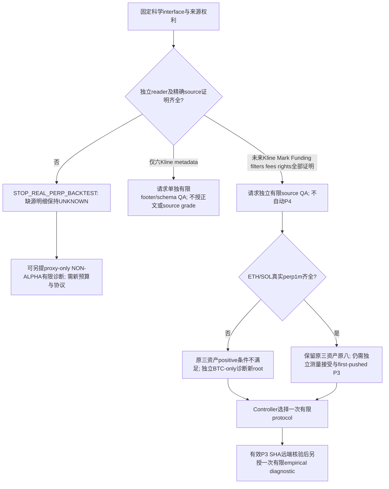

# BTC-only finite diagnostic 与原三资产positive protocol的边界

**这是未来P3 blueprint，NOT actual preregistration。** 当前source/rights/reader/measurement均UNKNOWN，正文grant为空。单一建议为先请求最小有限schema/footer QA，而非直接启动BTC回测。终态为`P2_S2_PIT_SCIENCE_AND_DIAGNOSTIC_PREREG_DESIGNED_PENDING_CONTROLLER`。

## 单一source decision chart

图中全部未来good分支是假设条件。当前只有six-file metadata与Mark/funding父目录提示；不从dataset filename升级，也不读Mark目录查缺失。非PIT Funding无法用回填final rate补成历史entry；Mark缺失不能插值trade-price/daily Mark。若不能证明source/权利，停止real perp backtest。proxy-only也需明确新dispatch，不能在本任务启动。

## Original eight 与 BTC_DIAG_R1 身份

原权威=`e5b2006a89441f7eb2ec900e508aff451106b87a`。原三资产BTC/ETH/SOL同规则，positive screen single-asset exposure≤60%；BTC-only为100%，失败的是该multiasset positive screen，不是“资产数1/3少于60%”。另立BTC-only诊断能研究source、可计算性、friction geometry和稀疏support，不授multiasset positive、Alpha或nominee。

原8保持 STRUCTURAL_CONTINUATION/CLOSED_RETEST × LONG/SHORT ×04H/12H；ID、ER.35、body.5ATR、range2ATR、EMA20/50、retest24h/.25/.10ATR、三小时first confirmation、stop30–250bp、TP2R及gap.25ATR/cooldown4h全部原样。机器interface逐行保存原record/公式SHA；no signal calculation、no retune。旧R4三个proposed-only机制不加入本次future最小诊断选择；它们仍未冻结，不偷用旧四个relinguished slots。

建议protocol名称仅草案 `BTC_DIAG_R1_FINITE_SOURCE_LIMITED_NON_ALPHA`，Controller需选择新method root、BTC-only universe、estimand与R1.2；不能叫原三资产协议已接受、等价R1.1或现有blueprint的commit即有效P3。R1.2 proof floor和AM01 retest chronology都需公开lineage，不retroactive。

## 有限六个月input partition角色、support与统计口径

仅以下六个非protected月份，无rolling/continuous extension：

| Source month | 草案角色 | Scored window |
|---|---|---|
| 2021-03 | deterministic warmup，development input | 不作scored fold |
| 2021-04 | development scoring | [2021-04-01,2021-05-01) |
| 2023-03 | deterministic warmup，development input | 不作scored fold |
| 2023-04 | development scoring | [2023-04-01,2023-05-01) |
| 2025-03 | deterministic warmup，development input | 不作scored fold |
| 2025-04 | development scoring | [2025-04-01,2025-05-01) |

以上为 `NEEDS_CONTROLLER_METHOD_CHOICE` 的单一建议，非隐含已接受角色。六个development input partitions中三个warmup、三个scoring folds，不能把它说成六个独立outcome folds。March至少240h完全分钟初始化；April两侧12h purge/embargo并禁止跨fold exit；未来ACK/资金费tail的proof需在已准入的末尾数据内，不能读取May来虚构末尾清账；tail不足即censored/UNKNOWN或预先冻结更早last-entry cutoff。保护BTC `[2026-02-01,2026-08-01)`、forward/H39/H40/H41/A-line等，不能以结果欠样本改用这些月份。

每candidate×scenario独立1000USDT并配孤立controls是原完整book契约，未来非受资助matched episode若选择为更小的诊断estimand，必须新科学root公开差异，不能报告portfolio ROI、完整minute-MTM drawdown或通过原positive门。STOP/WAIΤ、source-ineligible、12h geometry-ineligible、零事件全部披露；不能选最好side/month、去掉亏损fold或降cost救positive。

原8×BASE/STRESS是描述性两cost路径；future higher-cost net和paired incremental保持16 endpoints、one-sided Bonferroni.05/16，不把共享signal、两family或三资产相关性当理由削减比较。当前BTC-only诊断不作formal positive/support推断；若未来要CI/futility声明必须独立方法adequacy/coverage接受，不能借QA PASS。新concept方向、threshold/window/筛选均另计未来family，不与原8混合隐瞒选择。

实际纯planning以此前R4固定人造σ5/10/20bp、delta5、12独立weeks计算：80%toy需要13/52/205weeks，当前12weeks toy power76.72%/15.81%/3.09%。所有真实variance、autocorrelation、密度和effective blocks UNKNOWN；长时间收集也不自动维持同estimand。filled/day .5/1/2/4在29日fold的期望14.5/29/58/116，不是observed support。原100 unique/fold、12 joint weeks只是positive floors，BTC-only full-duration4h+4h cooldown约3/day、12h+4h约1.5/day，早exit/ACK/filters改变密度但不保证达到100。

共同UTC-week bundles、within-era separate sampling、12h overlap、跨family共享shock均需保存；不能将三era拼接成相邻weeks，不能将8 policy×asset×weeks当独立N。未来bootstrap10000 draws/固定seed/index/quantile和14d敏感性需先freeze；0事件fold/无效draw不给positive，并且不能删draw或换seed。BTC-only positive concentration仍不满足；有限diagnostic可以停止资源投入而不证明无edge。

## 最小future read grant：精确path、byte与能力分离

**当前以下路径仅作为草案字符串，未lstat/open/footer/header/hash任何owner数据。** 正path集合恰好六个：

- `/root/workspace/project/Quant-agent/data/research/BTCUSDT/1m/year=2021/month=03/data.parquet`
- `/root/workspace/project/Quant-agent/data/research/BTCUSDT/1m/year=2021/month=04/data.parquet`
- `/root/workspace/project/Quant-agent/data/research/BTCUSDT/1m/year=2023/month=03/data.parquet`
- `/root/workspace/project/Quant-agent/data/research/BTCUSDT/1m/year=2023/month=04/data.parquet`
- `/root/workspace/project/Quant-agent/data/research/BTCUSDT/1m/year=2025/month=03/data.parquet`
- `/root/workspace/project/Quant-agent/data/research/BTCUSDT/1m/year=2025/month=04/data.parquet`

没有owner-root glob、raw子目录listing、Mark wildcard或market API。`funding_events.csv`仅metadata位置提示，可能混有protected时期；不能整CSV读入后再按timestamp过滤，也不能整文件hash作为“只读metadata”。未来先取得exact nonprotected funding/Mark file aliases与来源clock manifest，否则对应positive set为空并STOP；不是要求用户发送raw历史数据。

正path名称也不证明文件内部没有错分/保护期记录。任何未来timestamp/body能力之前还需可信producer的file-specific非protected分区声明与content identity/rights绑定；没有这种upstream证明则不授能力。拟议QA须检查时间成员关系并在第一条越界停止、记录incident，不能以“读后过滤”授权原本禁止的记录，也不能把QA抽样当完整no-protected证明。

Stage A建议最小独立schema/footer检查：six exact files、每file最多last8byte+footer65536byte=65544byte、总393264byte、最多12 logical range reads、300s；0 row-body decode、0 full-file SHA、0 price-stat decode。Footer含encoded min/max等市场统计是可能的，必须在权利与byte grant中明确批准这些实际字节，不能宣称“footer完全无市场derived values”；不批准则不读。Oversize/malformed/encrypted或cap/permission不清返回UNKNOWN/STOP，不扩读。只有独立reader路径、FD identity、no symlink/mount/TOCTOU、每次attempted syscall与byte计数均通过新审核才可提出执行许可，旧locator不得使用。

Logical range次数不是actual OS调用计数。Controller未来token还必须绑定全部attempted filesystem调用上限（建议100次，含失败/ancestor/FD checks）及actual read上限（建议12次，禁止库隐式overshoot）；未绑定/未独立instrument即UNKNOWN，不执行。缓存unique path不能替代实际attempt计数；本interface是科学要求与预算草案，不是已经满足该security合同的reader。

Stage B另行timestamp-body QA草案：仅六file UTC minute start/close列，最多300000 rows、16MiB encoded和8MiB decoded timestamp、900s；streaming但每bytecap真实计量。日历预计263520分钟是本任务stdlib计算，并不证明file rows。完整已选timestamps才能证实该selected scope的ordering/unique/completeness；小sample只能FAIL局部问题或UNKNOWN全量完整性，不能PASS连续stream。实际Parquet column projection是否能排除price blocks/overshoot需独立reader证明，不能假设库一定只读被选列。

Stage C以后Mark/Funding/cost-body：当前未绑定，NOT_GRANTED。仅可建议6个预先固定的一小时window、最多360 Kline/360 Mark/18 funding records与8MiB encoded，须先按新Controller冻结具体nonprotected file/time/column aliases与P3/QA-scope权限；小片段不证明整月Mark连续或funding完整。正文grant不由Stage A/B继承，CSV header也不由file存在继承。全文件SHA是全部byte读取，当前A/B不授；若未来科学prereg必须observed content hash，需独立whole-file hash能力/预算与protected exclusion，issuer declared hash须注明未独立observed。未知Mark路径或mix-protected funding单文件令grant保持空。

允许的QA结论只限：PASS已检查schema/timestamp/source proof的精确scope；FAIL复现冲突、gap、非法clock或contract drift；UNKNOWN未读/欠权利/over-cap/不可达/未绑定或proof缺口。权限拒绝不是文件不存在；这些结论不授source grade、策略收益或P4。所有budget是建议上限非必须消费数，遇明确不足即停止，不为了完成预算继续读取。

## 三项测量交付比较：均未实现/未接受

| Option | P1已知失败如何接受未来检查 | 当前限制与stop |
|---|---|---|
| A 验证过的外部standard backtester+独立source/PIT/cash adapters | 入库前同source-close冲突拒绝；partial exit≤fill；每candidate/case资金独立；owner shortfall/PIT floor/fee终端逐项独立核对 | 上游测试或库名不证明原SL-first、H+120s与R1.2兼容；固定library SHA+adapter独立audit后才能有限QA，不开发第三engine |
| B 两个独立专用reference finite traces | 正反冲突、exit2/fill1拒绝、A loss不kill B、funding.4 cover/shortfall、proof前后cash、owed fee2不得clear分别手算与另一独立公式 | 条件性偏好先做此measurement acceptance门；没有实现。有限trace不能认证原全book-MTM/策略ROI；同函数两次不是独立oracle；差异STOP，不能自动扩成fill engine |
| C 前瞻无交易观察 | immutable receipt/source身份、因果时钟、source纠错、signed funding职责/删失、每policy单独hypothetical endpoint | 慢/sparse/common-shock；不认证真实execution/privatecash；不得paper portfolio冒充原book，固定末端未付fee/funding保留，不自动收集360天或live下单 |

对A/B/C均要求来源权利、冲突Mark、over-exit、pooled cash/kill、payout shortfall、as-of proof和终端unpaid bills的独立executed enforcement。当前仅合成oracle PASS，所有measurement options `CONDITIONALLY_UNACCEPTABLE_PENDING_INDEPENDENT_ENFORCEMENT`。既有P1永久终止，不导入其reducer/包一层adapter求接受；G/S工作流分别独立，Controller以后核验二者exact SHAs才做joint gate。

## 未来prereg必冻结字段与单次终点

新Controller选择一次protocol identity和测量路径 → 独立source/right/reader限制与有限QA → outcome-blind science freeze → independent PIT/accounting/measurement acceptance → **另一个first-pushed exact P3 SHA远端核验** → separate explicit one-shot body/empirical diagnostic grant → terminal Controller review。本blueprint的commit不是这个P3。

未来记录source content SHA/observed-vs-declared/row counts/clock与revision provenance/rights；six input partition roles、初始warmup、H+60/+120/R1.2 ACK、funding±15/event cadence/caps；原8 IDs和formulaSHA、BASE22/STRESS44+4/8 event proxies、filters/friction证据等级、fixed stops及risk；controls/pairing/independent book vs episode差异、unique IDs/WAIT/censoring、sample支持/weekly block/16 endpoints/seed/quantile；资源及读取cap、no protected、no extensions/replacements/subgroup/cost-switch/parameter retune。

有限diagnostic只在预定六input months/三个score folds结束，source/clock/integrity breach立即STOP；未证明true Mark或PIT funding=STOP_REAL_PERP_BACKTEST；proxy-only不得发布actual-cost positive；12h hourly stress=静态不合格保留ID；sparse/宽CI=INSUFFICIENT_SUPPORT，不能查第四fold/2026或喊NO EDGE。若全部无法计算，终点可以资源retirement，科学效果仍未知。没有Alpha、trade entry、TESTNET/LIVE/real funds授权。
