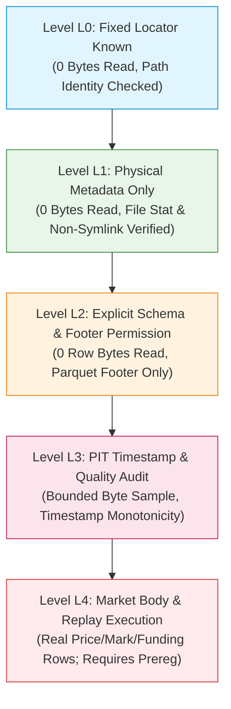

# Next-Stage Minimal Safe Source Reader Security Contract

**Document ID:** `V06_P2_S2_NEXT_STAGE_MINIMAL_SOURCE_READER_SECURITY_CONTRACT_R1`
**Task ID:** `V06_P2_S2_GEMINI_LONG_SOURCE_CONTRACT_AND_SYNTHETIC_CAPABILITY_GATE_R1`
**Lineage & Authorities:**
- **Controller Dispatch SHA:** `b176f4361cd97d1d89c3e25173b2c72a6af93ec4`
- **Code Start SHA:** `e0ff8c3473de4bfa3e66fe7928d42992a4d38a32`
- **Prior Terminated Locator (Counterexample):** `4a1fcc2871708f0e9e3a7c40036ecaab39ba99b8`
- **Controller Termination Adjudication:** `ca0b6ea62613e6981b6f818f37f45be8c1d74901`
- **Controller Prospective Source Admission Design:** `519b2e9ba2ca847e76ad9c0a7fbafcec5fcda158`

---

## 1. Specification Purpose & Failsafe Philosophy

This specification defines the rigorous security contract, capability model, and low-level system call accounting invariants required for any future tool permitted to inspect market data files.

### 1.1. Core Counterexample Post-Mortem (Neutralizing F01 & F02)
Prior locator `4a1fcc2871` achieved 2,831 passing unit tests in GitHub CI (run 38017621125), but was **terminated by Controller verdict `ca0b6ea626`** due to fatal architectural bypasses:
1. **F01 (CLI Custom Root Override Bypass):**
   In the old CLI (`scripts/strategy_research/p2_owner_root_metadata/cli.py`), providing any non-default `--data-root` automatically elevated `is_custom = True`, disabling the immutable root restriction. An unauthenticated command-line flag could thus redirect inspection to arbitrary locations.
2. **F02 (Syscall Accounting & Cache Bypass):**
   The old verifier tracked unique path visits rather than instrumenting actual OS-level system calls at the boundary. Subsequent operations made uncounted `os.lstat` calls, bypassing the `MAX_LSTAT=100` ceiling and rendering reported execution budgets non-falsifiable.
3. **Ancillary Semantic Collapses:**
   `PermissionError` (errno 13 EACCES) was collapsed into `FileNotFoundError` (errno 2 ENOENT) as `P2_OWNER_ROOT_NOT_PRESENT_AT_EXACT_PATH`, concealing permission barriers as non-existence. Intermediate non-directory components were not rejected.

**Contract Remedy:**
The contract authored herein permanently neutralizes F01 and F02:
- Production root is hardcoded to `/root/workspace/project/Quant-agent/data` and cannot be overridden by CLI arguments, environment variables, or configuration files.
- Testing mode operates **strictly via synthetic in-memory fixtures** injected directly into policy kernel harnesses.
- Every system call (`lstat`, `open`, `fstat`, `read`, `close`, `scandir`) is counted individually at the OS boundary; no caching of unique paths is permitted.
- `EACCES` is strictly distinguished from `ENOENT` in all machine status records.

---

## 2. Granular Reader Capability Model (L0 to L4)

Access is strictly segmented into five positive capability tiers. Higher tiers require separate, explicit Controller authorization tokens; **grant of an inferior level never implies or permits promotion to a superior level.**

- **Level L0 (Fixed Locator Known):**
  Verification that candidate paths exist in the static contract catalog. Zero OS system calls, zero byte reads.
- **Level L1 (Physical Metadata Only — Current Scope):**
  Low-level `lstat` inspection to verify regular file status, mode, size, and symlink absence. Zero file body bytes read (`max_bytes=0`).
- **Level L2 (Schema & Footer Permission — Future Explicit Dispatch):**
  Parsing of Parquet structural metadata (column names, physical types, row counts) without decoding dictionary or row data pages. Bounded footer budget ($\le 64\text{ KB}$).
- **Level L3 (Timestamp & Quality QA — Future Explicit Dispatch):**
  Bounded sequential inspection of `event_ts` and `known_at` columns to verify monotonicity, gap distributions, and clock causality. Strictly bounded sampling budget ($\le 10\text{ MB}$).
- **Level L4 (Market Body & Replay Execution — Future Separate Prereg):**
  Reading actual market price, volume, mark, and funding values. Authorized **only** under a pre-registered, cryptographic experimental protocol on non-protected partitions.

---

## 3. Strict Positive Path Allowlist

Under the immutable root `/root/workspace/project/Quant-agent/data`, an authorized reader is restricted to the **exact six candidate monthly partitions**:

1. `research/BTCUSDT/1m/year=2021/month=03/data.parquet` (2,756,024 bytes)
2. `research/BTCUSDT/1m/year=2021/month=04/data.parquet` (2,621,313 bytes)
3. `research/BTCUSDT/1m/year=2023/month=03/data.parquet` (2,415,597 bytes)
4. `research/BTCUSDT/1m/year=2023/month=04/data.parquet` (2,201,521 bytes)
5. `research/BTCUSDT/1m/year=2025/month=03/data.parquet` (2,352,476 bytes)
6. `research/BTCUSDT/1m/year=2025/month=04/data.parquet` (2,329,220 bytes)

Any other relative path (including candidate month 05 or adjacent assets) results in immediate contract denial (`DENIED_ALLOWLIST_VIOLATION` or `DENIED_CAPABILITY_INVALID`).

---

## 4. Descriptor-Based Path Traversal and OS Safety Invariants

To eliminate symlink escapes, mount escapes, and race conditions, any future reader must implement descriptor-based component walk semantics:

### 4.1. Step-by-Step Component Walk (`O_NOFOLLOW | O_DIRECTORY`)
1. Split the relative path into atomic components $[c_1, c_2, \dots, c_k]$.
2. Reject any component containing `..`, `.`, backslashes, or null bytes.
3. Stat the root directory and record its device identifier: `root_dev = stat(root).st_dev`.
4. Walk sequentially: for each intermediate component $c_i$, call `lstat(current_path)`:
   - If `stat.is_symlink()` is true: abort with `SymlinkEncounteredError`.
   - If `stat.is_dir()` is false: abort with `NotADirectoryError`.
   - If `stat.st_dev != root_dev`: abort with `MountBoundaryViolationError` (preventing mount-point escapes into foreign filesystems or virtual filesystems).
5. For the final target $c_k$:
   - If `stat.is_symlink()` is true: abort with `SymlinkEncounteredError`.
   - If `stat.st_dev != root_dev`: abort with `MountBoundaryViolationError`.

### 4.2. Time-of-Check to Time-of-Use (TOCTOU) Defense
To prevent an attacker or concurrent process from replacing a verified file with a symlink between metadata inspection and file opening:
1. Open the file descriptor using `open(path, O_RDONLY | O_NOFOLLOW | O_CLOEXEC)`.
2. Execute `fstat(fd)`.
3. Verify that `fstat.st_ino == lstat.st_ino` and `fstat.st_dev == lstat.st_dev`.
4. Verify that `fstat` does not report a symbolic link.
5. If any attribute mismatches, close descriptor immediately and abort with `SymlinkEncounteredError`.

### 4.3. Exception Specificity
- If an OS operation raises errno 13 (`EACCES`), it must be mapped strictly to `EACCESAccessDeniedError` (`DENIED_PERMISSION_ERROR`).
- If an OS operation raises errno 2 (`ENOENT`), it must be mapped strictly to `ENOENTNotFoundError` (`DENIED_NOT_FOUND`).
- Merging these two failure modes into a generic "not found" status is explicitly prohibited.

### 4.4. Network and Object Store Denial
- S3, GCS, HTTP, or remote object-store fallback readers are strictly prohibited.
- High-level convenience functions (e.g. `pandas.read_parquet(url)` or `pyarrow.dataset.dataset(...)` without explicit local file descriptors) are barred from the security boundary.

---

## 5. Absolute Exclusion Boundaries (Protected Partitions)

Under no circumstance may any reader or contract verifier touch or inspect files matching the following patterns:
1. **Protected Holdout:** Any data within the window $[2026\text{-}02\text{-}01, 2026\text{-}08\text{-}01)$, including `year=2026` monthly partitions.
2. **Forward Operation:** `data/forward/**`.
3. **Out-of-Sample Holdout:** `data/research/h39_validation/**` and all H39/H40/H41 artifacts.
4. **Sanitized & Auxiliary Repositories:** `Quant-agent-sanitized/**`, `rc1-*`, `rc2-*`.
5. **Credentials & Secrets:** `.env`, `.git/config`, `id_rsa`, `*.pem`, `*.key`, `credentials.json`.

Matching any pattern results in immediate termination with `ProtectedPartitionDeniedError` (`DENIED_PROTECTED_PATH`).

---

## 6. Proposed Resource Budgets for Future Authorization Stages

The table below outlines proposed resource ceilings for future stages. These are **proposals only** and do not constitute active grants under the present dispatch:

| Stage / Capability Level | Target Scope | Max Real Bytes | Max OS Syscalls | Max Memory (RSS) | Max Wall Clock | Output Artifact Constraints |
|---|---|---|---|---|---|---|
| **Level L1 (Current)** | 6 Candidate Months Metadata | **0 Bytes** | 50 calls | 128 MB | 5 seconds | Metadata receipt only; zero market values |
| **Level L2 (Proposed)** | 6 Candidate Parquet Footers | 64 KB total | 80 calls | 256 MB | 10 seconds | Schema JSON; column types & row counts only |
| **Level L3 (Proposed)** | Timestamp Monotonicity Sample | 10 MB total | 150 calls | 512 MB | 30 seconds | Monotonicity & gap metrics; zero price levels |
| **Level L4 (Proposed)** | Full Candidate Monthly Series | 200 MB total | 500 calls | 1024 MB | 120 seconds | Strategy event logs under pre-registered SHA |

---

## 7. Failsafe Defaults & Non-Escalation Guarantee

1. **Default Deny:** Any unrecognized path, missing capability token, corrupt signature, or missing permission immediately returns a negative decision.
2. **Deterministic Audit Receipts:** Every evaluation produces an `AuditReceipt` containing exact timestamps, canonical path, decision code, and complete system call accounting.
3. **Synthetic Independence:** The policy kernel operates as a pure state machine in Python standard library code. Verification of contract compliance is achieved via 38 focused synthetic unit, adversarial, and mutant tests without requiring or permitting access to physical market data.
