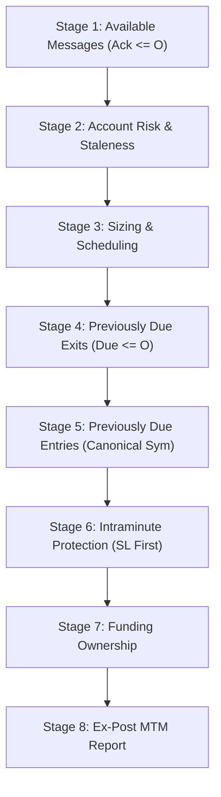

# Synthetic Replay Architecture and Execution Protocol (Role A)

**Task Identifier**: `V06_G2_R3_PARALLEL_P0_OFFLINE_PREPARATION`
**Role**: `GEMINI_A` (Synthetic Replay & Candidate Implementation)
**Implementation SHA**: `3ebb7db9a1043e58843b518af9381218d9f25af1`
**Controller Dispatch SHA**: `56f8a9faa1a4539124ab006b49bf42b6e7c997e3`
**Base Code SHA**: `e0ff8c3473de4bfa3e66fe7928d42992a4d38a32`
**Method Design Addendum HEAD**: `cf2d5cc33774cdcff7d709636305bba830e977ef`
**Status**: `P0_OFFLINE_SYNTHETIC_VERIFIED__NO_EMPIRICAL_DATA_ACCESS`

---

## 1. Overview and Core Philosophy

The R3 overnight discovery replay engine implements a deterministic, Point-In-Time (PIT) simulation architecture designed to eliminate lookahead bias, execution optimism, and capital leakage. The implementation is entirely isolated as a research sidecar in `src/btc_quant_agent/strategy_research/r3_overnight/` without mutating production code or shared configs.

Each of the **exact 8 pre-registered candidates** operates within an independent virtual book endowed with 1,000 USDT initial capital. Books never compete for pooled margin or share executions.

---

## 2. Point-in-Time Clocks and Lag Architecture

The engine distinguishes between two strictly separated timelines:
1. **Ex-Post Economic Timeline**: The physical execution events (fills, intrabar touches, settlements) occurring on market tape $T$.
2. **Decision & Risk Ledger Timeline**: The delayed information set available to the actor, governed by explicit latency parameters.

### Timeline Invariants
- **Bar Close Availability Lag**: Decision metrics for an hourly bar ending at $H_{\text{end}}$ are calculated and available only at $H_{\text{end}} + 60\,\text{s}$ ($O + 60\,\text{s}$).
- **Earliest Execution Lag**: Orders created at $H_{\text{end}} + 60\,\text{s}$ are scheduled and due for execution at the following minute open $H_{\text{end}} + 120\,\text{s}$ (minimum 60s creation lead time).
- **Delayed Fill Acknowledgments**: A fill executed at minute open $O$ emits an acknowledgment that is withheld until $O + 60\,\text{s}$. Unacknowledged cash or released capital cannot be reused retroactively.
- **Mark Freshness**: Mark price events must have an age $\le 120\,\text{s}$ relative to decision open $O$. Staler or missing marks veto entries and queue liquidation of known positions.

---

## 3. The Deterministic 8-Stage Execution Contract

At every minute open $O$, the virtual book processes the following stages in strict sequential order:

### Stage Details
1. **Stage 1 (Available Messages)**: Consumes trade fills, exit proceeds, funding charges, and mark price messages with `available_at_ms <= O`. Updates cash, positions, and reservations.
2. **Stage 2 (Account Risk & Freshness)**: Values acknowledged positions using latest available marks. Evaluates mark freshness ($\le 120\,\text{s}$). Updates high-water equity. Latch kill if equity $\le 0$ or drawdown $\ge 100\,\text{USDT}$.
3. **Stage 3 (Scheduling)**: Sizes and schedules future orders due at $O + 60\,\text{s}$. Cancels commitments if kill is latched.
4. **Stage 4 (Previously Due Exits)**: Executes exits created prior to $O$ and due at or before $O$. Favorable gap TP capped at fixed target price; adverse gap stop executes at worse open.
5. **Stage 5 (Previously Due Entries)**: Processes due entries in canonical `BTCUSDT`, `ETHUSDT`, `SOLUSDT` order. Vetoes entries if gap from decision close exceeds $0.25\,\text{ATR}_{20}$ or if risk distance at actual modeled fill is outside $[30\,\text{bp}, 250\,\text{bp}]$.
6. **Stage 6 (Intraminute Protection)**: Evaluates 1m OHLCV. **If both stop and target are touched in the same 1m bar, SL resolves first**. Adverse gap stop executes at worse open.
7. **Stage 7 (Funding Ownership)**: Charges funding if position exposure intersects the whole-hour window $[S - 15\,\text{s}, S + 15\,\text{s}]$. Charges each settlement ID once per position.
8. **Stage 8 (Ex-Post Report)**: Computes true minute-close mark-to-market equity. Preserves negative equity and flags insolvency without bankruptcy clipping.

---

## 4. Cost Model & Sizing Realism

### Transaction Costs
- **Base Scenario (22 bp round trip)**:
  - Taker fee: 6 bp per leg (debited separately on executed notional).
  - Half-spread (2 bp) + slippage (3 bp) = 5 bp per leg embedded into effective execution price.
  - Buy execution: $\lceil P \times (1 + 0.0005) \rceil_{\tau}$.
  - Sell execution: $\lfloor P \times (1 - 0.0005) \rfloor_{\tau}$.
- **Stress Scenario (44 bp round trip)**:
  - Taker fee: 12 bp per leg.
  - Friction embedded: 10 bp per leg (4 bp spread + 6 bp slippage).

### Sizing and 5% Capital Reserve
- Available Capital: $A = \max(0, 0.95 \times E_d - R_f - C_o)$.
- Asset Allocation Budget: $B = \max(0, \min(333.333333333333, A / 3, A - G))$.
- Reserve Buffer: $1.10 \times X$ protects against adverse gap expansion.
- Denominator includes exit cost reserve $C_{\text{exit}}$ and scenario funding reserve $F_{\text{unit}}$.

---

## 5. Geometry Ineligibility of 12h Stress Variants

Under the pre-registered stress scenario:
- Round trip transaction stress: $44\,\text{bp}$.
- 12 hourly funding settlements at $8\,\text{bp}$: $12 \times 8 = 96\,\text{bp}$.
- Total adverse drag hurdle: $140\,\text{bp}$.
- With target $= 2R$, survival in non-negative expectancy space requires:
$$\text{Stop Distance} \ge 2 \times 140\,\text{bp} = 280\,\text{bp}$$
- Pre-registered maximum allowable initial stop distance: $250\,\text{bp}$.
- Since $280\,\text{bp} > 250\,\text{bp}$, 12h variants cannot satisfy the pre-registered geometry under stress.
- **Reporting Invariant**: Flagged as `STRESS_COST_GEOMETRY_INELIGIBLE` (diagnostic only). The candidate IDs remain in the registry; they are **never deleted or modified**.

---

## 6. Hermetic Nonmarket Fixtures Test Matrix

All 10 required synthetic test fixtures have been executed and passed:
1. `test_constructed_win_long`: Reaches 2R target with adverse frictions and fees reconciled.
2. `test_constructed_win_short`: Short direction 2R target reached.
3. `test_constructed_loss_long_and_short`: Stop loss hit cleanly for both directions.
4. `test_stop_before_target_collision`: Both SL and TP touched in same 1m bar; SL resolves first.
5. `test_adverse_gap_stop_uses_worse_open`: Gap below stop executes at worse open, not stop level.
6. `test_favorable_target_gap_capped_at_target`: Gap above target capped at fixed target price with zero overcredit.
7. `test_mark_staleness_triggers_veto_and_exit`: Mark age $>120\,\text{s}$ vetoes entries and queues liquidation.
8. `test_negative_collateral_preserved_without_clipping`: Catastrophic gap loss preserves negative equity; book latched insolvent.
9. `test_funding_charge_across_settlement_window`: Whole hour settlement window charges adverse proxy debit once.
10. `test_no_fill_gap_veto`: Open gap $> 0.25\,\text{ATR}$ triggers entry veto; event never retries.
11. `test_future_price_leak_detection`: Raises `FuturePriceLeakError` upon detecting unclosed/future bar evaluation.
12. `test_double_fee_check`: Friction embedded once in price, taker fee debited once from cash.
