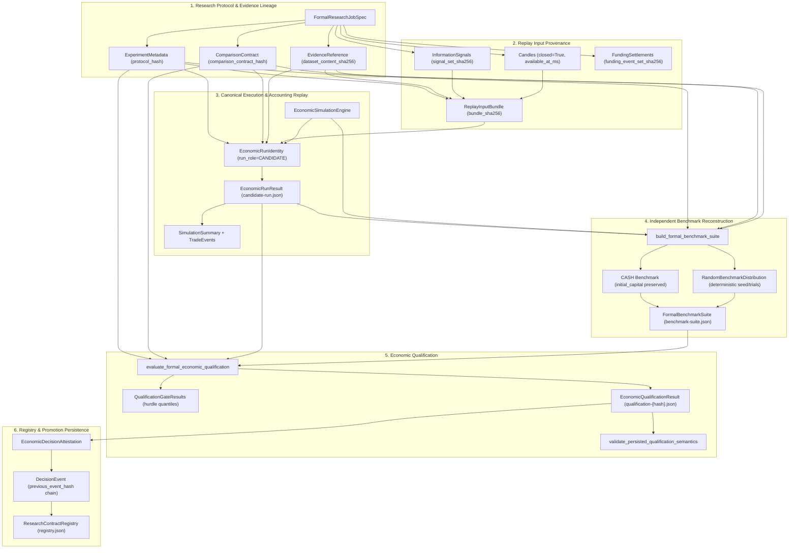

# v0.5.0 R03A — Contract & Data-Model Inventory Report

## Status and Authority

```text
V0_5_R03A_INVENTORY_COMPLETE_PENDING_SOL_REVIEW
FORMAL_ECONOMIC_KERNEL_UNCHANGED
H39_PROTECTED_UNCHANGED
FINAL_HOLDOUT_SEALED
EXECUTION_DISABLED
ALPHA_RESEARCH_NOT_STARTED
```

This document provides a read-only structural audit of the contract and data-model
surfaces on `EXASHXE/btc-quant-agent` following accepted R02 and R02R.
Zero production code, tests, configs, semantic goldens, frozen evidence,
H39 state, holdout partitions, or CI workflows were modified during this audit.

---

## 1. Exact Lineage & CI Receipt

| Reference | Exact Identity |
| --- | --- |
| Audited Code Branch | `v0.5-refactor` |
| Audited Code HEAD | `78a5e38b7631b9926f5072b426cd4d24a706f39e` |
| Prompt Branch | `v0.5-refactor-docs` |
| Prompt Path | `prompts/v0.5/review/v0.5.0_R03A_contract_data_model_inventory.md` |
| Prompt Commit | `b35858e6583d789069d5ec42d075bcce2a4bb4dc` |
| CI Run ID | [34852764469](https://github.com/EXASHXE/btc-quant-agent/actions/runs/34852764469) |
| Quality Job ID | `104004590465` (completed in 3m3s) |
| CI Status | `FAST_CI_GREEN_PY313` |
| Repaired Kernel Anchor | `6710b6302bf224cdc178e6f3d817a95f79277f38` |

---

## 2. Current Formal Authority Graph

The formal research and economic validation pathway flows strictly downward across six decoupled authority layers:



### Authority Boundary Transitions
1. **L1 -> L2 (Protocol to Replay Preimage)**: Protocol parameters and evidence paths are frozen into `ReplayInputBundle` via `build_formal_replay_input_bundle()`. Every signal is bound to its producing contract hash and causal input row content hashes.
2. **L2 -> L3 (Replay Preimage to Ledger)**: `execute_bound_run()` executes `EconomicSimulationEngine` over replayed inputs. Never trusts candidate-submitted trades, fills, or PnL. Replay creates atomic `TradeEvent` records and derives `SimulationSummary`.
3. **L3 -> L4 (Candidate Run to Benchmarks)**: Candidate run result ID and dataset evidence are passed to `build_formal_benchmark_suite()`. Benchmarks are reconstructed independently: CASH (zero return, capital preserved) and RANDOM (deterministic pseudo-random execution over matched trials).
4. **L4 -> L5 (Runs to Qualification)**: Candidate metrics are compared against hurdle thresholds and random benchmark distributions. `verify_formal_qualification()` performs cold re-validation of all accounting arithmetic and equity curves.
5. **L5 -> L6 (Qualification to Promotion)**: If qualification passes, an immutable `EconomicDecisionAttestation` is created and cryptographically committed into the `ResearchContractRegistry` append-only event log.

---

## 3. Complete Contract & Type Inventory

The formal research and economic validation path encompasses 27 primary types across 20 modules:

| Type Name | Location | Authoritative Owner | Persisted? | Hashed? | Reconstructed? | Disposition |
| --- | --- | --- | --- | --- | --- | --- |
| `ExperimentMetadata` | `research_contract/models.py` | Research Protocol | YES (JSON) | YES (`protocol_hash`) | NO | `PROTECTED_AUTHORITY` |
| `SignalProducerContract` | `economic/signal_producer.py` | Signal Authority | YES (JSON) | YES (`contract_hash`) | YES | `KEEP_SECURITY_BOUNDARY` |
| `EvidenceReference` | `research_contract/models.py` | Evidence Lineage | YES (JSON) | YES (`content_sha256`) | NO | `PROTECTED_AUTHORITY` |
| `DataIntervalIdentity` | `economic/qualification.py` | Dataset Boundary | YES (JSON) | YES (`dataset_content_sha256`) | YES | `KEEP_SECURITY_BOUNDARY` |
| `ComparisonContract` | `economic/qualification.py` | Comparison Spec | YES (JSON) | YES (`comparison_contract_hash`) | NO | `PROTECTED_AUTHORITY` |
| `EconomicHurdle` | `economic/qualification.py` | Hurdle Criteria | YES (JSON) | YES (part of contract) | YES | `PROTECTED_AUTHORITY` |
| `BenchmarkMatchingRules` | `economic/qualification.py` | Trial Alignment | YES (JSON) | YES (part of contract) | YES | `KEEP_SECURITY_BOUNDARY` |
| `InformationSignal` | `economic/signal.py` | Replay Input | YES (JSON) | YES (`signal_set_sha256`) | YES | `PROTECTED_AUTHORITY` |
| `InputReference` | `economic/replay_bundle.py` | Causal Provenance | YES (JSON) | YES (`row_content_sha256`) | YES | `KEEP_SECURITY_BOUNDARY` |
| `DecisionInputEntry` | `economic/replay_bundle.py` | Causal Binding | YES (JSON) | YES (`producer_contract_hash`) | YES | `KEEP_SECURITY_BOUNDARY` |
| `ReplayInputBundle` | `economic/replay_bundle.py` | Replay Preimage | YES (JSON) | YES (`bundle_sha256`) | YES | `KEEP_SECURITY_BOUNDARY` |
| `EconomicRunRole` | `economic/qualification.py` | Run Role Enum | YES (JSON) | YES (part of identity) | YES | `KEEP_SECURITY_BOUNDARY` |
| `EconomicRunIdentity` | `economic/qualification.py` | Replay Identity | YES (JSON) | YES (`run_result_id`) | YES | `KEEP_SECURITY_BOUNDARY` |
| `SimulationSummary` | `economic/metrics.py` | Accounting Ledger | YES (JSON) | YES (`accounting_bundle_hash`) | YES | `PROTECTED_AUTHORITY` |
| `TradeEvent` | `economic/trade_event.py` | Atomic Trade | YES (JSON) | YES (`trade_id`) | YES | `PROTECTED_AUTHORITY` |
| `RoundTripAttribution` | `economic/metrics.py` | Trade Attribution | YES (JSON) | NO | YES | `DERIVED_CACHE` |
| `EconomicRunResult` | `economic/qualification.py` | Run Envelope | YES (JSON) | YES (`result_id`) | YES | `PROTECTED_AUTHORITY` |
| `FormalBenchmarkResult` | `economic/qualification.py` | Benchmark Result | YES (JSON) | YES (`run_result_id`) | YES | `KEEP_SECURITY_BOUNDARY` |
| `RandomBenchmarkDistribution` | `economic/qualification.py` | Trial Set | YES (JSON) | YES (provenance) | YES | `KEEP_SECURITY_BOUNDARY` |
| `FormalBenchmarkSuite` | `economic/qualification.py` | Benchmark Suite | YES (JSON) | YES (`suite_id`) | YES | `PROTECTED_AUTHORITY` |
| `QualificationGateResult`| `economic/qualification.py` | Hurdle Result | YES (JSON) | NO | YES | `PROTECTED_AUTHORITY` |
| `EconomicQualificationResult`| `economic/qualification.py` | Verdict Authority | YES (JSON) | YES (`result_id`) | YES | `PROTECTED_AUTHORITY` |
| `EconomicDecisionAttestation` | `research_contract/models.py` | Registry Payload | YES (JSON) | YES (`result_artifact_sha256`) | NO | `PROTECTED_AUTHORITY` |
| `DecisionEvent` | `research_contract/models.py` | Event Chain | YES (JSON) | YES (`previous_event_hash`) | NO | `PROTECTED_AUTHORITY` |
| `ResearchContractRegistry` | `research_contract/registry.py`| P5 Governance | YES (JSON) | YES (event chain) | NO | `PROTECTED_AUTHORITY` |
| `ResearchRegistry / Component`| `research_registry.py` | Actionability Store| YES (JSON) | NO | NO | `SEMANTIC_CUT_REQUIRES_SOL` |
| `BenchmarkResult / Engine` | `economic/benchmarks.py` | Legacy Helper | NO (Memory) | NO | NO | `SAFE_MECHANICAL_CANDIDATE` |

---

## 4. Field-Level Duplication Matrix

Facts that appear across multiple abstraction layers were evaluated. Each is classified by its architectural purpose:

| Fact | Represented In | Classification | Security Boundary & Rationale |
| --- | --- | --- | --- |
| **`protocol_hash`** | `ExperimentMetadata`, `ReplayInputBundle`, `EconomicRunIdentity`, `EconomicQualificationResult`, `EconomicDecisionAttestation` | `NECESSARY_CROSS_CHECK` | **B04**: Prevents candidate or trial from substituting another protocol's parameters while claiming valid qualification. |
| **`dataset_content_sha256`** | `EvidenceReference`, `DataIntervalIdentity`, `ReplayInputBundle`, `EconomicRunIdentity`, `EconomicQualificationResult` | `NECESSARY_CROSS_CHECK` | **B05 / H4**: Cryptographically locks execution to exact raw candle dataset bytes. Prevents swapping dataset intervals. |
| **`product_scope / symbol`** | `Candle`, `InformationSignal`, `TradeEvent`, `ComparisonContract`, `EconomicRunIdentity`, `EconomicQualificationResult` | `NECESSARY_CROSS_CHECK` | **B05**: Ensures all signals, executions, fees, and funding events belong to the identical asset. |
| **`horizon_ms`** | `PredictionTarget`, `InformationSignal`, `ReturnMetricsContract` | `NECESSARY_CROSS_CHECK` | **B04**: Asserts candidate signal predictions correspond to the target prediction window. |
| **`signal_producer_contract`**| `ExperimentMetadata`, `DecisionInputEntry`, `EconomicRunIdentity` | `KEEP_SECURITY_BOUNDARY` | **B04 / B05**: Guarantees signals were generated by the protocol's authorized producer, not fabricated. |
| **`run_role`** | `EconomicRunIdentity` (`CANDIDATE` vs `RANDOM_BENCHMARK`) | `KEEP_SECURITY_BOUNDARY` | **B04**: Prevents relabeling random benchmark runs as candidate runs or vice versa. |
| **`run_result_id`** | `EconomicRunResult`, `FormalBenchmarkSuite.candidate_run_result_id`, `EconomicDecisionAttestation` | `NECESSARY_CROSS_CHECK` | **B04 / B05**: Binds qualification verdict directly to the replayed candidate run artifact. |
| **`replay_input_bundle_sha256`** | `ReplayInputBundle.bundle_sha256`, `EconomicRunIdentity` | `KEEP_SECURITY_BOUNDARY` | **B05**: Ensures execution replay was performed against a verified causal input bundle. |
| **`cost / fee / funding models`**| `ComparisonContract`, `EconomicSimulationEngine`, `EconomicRunIdentity` | `NECESSARY_CROSS_CHECK` | **B05**: Verifies simulation fee rates and funding intervals match comparison contract rules. |
| **`random_seed / trials`** | `ComparisonContract`, `FormalBenchmarkSuite`, `RandomBenchmarkDistribution`, `FormalBenchmarkResult` | `KEEP_SECURITY_BOUNDARY` | **H1 / B06**: Guarantees deterministic pseudo-random benchmark reconstruction and quantile calculation. |
| **`initial_capital`** | `ComparisonContract`, `EconomicSimulationEngine`, `SimulationSummary`, `CASH Benchmark` | `NECESSARY_CROSS_CHECK` | **H2 / B07**: Enforces equal starting equity across candidate, CASH, and random trials. |
| **`terminal_equity / PnL`** | `SimulationSummary`, `EconomicRunResult`, `QualificationGateResult` | `NECESSARY_CROSS_CHECK` | **B05**: Reconstructed from trade ledger; verified against summary to prevent ledger tampering. |
| **`benchmark_suite_id`** | `FormalBenchmarkSuite`, `EconomicQualificationResult`, `EconomicDecisionAttestation` | `NECESSARY_CROSS_CHECK` | **B06 / B07**: Binds qualification verdict to exact benchmark suite artifact. |
| **`comparison_contract_hash`** | `ComparisonContract`, `EconomicRunIdentity`, `EconomicQualificationResult`, `EconomicDecisionAttestation` | `NECESSARY_CROSS_CHECK` | **B04 / B05**: Enforces that candidate run and qualification adhere to the declared comparison contract. |
| **`availability_ms / closed`** | `Candle`, `InputReference`, `ReplayInputBundle` | `KEEP_SECURITY_BOUNDARY` | **H4 / B2**: Enforces Point-In-Time boundary, rejecting unclosed bars or future lookahead. |
| **`round_trips`** | `SimulationSummary.round_trips` | `DERIVED_CACHE` | **None**: Can be computed on demand from atomic `trade_events`. Redundant persisted cache in accounting JSON. |

---

## 5. Serialization & Schema Compatibility Matrix

The formal research subsystem operates across six schema definitions:

| Schema Identity | File / Constant | Current Version | Compatibility Level | Notes |
| --- | --- | --- | --- | --- |
| **Formal Job** | `formal_research.py::FORMAL_JOB_SCHEMA_VERSION` | `1.0.0` | `CURRENT_REQUIRED` | Input specification format for `run_formal_job()`. |
| **Candidate Run Artifact** | `qualification.py::schema_version` | `1.0.0` | `CURRENT_REQUIRED` | Serialized in `candidate-run.json`. |
| **Benchmark Suite Artifact** | `qualification.py::schema_version` | `1.0.0` | `CURRENT_REQUIRED` | Serialized in `benchmark-suite.json`. |
| **Qualification Result Artifact** | `qualification.py::P6_RESULT_SCHEMA_VERSION` | `1.1.0` | `CURRENT_REQUIRED` | Serialized in `qualification-{hash}.json`. |
| **Research Contract Registry** | `research_contract/registry.py::REGISTRY_SCHEMA_VERSION` | `1.0.0` | `CURRENT_REQUIRED` | Serialized in `registry.json`. |
| **Replay Input Bundle** | `replay_bundle.py::FORMAL_REPLAY_INPUT_BUNDLE_SCHEMA_VERSION` | `1.0.0` | `CURRENT_REQUIRED` | Serialized inside accounting payload. |
| **Simulation Summary** | `metrics.py::schema_version` | `2.0.0` | `CURRENT_REQUIRED` | In-memory and persisted accounting format. |
| **Runtime Market Data v2** | `acceptance_verifier.py::RUNTIME_MARKET_DATA_SCHEMA_VERSION` | `2.0.0` | `CURRENT_REQUIRED` | Requires explicit `closed` and `available_at_ms`. |
| **Legacy Market Data v1** | `acceptance_verifier.py::LEGACY_RUNTIME_MARKET_DATA_SCHEMA_VERSION`| `1.0.0` | `READABLE_DIAGNOSTIC_ONLY` | Historical format without availability proof; disallowed for new candidate promotion. |
| **Operational Registry** | `research_registry.py::schema_version` | `1.0.0` | `READABLE_AND_PROMOTABLE` | Reads `configs/research/research_registry.json`. |

---

## 6. Historical Security-Boundary Mapping

Every proposed cut was checked against the historical defect and security fixes:

- **B1 / B05 (Forged Candidate Execution)**:
  - *Defense*: Cold replay in `EconomicSimulator`; accounting verified in `verify_formal_accounting()` by reconstructing the equity curve directly from trade events and candle closes.
  - *Rule*: Never trust submitted PnL, fills, or equity curves.
- **B2 / H4 (Intrabar Ambiguity & PIT Closed Boundary)**:
  - *Defense*: Candles require explicit `closed=True` and `available_at_ms`. Order execution enforces causal observable-time bounds.
  - *Rule*: Keep explicit availability checks in `Candle` and `InputReference`.
- **H1 / B06 (Random Benchmark Reconstruction)**:
  - *Defense*: `RandomBenchmarkDistribution` with deterministic seed and trial count; matching rules check error fractions; quantiles independently recomputed during qualification verification.
  - *Rule*: Retain deterministic random trial generation and verification.
- **H2 / B07 (CASH Benchmark Substitution)**:
  - *Defense*: Independent CASH benchmark reconstruction verifying capital preservation and zero trade activity.
  - *Rule*: Never allow candidate to submit a synthetic CASH benchmark.
- **H5 (H39 Hermetic Boundary)**:
  - *Defense*: `_research_path()` explicitly rejects `h39_canonical_1m_candles.sqlite3` and `h39_validation`.
  - *Rule*: Formal research jobs cannot read operational H39 stores.
- **B04 (Identity & Producer Relabel Attacks)**:
  - *Defense*: `EconomicRunIdentity` enforces `run_role` equality, `SignalProducerContract` hash equality, and protocol hash equality.
  - *Rule*: Retain cross-check fields between identity, protocol, and result envelope.
- **B09 / B10 (Publication Immutability & Conflict)**:
  - *Defense*: `_publish_immutable()` acquires publication lock; verifies matching bytes if artifact exists; raises `PublicationConflict` on mismatch.
  - *Rule*: Retain publication locking and byte verification.
- **B11 / B12 (Bounded Schemas & Read-Only API)**:
  - *Defense*: Strict schema version enforcement; REST API narrowed to read-only monitoring with zero repository mutations (repaired in R02R).
  - *Rule*: Maintain zero-mutation API invariant.

---

## 7. Reachability & Dependency Evidence

### Module Coupling Metrics:
- **Total Formal Modules**: 20
- **Total Types / Classes**: 81
- **Internal Import Edges**: 540
- **Reachability by Entrypoint**:
  - `formal_research.py`: Reachable via CLI commands `backtest`, `research`, `replay`. Does not import operational CLI or API.
  - `research_registry.py`: Reachable via `service.health()` and CLI `research-registry`.
  - `acceptance_verifier.py`: Reachable via `formal_research.verify_formal_qualification()` and `validate_persisted_qualification_semantics()`.
  - `benchmarks.py`: Reachable ONLY via test files (`test_benchmarks.py`). **Zero production importers**.

---

## 8. Target Architecture Proposal for R03 / R04

The proposed target model preserves the six decoupled authority boundaries while eliminating redundant legacy layers:

```text
[Layer 1: Protocol & Contract]
  ExperimentMetadata (protocol_hash)
  ComparisonContract (comparison_contract_hash)
  EvidenceReference (dataset_content_sha256)
       │
       ▼
[Layer 2: Replay Authority Inputs]
  ReplayInputBundle (bundle_sha256)
  InformationSignal + Candle + FundingSettlement
       │
       ▼
[Layer 3: Canonical Execution Replay]
  EconomicSimulator -> TradeEvents -> SimulationSummary
  EconomicRunResult (run_result_id = SHA256(RunIdentity))
       │
       ▼
[Layer 4: Reconstructed Benchmarks]
  CASH Benchmark + Reconstructed Random Trials
  FormalBenchmarkSuite (suite_id)
       │
       ▼
[Layer 5: Qualification Evaluation]
  evaluate_formal_economic_qualification() -> EconomicQualificationResult
  validate_persisted_qualification_semantics() -> Boolean acceptance
       │
       ▼
[Layer 6: Registry Persistence]
  EconomicDecisionAttestation -> DecisionEvent -> ResearchContractRegistry
```

### Key Principles:
1. **One Canonical Representation per Authoritative Fact**: Remove legacy duplicate representations (`BenchmarkResult` in `benchmarks.py`).
2. **Explicit Layer Boundaries**: Clear handoff from Replay Preimage (Layer 2) to Execution Ledger (Layer 3) to Benchmarks (Layer 4) to Qualification (Layer 5) to Registry (Layer 6).
3. **Zero Framework Bloat**: No dependency-injection container, no universal event bus, no ORM layer.

---

## 9. Prioritized Simplification Candidates

| ID | Candidate Cut | Module | Classification | Est. LOC Delta | Rationale & Safety |
| --- | --- | --- | --- | ---: | --- |
| **SIMP-01** | Prune `BenchmarkResult` & `BenchmarkEngine` | `economic/benchmarks.py` | `SAFE_MECHANICAL_CANDIDATE` | -180 | Completely superseded by `qualification.py::FormalBenchmarkSuite`. Zero production callers. |
| **SIMP-02** | Remove `legacy_directional_role` field | `research_registry.py` | `SAFE_MECHANICAL_CANDIDATE` | -15 | Backwards-compatibility string adapter. All registry JSON files use standard `role`. |
| **SIMP-03** | Formalize legacy market data v1.0 as `READABLE_DIAGNOSTIC_ONLY` | `economic/acceptance_verifier.py` | `SAFE_MECHANICAL_CANDIDATE` | -25 | Explicitly prevents old candle formats from qualifying new promotion candidates. |
| **SIMP-04** | Decouple / Clarify P5 Registry vs Operational Registry | `research_contract/` vs `research_registry.py` | `SEMANTIC_CUT_REQUIRES_SOL` | 0 | Resolves naming overlap and clarifies authority boundaries. Requires Sol review. |
| **SIMP-05** | Streamline `SimulationSummary.round_trips` footprint | `economic/metrics.py` | `SEMANTIC_CUT_REQUIRES_SOL` | -80 | Derived cache duplicating atomic trade events; compute on-demand during qualification. Requires Sol review. |

---

## 10. Future BTC/ETH Multi-Horizon Compatibility Assessment

Audit against the anticipated future low-frequency perpetual research program (1h decision cadence, 4h/8h/12h/24h primary/supporting horizons, LONG/SHORT/NO_TRADE):

1. **Multi-Asset Support (BTC & ETH)**:
   - *Current State*: `Candle.symbol`, `InformationSignal.asset`, `TradeEvent.asset`, and `ComparisonContract.product_scope` are generic strings supporting arbitrary pairs (`BTCUSDT`, `ETHUSDT`).
   - *Gap*: `ForwardDerivativeStore` defaults to `data/forward/BTCUSDT/derivatives.sqlite3`. Needs explicit symbol parameterization when forward collection expands to ETH.
2. **Multi-Horizon Support (4h, 8h, 12h, 24h)**:
   - *Current State*: `PredictionTarget` contains `horizon_ms` and `horizon_description`. `ReturnMetricsContract` contains `cadence_ms` (configurable to 3,600,000 ms for 1h).
   - *Finding*: No horizon is hardcoded in formal replay or qualification contracts. Multiple candidate horizons can be evaluated without identity collision.
3. **Explicit Abstention / NO_TRADE**:
   - *Current State*: Formal research jobs cleanly support empty signal sets (`spec.signals = ()`), generating zero trades with capital fully preserved in cash.
4. **Feature-Family Provenance**:
   - *Current State*: `DecisionInputEntry.generation_contract` and `InformationSignal.metadata` allow recording feature-family provenance (trend, regime, derivatives, microstructure confirmation) without schema alterations.

---

## 11. Explicit Risks & Unknowns

1. **Downstream Test Sensitivity**: Several older tests in `tests/test_benchmarks.py` instantiate `BenchmarkEngine`. Pruning `SIMP-01` requires updating or removing these historical test assertions.
2. **Round-Trip Metrics Dependency**: Several qualification gate metrics (`completed_round_trips`, MAE/MFE) read from `SimulationSummary.round_trips`. If `round_trips` is removed from serialized accounting JSON (`SIMP-05`), qualification verifiers must recompute round trips on the fly.
3. **Two Registries Confusion**: External tooling might confuse `ResearchContractRegistry` (`registry.json`) with `ResearchRegistry` (`configs/research/research_registry.json`). Clarifying their documentation and API contracts in R03 is critical.

---

## 12. Recommended R03 Implementation Split

- **Round R03-Part 1 (Mechanical Cleanups)**:
  - Prune `economic/benchmarks.py` legacy types (`SIMP-01`).
  - Prune `legacy_directional_role` adapter (`SIMP-02`).
  - Strict classification of legacy market data v1.0 (`SIMP-03`).
- **Round R03-Part 2 (Registry & Attribution Simplification - Sol Review)**:
  - Document and unify registry access semantics (`SIMP-04`).
  - Evaluate on-demand vs serialized round-trip attribution (`SIMP-05`).

---

```text
V0_5_R03A_INVENTORY_COMPLETE_PENDING_SOL_REVIEW
```
