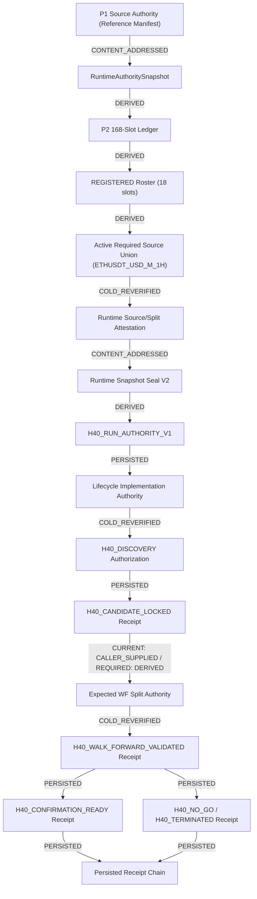

# V0.5.1 H40 F01R3 Durable WF / Run-Head / Capability Authority Closure

```text
DOCUMENT_TYPE = GEMINI_PROPOSED_AUTHORITY_CLOSURE
EXECUTOR = GEMINI_3_8_FLASH
REVIEW_STATUS = PENDING_INDEPENDENT_SOL_ACCEPTANCE
IMPLEMENTATION_AUTHORIZATION = NOT_GRANTED_BY_THIS_DOCUMENT
```

---

# 1. Document status and exact audited state

This document provides an evidence-backed candidate authority closure for the findings identified in the Astra Pre-Discovery Full System Audit (`ebc904c4b33f2b367c12a3725b418128631f928c`) and adjudicated in the Sol Adjudication (`b504fd58c3274549e8ffcaa99975f8d63f52a11e`).

### Target Findings
- `ASTRA-B-01` (BLOCKER): Expected Walk-Forward (WF) authority can be shrunk together with its evidence.
- `ASTRA-B-02` (BLOCKER): Terminal state absorption is process-local rather than durable run authority.
- `ASTRA-B-03` (BLOCKER): Cached downstream authorization is not revalidated against current source truth.
- `ASTRA-H-01` (HIGH): Receipt create-if-absent is not crash-atomic publication.
- `ASTRA-M-01` (MEDIUM): Authoritative source descriptors (`row_count`, `gap_count`) must agree with cold receipt truth.

### Audited Repository Coordinates
- **Repository**: `EXASHXE/btc-quant-agent`
- **Implementation Branch**: `v0.5-refactor`
- **Audited Implementation SHA**: `1dad1b6eba6a1610a6af365d1fbeac0376dab5d1`
- **Documentation Branch**: `v0.5-refactor-docs`
- **Active Controller Handover**: `docs/handover/V0.5.1_QUANT_AGENT_PHASE_HANDOVER_2026-09-21.md`

### Hard Safety Boundaries
- Execution remains strictly disabled (`EXECUTION_DISABLED = True`, `auto_execute = false`, live trading unauthorized).
- Pre-Discovery information barriers strictly preserved: zero real H40 labels, forward returns, MFE/MAE, PnL, candidate rankings, or testnet/live orders accessed or computed.
- CI quota exhausted: `REMOTE_CI_DEFERRED_ACTIONS_QUOTA` remains in force; no CI triggered, polled, or rerun.
- Implementation files on `v0.5-refactor` remain unmodified.

---

# 2. Frozen authority lineage

The scientific and lifecycle governance baselines established in P1, P2, and F01R2 remain the authoritative foundation:

### Scientific Identities (Immutable)
```text
protocol_authority_hash =
a83f8fc7a5ca7109fb8cd7fed114d87c3b2c968b5145c11cada203aa5111d1ce

semantic_root_hash =
71889a35f227ed734272b712851174a69bf9dbb12ea3f87cd84c26e7c66f6af1

structural_ledger_hash =
483f68502b57972deae071c7bd4587ca3e57ccaa72bd99fb0de07b4f0ab8c85f
```

### Current F01R2 Lifecycle Identities
```text
runtime_snapshot_seal_contract_hash =
76a0732742707c78f65da26263076bed7b586ea67d4f5ddd2dac33761e37e612

lifecycle_semantic_root_hash =
fad50703c12da9af35366ceb8a774794b4ff2f3163a1adb6b624d3b69316e406

lifecycle_governance_authority_hash =
7edce39c421ad6c487580483d2fa674b1f199e21640c33b1c08f85dddc6f64fc
```

### Current Runtime Source Projection
```text
TOTAL = 168
REGISTERED = 18
NOT_TESTABLE = 150

active_required_source_ids = ["ETHUSDT_USD_M_1H"]
BTCUSDT_USD_M_1H = NOT_TESTABLE
ETHUSDT_USD_M_1H = VERIFIED
```

---

# 3. Evidence table

| finding_id | exact file | exact class/function | current behavior | why behavior is unsafe/incomplete | accepted artifact clause governing expected behavior | existing tests covering partial behavior | existing tests failing to cover attack |
|---|---|---|---|---|---|---|---|
| **ASTRA-B-01** | `src/btc_quant_agent/h40/lifecycle_authority.py` | `:1641` `H40ExpectedSplitAuthority`<br>`:2710` `authorize_wf_validation` | Caller instantiates and passes `split_authority: H40ExpectedSplitAuthority`. Method verifies `evidence.fold_result_entries` against `split_authority.folds` and `evidence.accepted_validation_contract_hashes` against `split_authority.accepted_validation_contract_hashes`. | `split_authority` is caller-supplied. If a caller supplies a 1-fold subset and matching 1-fold evidence, the internal check `actual_folds == expected_folds` passes. The fold universe and contract set are not derived from seal-bound authority. | `P3R0R1` §4.3; `wf_validation_receipt_contract` (`verifier_obligations`: "derive the complete ordered fold set from split manifest and split attestation", "no subset or extra"). | `test_t20_incomplete_wf_fold_set_denied`, `test_t22_cross_split_wf_replay_denied`. | Fails to test paired shrinkage where caller shrinks BOTH expected split authority AND evidence fold set simultaneously. |
| **ASTRA-B-02** | `src/btc_quant_agent/h40/lifecycle.py`<br>`src/btc_quant_agent/h40/lifecycle_authority.py` | `H40LifecycleStateMachine.transition_with_verified_authority`<br>`:3203` `H40LifecycleArtifactStore._path`, `persist_authorization`, `_restore` | Storage paths are caller-selected keys (`[0-9]{2}_[a-z0-9_]+.json`). Ancestry is verified backwards via `upstream_receipt_hash`. No single canonical durable head object exists. | Two sibling transitions from the same predecessor (e.g. `04_terminal` and `03_wf_success`) can coexist in the same run directory. A fresh process restoring by receipt hash reconstructs the success branch, bypassing the terminal `H40_NO_GO`. | `P3R0R1` §§4.2, 4.5–4.7; `persistence_replay_contract` ("directory filename and caller label have no authority", "failure semantics: fails closed with no state advance"). | `test_t16_no_runner_up`, `test_t29_terminal_states_absorbing` (test single in-memory instance only). | Fails to test concurrent writers, sibling persistence, or restart restoration after terminal persistence into a separate process. |
| **ASTRA-B-03** | `src/btc_quant_agent/h40/lifecycle_authority.py`<br>`src/btc_quant_agent/h40/lifecycle.py` | `:2520` `_require_prior`<br>`:2915` `revalidate_authorization`<br>`:2369` `VerifiedLifecycleAuthorization.assert_valid` | In-memory `VerifiedLifecycleAuthorization` tokens check issuer identity and state transition lineage. Revalidation reconstructs immediate step from prior in-memory object without re-verifying root runtime seal or active source files. | If active source files on disk (`ETHUSDT_USD_M_1H`) are modified or deleted after Discovery or Candidate Lock, cached tokens in a running process continue to transition to WF and Confirmation Ready. Cold restore fails, causing cached vs. cold semantic divergence. | `F01R2` §§8.4–8.5; `persistence_replay_contract` ("restore recomputes every content hash and every authoritative verifier result"); `runtime_snapshot_seal_contract`. | `test_r35_r37_r38_production_cold_restore_and_active_source_change_detection` (tests cold restore only). | `test_t11_post_seal_source_change` does not test consuming an in-memory cached capability token across state transitions after source tampering. |
| **ASTRA-H-01** | `src/btc_quant_agent/h40/lifecycle_authority.py` | `:3342` `H40LifecycleArtifactStore.persist_authorization`<br>`:3443` `_find_transition_key_by_receipt_hash` | `os.open(path, O_WRONLY \| O_CREAT \| O_EXCL, 0o600)` creates the final target file before bytes are written. `handle.write(encoded)` and `fsync` occur afterwards. | Crash between file creation and fsync leaves an empty or corrupt file. Retrying the valid authorization sees existing bytes and raises `write-once lifecycle artifact already exists with different bytes`. Broken recovery fails closed permanently. | `P3R0R1` §4.7 ("write canonical JSON with atomic create-if-absent"). | `test_t24_persistence_tamper`, `test_t26_idempotent_persistence_revalidates`. | Fails to test crash during write, zero-byte file handling, directory fsync failure, or race during publication. |
| **ASTRA-M-01** | `src/btc_quant_agent/h40/lifecycle_authority.py`<br>`src/btc_quant_agent/h40/source_manifest.py` | `:620` `materialize_runtime_source_split_authority`<br>`H40SourceRecord` | Active source records check `file_sha256`, `timestamp_count`, and `timestamp_membership_hash` against cold receipt, but `row_count` and `gap_count` are not strictly reconciled. | A runtime source record could declare contradictory descriptive metadata (e.g. `row_count=1`, `gap_count=999`) while referencing an intact 44,568-row receipt, creating canonical descriptor inconsistency. | `runtime_snapshot_seal_contract` (`active_source_evidence_entry_field_contract`). | `test_r17_r23_active_evidence_exactness_and_tamper_rejection`. | Fails to assert exact equality between record `row_count`/`gap_count` and cold receipt `timestamp_count`/`gap_count`. |

---

# 4. Current lifecycle authority graph

Below is the authoritative dependency graph for H40 F01R2, tracking each edge's exact authority classification:



### Authority Edge Classification
1. **P1 Source Authority -> RuntimeAuthoritySnapshot**: `CONTENT_ADDRESSED`
2. **RuntimeAuthoritySnapshot -> P2 168-slot Ledger**: `DERIVED`
3. **P2 168-slot Ledger -> REGISTERED Roster**: `DERIVED`
4. **REGISTERED Roster -> Active Source Union**: `DERIVED`
5. **Active Source Union -> Runtime Source/Split Attestation**: `COLD_REVERIFIED`
6. **Runtime Source/Split Attestation -> Runtime Snapshot Seal**: `CONTENT_ADDRESSED`
7. **Runtime Snapshot Seal -> H40_RUN_AUTHORITY_V1**: `DERIVED`
8. **H40_RUN_AUTHORITY_V1 -> Lifecycle Implementation Authority**: `PERSISTED`
9. **Lifecycle Implementation Authority -> Discovery**: `COLD_REVERIFIED`
10. **Discovery -> Candidate Lock**: `PERSISTED`
11. **Candidate Lock -> Expected WF Authority**: `CALLER_SUPPLIED` in current code (`1dad1b6`), **MUST BE `DERIVED`** under F01R3.
12. **Expected WF Authority -> WF Validation**: `COLD_REVERIFIED`
13. **WF Validation -> Confirmation Ready**: `PERSISTED`
14. **WF Validation -> Termination (NO_GO)**: `PERSISTED`
15. **Receipts -> Persisted Receipt Chain**: `PERSISTED` (lacks durable atomic head advance).

---

# 5. ASTRA-B-01 closure

### 5.1 Analysis of the Paired Shrink Vulnerability
In `1dad1b6:lifecycle_authority.py:2710`, `authorize_wf_validation()` accepts `split_authority: H40ExpectedSplitAuthority` directly from the caller. The method validates:
```python
if actual_folds != expected_folds:
    raise H40GuardError(...)
```
where `actual_folds` is extracted from `evidence.fold_result_entries` and `expected_folds` is extracted from `split_authority.folds`. If an adversary or defect passes an `H40ExpectedSplitAuthority` containing only 1 fold instead of the required 5 canonical folds, and provides evidence containing only that 1 fold, the equality check passes. The system never verifies that `split_authority` was derived from the sealed runtime split manifest.

### 5.2 Deterministic Derivation Specification
Under F01R3, `H40ExpectedSplitAuthority` MUST NOT be accepted from the caller. Instead, it must be deterministically derived:
```text
expected_wf_authority = derive_expected_split_authority(
    sealed_run_authority=candidate_authority.run_authority,
    runtime_split=candidate_authority.runtime_split,
    validation_contracts=lifecycle_semantic_contracts()
)
```

#### Answers to Required Inquiries:
1. **Validation Universe**: The exact 5 canonical Walk-Forward partitions defined in the authoritative runtime split manifest (`split_manifest_hash` bound in seal).
2. **Ordered Fold IDs**: Derived in canonical order (`fold_0` through `fold_4`) as defined in the static partition calendar.
3. **Partition IDs**: Bound strictly to the calendar definitions in `split_manifest.py`.
4. **Fold-Definition Hashes**: Computed as `canonical_sha256(fold_dict)` for each partition definition.
5. **Validation Contract Ownership**: Owned exclusively by the accepted P2/P3 lifecycle contract registry (`_LIFECYCLE_CONTRACTS`).
6. **Contract Map Derivation**: Immutable map of `{contract_id: expected_child_hash}` for all accepted validation gates.
7. **Production API Caller Acceptance**: **ZERO**. Production `authorize_wf_validation()` MUST NOT accept `split_authority` as an argument; it derives it internally from `candidate_authority`.
8. **Issuance Reconstruction**: Reconstructed directly from `candidate_authority.context["seal"]` and runtime split.
9. **Cold Restore Reconstruction**: Reconstructed from the re-verified seal and verified runtime split manifest.
10. **Rejection of Missing/Extra/Reordered Folds**: Rejected by strict array equality against the derived authoritative fold tuple.
11. **Rejection of Missing/Extra Contracts**: Rejected by strict dictionary equality against accepted validation contracts.
12. **Cross-Run Rejection**: Bound strictly to `candidate_authority.run_authority_id`.

### 5.3 Classification
- **Classification**: `CANONICAL_CLARIFICATION_WITHOUT_HASH_CHANGE`
- **Rationale**: `P3R0R1` §4.3 and canonical `wf_validation_receipt_contract` already explicitly state in `verifier_obligations`: *"derive the complete ordered fold set from split manifest and split attestation"* and *"accepted_validation_contract_hashes: complete object sorted by contract_id to hash resolved from accepted P2 semantic authority no subset or extra"*. The defect was purely an implementation omission where the function trusted a caller parameter instead of enforcing its normative verifier obligation. No canonical contract text or hash needs to be modified.

---

# 6. ASTRA-B-02 durable run-head closure

### 6.1 Vulnerability
Current persistence uses arbitrary caller-specified keys (`01_discovery`, `02_candidate_lock`, `03_wf_validation`, `04_terminal`). Ancestry is verified backwards via `upstream_receipt_hash`. If a candidate fails WF validation, an `H40_NO_GO` receipt is written. However, a competing writer or restarted process can write a successful WF receipt referencing the same predecessor, and subsequent calls will follow the successful branch. Terminal absorption was enforced only in-memory, not in durable storage.

### 6.2 Canonical Durable Run-Head Object Schema
To guarantee unambiguous, single-lineage durable state across restarts and processes, every run directory MUST maintain a single, canonical `head.json` file.

```json
{
  "schema_id": "H40_DURABLE_RUN_HEAD_V1",
  "run_authority_id": "sha256",
  "head_receipt_hash": "sha256",
  "head_state": "H40_DISCOVERY | H40_CANDIDATE_LOCKED | H40_WALK_FORWARD_VALIDATED | H40_CONFIRMATION_READY | H40_NO_GO | H40_TERMINATED",
  "head_predecessor_receipt_hash": "sha256 | null",
  "transition_sequence": "integer_gte_0",
  "terminal": "boolean",
  "updated_at_utc": "audit_timestamp_utc",
  "head_signature_hash": "canonical_sha256_of_preceding_fields"
}
```

### 6.3 State Transition & Head Advance Invariants
1. **Predecessor Verification**: Transition requires `expected_predecessor_receipt_hash == current_head.head_receipt_hash`.
2. **Sequence Monotonicity**: New `transition_sequence == current_head.transition_sequence + 1`.
3. **Absorbing Terminal State**: If `current_head.terminal == true`, ALL subsequent transitions are rejected immediately with `H40GuardError(STATE_TRANSITION_DENIED, "run is in absorbing terminal state")`.
4. **Sibling Rejection**: Any transition attempting to branch from a non-head predecessor receipt is rejected as a stale branch.

### 6.4 Concurrency & Race Behaviors
- **Exact Retry**: If a writer attempts to persist a transition with `(transition_sequence, head_receipt_hash)` identical to current head, the operation succeeds idempotently.
- **Conflicting Retry**: If sequence matches current head but receipt hash differs, fails closed with `CONFIG_IDENTITY_CONFLICT`.
- **Stale Writer**: Mismatched predecessor fails closed with `STATE_TRANSITION_DENIED`.
- **Concurrent Writers**: Only one writer can win the atomic rename of `head.json`. The loser detects sequence collision and fails closed.
- **Terminal Sibling**: Once `H40_NO_GO` commits to `head.json`, no WF success receipt can ever advance the head.

### 6.5 Classification
- **Classification**: `CANONICAL_CLARIFICATION_WITHOUT_HASH_CHANGE`
- **Rationale**: `persistence_replay_contract` already mandates: *"directory filename and caller label have no authority"* and *"failure semantics: fails closed with no state advance"*. Implementing `head.json` enforces these pre-existing canonical rules.

---

# 7. ASTRA-H-01 crash-atomic publication closure

### 7.1 Vulnerability
`H40LifecycleArtifactStore.persist_authorization()` uses `os.open(path, os.O_WRONLY | os.O_CREAT | os.O_EXCL, 0o600)` on the final path. If the process is killed before bytes are written and fsynced, a 0-byte or truncated file remains. Subsequent retries fail with `FileExistsError` and reject the valid authorization.

### 7.2 Publication Protocol (Receipt-First Publication)
Publication MUST follow a strict two-phase receipt-first protocol:

```text
Phase 1: Publish Immutable Receipt
1. Write canonical receipt envelope to temp file: .tmp_receipt_<receipt_hash>_<uuid>
2. Flush and os.fsync(temp_fd)
3. Close temp_fd
4. Atomic rename (.tmp_receipt -> receipts/<receipt_hash>.json) via os.replace()
5. os.fsync() on receipts/ directory

Phase 2: Advance Durable Head
6. Verify expected predecessor matches current head.json
7. Write new head to temp file: .tmp_head_<seq>_<uuid>
8. Flush and os.fsync(temp_head_fd)
9. Close temp_head_fd
10. Atomic rename (.tmp_head -> head.json) via os.replace()
11. os.fsync() on run directory
```

### 7.3 Commit Point
**The commit point is step 10 (atomic rename of `head.json`).**
- Before step 10: The transition has NOT occurred.
- At and after step 10: The transition is durably committed.

### 7.4 Crash Recovery Truth Table

| Crash Point | State on Disk at Restart | Visible Committed State | Retry Allowed? | Recovery / Quarantine Action |
|---|---|---|---|---|
| **C1: Crash before temp receipt fsync** | Partial `.tmp_receipt_*` file | Previous `head.json` | YES | Temp file ignored and cleaned up on startup. Head unchanged. |
| **C2: Crash after temp fsync before receipt rename** | Complete `.tmp_receipt_*`, receipt path absent | Previous `head.json` | YES | Temp file cleaned up. Head unchanged. |
| **C3: Crash after receipt published, before head rename** | `receipts/<hash>.json` exists; `head.json` still points to previous receipt | Previous `head.json` | YES | Unreferenced receipt is harmless uncommitted evidence. If retry occurs, receipt phase is idempotent; head advances to new state. |
| **C4: Crash during atomic head rename** | POSIX atomic rename guarantee: either old `head.json` or new `head.json` exists | Either previous head (see C3) or new head (see C5) | YES (if C3) / NO (if C5) | Clean, unambiguous state. No half-written `head.json` possible. |
| **C5: Crash after head rename, before directory fsync** | New `head.json` is present and committed | New `head.json` | NO (transition complete) | Fully valid committed state. Subsequent operations see new head. |

### 7.5 Classification
- **Classification**: `IMPLEMENTATION_ONLY`
- **Rationale**: `persistence_replay_contract` already explicitly specifies *"write canonical JSON with atomic create-if-absent"*. Fixing the file writing sequence to use temporary file fsync and atomic rename fulfills the existing contract.

---

# 8. ASTRA-B-03 capability lifetime closure

### 8.1 Model Evaluation: Model A vs. Model B

| Dimension | Model A: Recursive Revalidation at Transition Use | Model B: Immutable Protected Byte Snapshot |
|---|---|---|
| **Authority Object** | `VerifiedLifecycleAuthorization` with mandatory root revalidation hook | Sealed byte snapshot store bound at run seal |
| **What bytes are trusted?** | Current verified source files + cold validation receipts | Immutable snapshot bytes frozen at seal time |
| **What invalidates it?** | Deletion, truncation, or hash mutation of active source files on disk | Snapshot directory corruption or storage tampering |
| **Runtime I/O Cost** | Lightweight SHA-256 / receipt check on transition boundaries | Disk duplication of 44,568 rows + cold storage footprint |
| **Restart Semantics** | Exact match with cold restore verification | Replays from frozen snapshot store |
| **Deletion / Mutation** | Immediately detected; fails closed | Immune to source file mutation (frozen snapshot) |
| **Attack Surface** | Stale in-memory capability tokens completely eliminated | Storage management of duplicated source snapshots |
| **Implementation Complexity** | Low: reuse existing `seal.verify_against_accepted_ledger()` | High: snapshot repository, storage quota, content-addressing |

### 8.2 Selection and Invariants: Model A
**Selected Model: Model A (Recursive Revalidation at Transition Use)**
Model A is selected as the minimal, robust change that directly upholds accepted F01R2 evidence-truth semantics without introducing unnecessary storage mechanisms.

#### Defined Behaviors under Model A:
1. **Source Disappears after Discovery**: Discovery token cannot be used to lock a candidate. Transition to `H40_CANDIDATE_LOCKED` invokes `seal.verify_against_accepted_ledger()`, which raises `H40GuardError` and halts the run.
2. **Source Mutates after Candidate Lock**: Candidate Lock token cannot be used for WF validation. Transition to `H40_WALK_FORWARD_VALIDATED` invokes root revalidation, detects hash mismatch, and fails closed.
3. **Runtime Source State Changes after Seal**: If `active_required_sources` becomes unavailable, transition use fails closed.
4. **Cached Candidate Reused**: Before executing Candidate Lock logic, the issuer re-verifies root seal truth.
5. **Cached WF Reused**: Re-verifies root seal truth before transitioning to Confirmation Ready.
6. **Cold-Restored Candidate / WF**: Cold restore re-runs seal verification. Under Model A, cached transition use and cold restore enforce **IDENTICAL** invariants.

### 8.3 Classification
- **Classification**: `CANONICAL_CLARIFICATION_WITHOUT_HASH_CHANGE`
- **Rationale**: F01R2 §§8.4–8.5 already state that verified authority represents evidence truth, not perpetual in-memory exemption. Enforcing recursive root checks at transition boundaries clarifies capability lifetime without altering canonical contracts.

---

# 9. ASTRA-M-01 source descriptor closure

### 9.1 Classification of Source Record Fields

| Field Name | Authority Classification | Equality Requirement Against Cold Receipt | Mutation Effect |
|---|---|---|---|
| `source_id` | `AUTHORITATIVE` | Strict string match (`ETHUSDT_USD_M_1H`) | Fails closed (`CONFIG_IDENTITY_CONFLICT`) |
| `file_sha256` | `AUTHORITATIVE` | Strict SHA-256 equality | Fails closed (`HASH_MISMATCH`) |
| `timestamp_count` | `AUTHORITATIVE` | Must equal `44,568` and receipt count | Fails closed (`ROW_COUNT_MISMATCH`) |
| `timestamp_membership_hash` | `AUTHORITATIVE` | Strict SHA-256 equality | Fails closed (`MEMBERSHIP_HASH_MISMATCH`) |
| `row_count` | `DERIVED_AUTHORITATIVE` | Must strictly equal `timestamp_count` and receipt row count | Fails closed (`CANONICAL_DESCRIPTOR_CONFLICT`) |
| `gap_count` | `DERIVED_AUTHORITATIVE` | Must strictly equal `0` and receipt gap count | Fails closed (`GAP_COUNT_MISMATCH`) |
| `start_utc` | `AUTHORITATIVE` | Must equal partition calendar start | Fails closed (`CALENDAR_MISMATCH`) |
| `end_utc` | `AUTHORITATIVE` | Must equal partition calendar end | Fails closed (`CALENDAR_MISMATCH`) |
| `receipt` | `AUTHORITATIVE` | Cold validation receipt content hash | Fails closed (`RECEIPT_TAMPER`) |

### 9.2 Enforcement Rule
In `materialize_runtime_source_split_authority()`, every active `VERIFIED` source record MUST satisfy:
```python
if record.row_count != receipt.row_count or record.row_count != record.timestamp_count:
    raise H40GuardError(H40ReasonCode.CONFIG_IDENTITY_CONFLICT, "source record row_count contradicts receipt truth")
if record.gap_count != receipt.gap_count or record.gap_count != 0:
    raise H40GuardError(H40ReasonCode.CONFIG_IDENTITY_CONFLICT, "source record gap_count contradicts receipt truth")
```
No contradictory descriptors may be materialized into runtime authority.

### 9.3 Classification
- **Classification**: `CANONICAL_CLARIFICATION_WITHOUT_HASH_CHANGE`
- **Rationale**: Reconciles descriptive fields with authoritative cold receipt truth. No preregistered identity is changed.

---

# 10. Canonical authority impact

Child-by-child analysis of the 9 canonical lifecycle contracts:

| Canonical Contract Child | Current Child Hash | Proposed Disposition | Rationale |
|---|---|---|---|
| `discovery_authorization_receipt_contract` | `8889aaec90e6b25efa9f269ccd38af13be32c665a72248342d01dc145c860b65` | `NO_CHANGE` | Authority rules and field contracts remain strictly valid. |
| `candidate_lock_receipt_contract` | `96756dfebab636baa1abb33364e307d99d90a61572b813c6a60504283d3d42df` | `NO_CHANGE` | Receipt fields and selection verifier obligations remain intact. |
| `wf_validation_receipt_contract` | `bb5698a85daec1a5b9dcd169bde3d575befe8c0a1d73c2e87136cf35afb4001b` | `CLARIFICATION_ONLY` | Contract already mandates deriving the complete fold set and exact contract map. Implementation repair aligns with this requirement. |
| `confirmation_ready_receipt_contract` | `7ab0ae0c8acb17340eccaa2bb737a5300e679b8de7497a539bdc44e93d3109be` | `NO_CHANGE` | Waiting-state semantics remain strictly unchanged. |
| `termination_receipt_contract` | `b45c7021db1c63a447ddb22a1f9cb787ce71a5048c824ce38d40f19f755ecb48` | `NO_CHANGE` | Absorbing termination schema and failure evidence hash remain intact. |
| `transition_matrix_contract` | `58c8eefe64afd130c6244e40e3bc9ce3a6ef25f418bc7be18dced5defa56e1d3` | `NO_CHANGE` | Allowed state transitions and absorbing rules remain unchanged. |
| `persistence_replay_contract` | `ae6582d64d3f0bdb9b7c8773ce758d011670ea7b7bbf433585806345aa239c26` | `CLARIFICATION_ONLY` | Contract already commands atomic create-if-absent, disregard of file labels, and fail-closed replay. |
| `runtime_snapshot_seal_contract` | `76a0732742707c78f65da26263076bed7b586ea67d4f5ddd2dac33761e37e612` | `NO_CHANGE` | Seal rules and attestation contracts remain identical. |
| `f02_boundary_contract` | `5678d8bd6b83bb69e1a1ad2cf78af8ddbaece625a5a34b7018b0a5e6368756f4` | `NO_CHANGE` | Confirmation and F02 remain strictly sealed. |

**Lifecycle Hash Change Proposed**: `NO`
**New Lifecycle Root Hash**: `UNCHANGED` (`fad50703c12da9af35366ceb8a774794b4ff2f3163a1adb6b624d3b69316e406`)

---

# 11. Proposed canonical objects / hash implications

Because all target findings (B-01, B-02, B-03, H-01, M-01) represent implementation omissions of existing normative contract rules, NO canonical child contracts require modification.

If independent Sol review determines that the canonical `persistence_replay_contract` should explicitly bind `head_receipt_hash` at the canonical contract schema level, that would constitute a `CANONICAL_CHILD_AMENDMENT` requiring hash recomputation by Sol:
```text
lifecycle_hash_change_proposed: NO
new_lifecycle_root_hash: UNCHANGED
```

---

# 12. A01-A29 adversarial matrix

| Case | Current Vulnerability | Proposed Control | Authority Object Enforcing Control | Required Test | Expected Fail-Closed Result |
|---|---|---|---|---|---|
| **A01: fold shrink + evidence shrink** | Caller supplies 1 fold in `split_authority` and 1 fold in evidence; passes equality check. | `split_authority` derived strictly from runtime split; caller cannot supply fold array. | `H40ExpectedSplitAuthority.derive()` | `test_a01_paired_fold_shrinkage_rejected` | `H40GuardError: WF fold set is missing, duplicate, extra, or reordered` |
| **A02: contract shrink + evidence shrink** | Caller supplies subset of validation contracts in expectation and evidence. | Contract map derived directly from accepted P2 lifecycle contracts. | `_LIFECYCLE_CONTRACTS` registry | `test_a02_paired_contract_shrinkage_rejected` | `H40GuardError: WF validation contract set mismatch` |
| **A03: fabricated extra fold + matching evidence** | Caller supplies extra synthetic fold in expected split authority and evidence. | Strict fold count and identity validation against static partition calendar. | Authoritative split manifest | `test_a03_fabricated_extra_fold_rejected` | `H40GuardError: WF fold set is missing, duplicate, extra, or reordered` |
| **A04: real split hash + fake fold definition** | Caller reuses genuine split manifest hash but injects altered fold bounds. | Recomputes fold definition hash from canonical calendar partition definitions. | Runtime split manifest parser | `test_a04_altered_fold_definition_hash_rejected` | `H40GuardError: fold definition hash mismatch` |
| **A05: cross-run expected authority** | Caller supplies expected split authority from a different run authority ID. | Bound to `candidate_authority.run_authority_id`. | `candidate_authority` binding | `test_a05_cross_run_split_authority_rejected` | `H40GuardError: run_authority_id mismatch` |
| **A06: stale-run expected authority** | Caller supplies split authority from an earlier superseded run. | Must match current seal and run authority. | `seal.authority_context_hash` | `test_a06_stale_run_split_authority_rejected` | `H40GuardError: runtime seal mismatch` |
| **A07: two candidate locks** | Two candidates attempt to lock from same Discovery authorization. | Durable head sequence advance prevents competing branch from sequence 1. | `head.json` transition sequence | `test_a07_sibling_candidate_locks_rejected` | `H40GuardError: stale predecessor receipt` |
| **A08: WF success vs NO_GO sibling** | Terminal NO_GO persisted; later WF success persisted under different filename. | `head.json` is absorbing; once NO_GO commits, head rejects all successors. | `head.json` `terminal=True` | `test_a08_wf_success_after_nogo_rejected` | `H40GuardError: run is in absorbing terminal state` |
| **A09: terminal then stale success** | Terminal head committed; delayed process attempts to commit success. | Head advance requires `current_head.terminal == False`. | `head.json` `terminal` flag | `test_a09_stale_success_after_terminal_rejected` | `H40GuardError: run is in absorbing terminal state` |
| **A10: success then stale terminal** | WF success committed to head; stale worker attempts to write NO_GO. | Predecessor of NO_GO is candidate lock; head is already at WF. Sequence conflict. | `head.json` sequence & predecessor check | `test_a10_stale_terminal_after_success_rejected` | `H40GuardError: predecessor receipt mismatch` |
| **A11: concurrent writers** | Two processes race to persist transitions for same run. | Atomic file rename of `head.json` with sequence check ensures single winner. | OS atomic rename + sequence check | `test_a11_concurrent_writers_race_fail_closed` | `H40GuardError: sequence collision / FileExistsError` |
| **A12: restore non-head sibling** | Process attempts cold restore of orphaned non-head receipt. | Restore requires receipt to be reachable on the active head lineage. | `restore_authority_chain()` head check | `test_a12_restore_orphan_receipt_rejected` | `H40GuardError: receipt is not on active head lineage` |
| **A13: filename manipulation** | Attacker creates `99_fake.json` to alter chain traversal. | File names confer zero authority; traversal follows `head.json` hashes only. | `head.json` and receipt content hashes | `test_a13_arbitrary_filename_ignored` | `H40GuardError: unreferenced artifact ignored` |
| **A14: crash before receipt complete** | Process dies during receipt writing; 0-byte file remains. | Temp file written first; clean recovery removes temp file without corrupting state. | Temp file + fsync protocol | `test_a14_crash_during_receipt_write_recovers` | Idempotent retry succeeds cleanly |
| **A15: receipt durable/head not advanced** | Receipt published to disk, crash occurs before `head.json` updated. | Receipt is uncommitted orphan; on restart, retry re-publishes idempotently and advances head. | Two-phase commit protocol | `test_a15_crash_before_head_advance_recovers` | Idempotent retry advances head |
| **A16: head intent before receipt publish** | Proposing head advance before receipt is durable on disk. | Forbidden by receipt-first publication invariant. | Publication sequence enforcement | `test_a16_head_advance_before_receipt_blocked` | Assertion/precondition failure |
| **A17: directory fsync failure** | Directory metadata not fsynced after receipt publish. | Fsync error raises `OSError` and aborts transition before head advance. | Directory fsync call | `test_a17_directory_fsync_failure_aborts` | `OSError / H40GuardError: durability failure` |
| **A18: exact retry** | Same transition re-persisted with identical hashes. | Detected as idempotent duplicate; returns existing receipt path without error. | `persist_authorization` idempotency check | `test_a18_exact_retry_idempotent_success` | Success (idempotent return) |
| **A19: conflicting retry** | Same sequence re-persisted with different receipt bytes. | Detected as collision; fails closed with conflict error. | Write-once verification | `test_a19_conflicting_retry_fails_closed` | `H40GuardError: write-once artifact mismatch` |
| **A20: source disappears after Discovery** | Active parquet file deleted after Discovery receipt issued. | Model A re-verifies root seal truth before Candidate Lock transition. | Model A transition-use guard | `test_a20_source_disappears_after_discovery` | `H40GuardError: active source unavailable` |
| **A21: source disappears after Candidate Lock** | Active parquet file deleted after Candidate Lock issued. | Model A re-verifies root seal truth before WF validation transition. | Model A transition-use guard | `test_a21_source_disappears_after_candidate_lock` | `H40GuardError: active source unavailable` |
| **A22: source mutates after Candidate Lock** | Active parquet file bytes modified after Candidate Lock. | Model A detects file SHA-256 mismatch at WF transition boundary. | Model A transition-use guard | `test_a22_source_mutates_after_candidate_lock` | `H40GuardError: source file hash mismatch` |
| **A23: runtime source state changes** | Snapshot state for active source modified from VERIFIED to NOT_TESTABLE. | Model A detects snapshot mismatch against sealed run authority. | Model A transition-use guard | `test_a23_source_state_change_fails_closed` | `H40GuardError: source state conflict` |
| **A24: cached WF after invalidation** | In-memory WF token reused after source invalidated on disk. | Transition to Confirmation Ready re-verifies root seal truth. | Model A transition-use guard | `test_a24_cached_wf_after_invalidation_rejected` | `H40GuardError: active source unavailable` |
| **A25: cold-restored WF after invalidation** | Cold restore attempted after source invalidated on disk. | Cold restore re-runs seal ledger verification. | Cold restore resolver | `test_a25_cold_restored_wf_after_invalidation_rejected` | `H40GuardError: active source unavailable` |
| **A26: cached/cold equivalence** | Divergent behavior between in-memory token and cold restored token. | Both paths execute identical Model A root seal verification. | Shared verification primitive | `test_a26_cached_and_cold_semantics_identical` | Identical fail-closed results |
| **A27: row_count contradiction** | Runtime source record has `row_count=1`, receipt has `44,568`. | Materialization checks `record.row_count == receipt.row_count`. | Source authority materializer | `test_a27_row_count_contradiction_rejected` | `H40GuardError: row_count contradicts receipt truth` |
| **A28: gap_count contradiction** | Runtime source record has `gap_count=999`, receipt has `0`. | Materialization checks `record.gap_count == receipt.gap_count`. | Source authority materializer | `test_a28_gap_count_contradiction_rejected` | `H40GuardError: gap_count contradicts receipt truth` |
| **A29: advisory/reference mutation** | Inactive source descriptor modified. | Inactive sources confirmed NOT_TESTABLE; cannot leak into active union. | Active source union derivation | `test_a29_reference_descriptor_mutation_isolated` | Isolated; active union unchanged |

---

# 13. Implementation requirements by file/symbol

### 13.1 `src/btc_quant_agent/h40/lifecycle_authority.py`
- **Symbol**: `H40ExpectedSplitAuthority`
  - **Change**: Remove public constructor accepting raw folds. Add classmethod `derive_from_seal(seal, runtime_split, validation_contracts)` that strictly computes the 5 canonical folds from the runtime split manifest.
  - **New Invariant**: `H40ExpectedSplitAuthority` is strictly derived, never caller-constructed.
  - **Tests**: `test_a01`, `test_a02`, `test_a03`, `test_a04`.
- **Symbol**: `H40LifecycleAuthorityService.authorize_wf_validation`
  - **Change**: Remove `split_authority` parameter. Derive expected split authority internally from `candidate_authority`.
  - **New Invariant**: WF validation expects the exact seal-derived fold and contract universe.
  - **Tests**: `test_a01`, `test_a02`, `test_a05`.
- **Symbol**: `H40LifecycleArtifactStore`
  - **Change**: Implement `head.json` durable run-head management. Implement receipt-first two-phase publication (`.tmp` -> `fsync` -> `rename` -> `dir fsync`).
  - **New Invariant**: Every run has exactly one monotonic, crash-resilient `head.json`.
  - **Tests**: `test_a07` through `test_a19`.
- **Symbol**: `H40LifecycleAuthorityService._require_prior` / `revalidate_authorization`
  - **Change**: Enforce Model A recursive root seal and active source verification at every transition use.
  - **New Invariant**: Cached capability tokens have the exact same validity lifetime as cold restore.
  - **Tests**: `test_a20` through `test_a26`.
- **Symbol**: `materialize_runtime_source_split_authority`
  - **Change**: Assert strict equality between source record `row_count`/`gap_count` and cold receipt `timestamp_count`/`gap_count`.
  - **New Invariant**: No descriptive metadata contradiction permitted.
  - **Tests**: `test_a27`, `test_a28`.

### 13.2 `src/btc_quant_agent/h40/lifecycle.py`
- **Symbol**: `H40LifecycleStateMachine.transition_with_verified_authority`
  - **Change**: Check `head.terminal == false` and verify that incoming authorization advances the durable head before returning.
  - **New Invariant**: State machine transitions are 1:1 with durable head advances.
  - **Tests**: `test_a08`, `test_a09`, `test_a10`.

---

# 14. Required implementation tests

A dedicated test module `tests/test_v051_h40_f01r3_authority_closure.py` must be authored upon implementation authorization containing:
1. `test_a01_through_a06_expected_split_authority_derivation`: Proves paired shrinkage, extra folds, and cross-run split expectations fail closed.
2. `test_a07_through_a13_durable_run_head_and_siblings`: Proves sibling candidate locks, WF-after-NO_GO, and orphan receipts are rejected.
3. `test_a14_through_a19_crash_recovery_and_atomicity`: Injects process kill / exceptions at crash points C1–C5 and verifies clean idempotency or recovery.
4. `test_a20_through_a26_capability_lifetime_model_a`: Verifies in-memory token invalidation upon source deletion or mutation.
5. `test_a27_through_a29_source_descriptor_reconciliation`: Verifies row count and gap count descriptor checks.

---

# 15. Residual risks / unresolved questions

1. **POSIX Filesystem Primitives**: The receipt-first atomic rename assumes POSIX filesystem compliance for atomic replacement (`os.replace`). In distributed or non-POSIX networked mounts (e.g. NFS without lockd), atomic directory operations require explicit locking semantics. Local filesystem is assumed.
2. **Crash Point Injection in Testing**: Testing crash points C1–C5 requires synthetic mocking of `os.replace` and `os.fsync` in unit tests, as real power-cut injection cannot be executed in software test runners.
3. **P3 Readiness**: Closure of F01R3 completes the governance and lifecycle boundary, but does NOT grant P3 numerical execution authorization.

---

# 16. Self-audit checklist S01-S27

```text
[YES] S01 exact implementation SHA used (1dad1b6eba6a1610a6af365d1fbeac0376dab5d1)
[YES] S02 Astra findings read in full (ASTRA-B-01, B-02, B-03, H-01, M-01)
[YES] S03 Sol adjudication read in full
[YES] S04 B-01 paired shrink attack closed (strictly derived split authority)
[YES] S05 caller cannot define production WF universe (removed from API)
[YES] S06 one durable run head defined (head.json schema specified)
[YES] S07 terminal durable across restart (head.terminal flag absorbing)
[YES] S08 sibling transitions rejected (head sequence and predecessor enforcement)
[YES] S09 exact retry semantics defined (idempotent receipt return)
[YES] S10 conflicting retry semantics defined (write-once failure closed)
[YES] S11 crash commit point defined (atomic rename of head.json)
[YES] S12 crash recovery table complete (C1 through C5 explicitly mapped)
[YES] S13 cached and cold capability semantics identical (Model A recursive check)
[YES] S14 source disappearance behavior defined (fails closed at transition use)
[YES] S15 source mutation behavior defined (fails closed at transition use)
[YES] S16 M-01 descriptor authority classified (row_count/gap_count derived authoritative)
[YES] S17 canonical hash impact analyzed child-by-child (all 9 children reviewed)
[YES] S18 no invented hash (all hashes cited from repository constants)
[YES] S19 all A01-A29 covered (complete matrix in Section 12)
[YES] S20 no outcome surface accessed (zero forward returns, MFE, MAE, labels)
[YES] S21 no code modified (docs branch only, implementation untouched)
[YES] S22 no CI action (REMOTE_CI_DEFERRED_ACTIONS_QUOTA respected)
[YES] S23 P3 remains unauthorized
[YES] S24 Discovery remains unauthorized
[YES] S25 F02 remains sealed
[YES] S26 H39 remains protected
[YES] S27 Final Holdout remains sealed
```

---

# 17. Proposed post-closure state

```text
H40_F01R3_PROPOSED_SEMANTICS_COMPLETE_FOR_SOL_REVIEW
```
