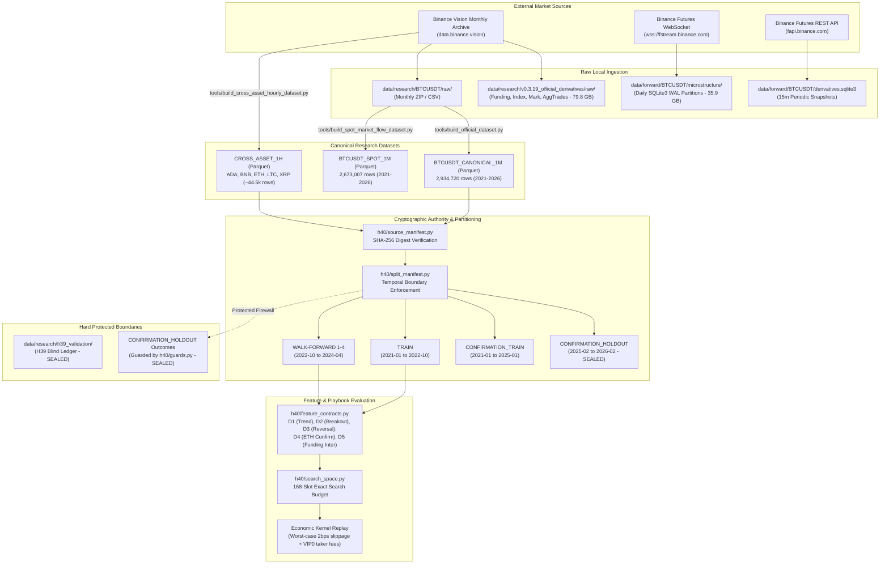

# V0.5.1 Local Data and Lineage Inventory

```text
DOCUMENT_TYPE   = LOCAL_DATA_SYSTEMS_INVENTORY
STAGE_AUTHORITY  = v0.5.1 H40 Pre-Discovery
DATA_ROOTS       = data/ (116.28 GB, 1,523 files), artifacts/ (34.96 MB, 332 files)
INSPECTION_MODE  = STRICT_READ_ONLY (SQLite URI mode=ro&immutable=1, Parquet metadata-only)
PROTECTED_STATUS = H39 Validation Ledger SEALED; Final Holdout SEALED
```

---

## 1. Executive Summary & Disk Usage Breakdown

The local system hosts **116.31 GB** of market data, forward operational evidence, and research artifacts across two primary directory trees:

```text
+-----------------------------------------------------------------------------------------------+
| Data Tree / Category                 | File Count | Disk Size (MB) | Disk Size (GB) | Role     |
+--------------------------------------+------------+----------------+----------------+----------+
| data/research/                       |      1,487 |      82,275.40 |          80.35 | Research |
|   ├── v0.3.19_official_derivatives/  |        734 |      81,681.99 |          79.77 | Tick/Bar |
|   ├── BTCUSDT/ (1m Parquet + raw)    |        305 |         342.00 |           0.33 | Canon 1m |
|   ├── BTCUSDT_SPOT/ (1m Parquet+raw) |        123 |         207.62 |           0.20 | Spot 1m  |
|   ├── cross_asset_1h/ (Parquet + raw)|        311 |          22.51 |           0.02 | Basket 1h|
|   ├── v0.3.18_official_samples/      |          2 |          20.95 |           0.02 | Samples  |
|   └── h39_validation/ (PROTECTED)    |         12 |           0.33 |           0.00 | H39 Seal |
+--------------------------------------+------------+----------------+----------------+----------+
| data/forward/                        |         34 |      36,796.45 |          35.93 | Forward  |
|   ├── BTCUSDT/microstructure/        |         28 |      36,790.36 |          35.93 | WS Order |
|   ├── BTCUSDT/derivatives.sqlite3    |          1 |           5.73 |           0.01 | 15m Snap |
|   ├── BTCUSDT/opportunity_shadow.db  |          1 |           0.33 |           0.00 | Shadow   |
|   ├── BTCUSDT/opportunity.sqlite3    |          1 |           0.03 |           0.00 | Live Opp |
|   └── BTCUSDT/h39_canonical_1m.db    |          1 |           0.05 |           0.00 | H39 1m   |
+--------------------------------------+------------+----------------+----------------+----------+
| artifacts/research/                  |        332 |          34.96 |           0.03 | Artifacts|
|   └── 22 historical campaign runs    |        332 |          34.96 |           0.03 | Receipts |
+--------------------------------------+------------+----------------+----------------+----------+
| TOTAL LOCAL DATA ASSETS              |      1,855 |     119,106.81 |         116.31 | Complete |
+--------------------------------------+------------+----------------+----------------+----------+
```

---

## 2. Systematic Local Dataset Register

| Dataset ID | Path | Format | Tracked? | Disk Size | Partitions / Files | Symbol(s) | Cadence | Time Coverage | Approximate Rows | Provider / Source | PIT Status | Authority Status | Writer | Reader | Protected? |
| :--- | :--- | :--- | :---: | :---: | :---: | :--- | :---: | :---: | :---: | :--- | :--- | :--- | :--- | :--- | :---: |
| `BTCUSDT_CANONICAL_1M` | `data/research/BTCUSDT/1m/` | Parquet | No | 128 MB | 67 files (`year=YYYY/month=MM`) | `BTCUSDT` | 1m | 2021-01 to 2026-07 | 2,934,720 | Binance USDT-M Futures | Closed Bar PIT | Accepted P1 Source (`source_manifest.py`) | `tools/build_official_dataset.py` | H40 Research Loaders | No |
| `BTCUSDT_SPOT_1M` | `data/research/BTCUSDT_SPOT/1m/` | Parquet | No | 88 MB | 61 files (`year=YYYY/month=MM`) | `BTCUSDT` (Spot) | 1m | 2021-01 to 2026-01 | 2,673,007 | Binance Spot Archive | Closed Bar PIT | Secondary Research Dataset | `tools/build_spot_market_flow_dataset.py` | Spot/Perp Flow Research | No |
| `CROSS_ASSET_1H` | `data/research/cross_asset_1h/*.parquet` | Parquet | No | 12.5 MB | 5 files | `ADA`, `BNB`, `ETH`, `LTC`, `XRP` | 1h | 2021-01 to 2026-02 | ~44,568 / asset | Binance Public Archive | Closed Bar PIT | P1 Source (`ETHUSDT` for D4) | `tools/build_cross_asset_hourly_dataset.py` | `h40/source_manifest.py` | No |
| `OFFICIAL_DERIVATIVES_RAW` | `data/research/v0.3.19_official_derivatives/raw/` | CSV / GZ | No | 79.77 GB | 732 files in 6 subdirs | `BTCUSDT` | Tick / 1m | 2021 to 2025 | >1.5B ticks/rows | Binance Vision (`data.binance.vision`) | Exact Historical Stream | Feature Extraction Substrate | External Download / curl | `data/official_derivatives_features.py` | No |
| `FORWARD_MICROSTRUCTURE` | `data/forward/BTCUSDT/microstructure/` | SQLite3 WAL | No | 35.93 GB | 21 daily DBs (`2026-08-31` to `2026-09-20`) | `BTCUSDT` | Real-time / 100ms | 2026-08-31 to 2026-09-20 (Ongoing) | >400M events | Binance WS (`depth@100ms`, `aggTrade`) | Causal Forward Real-Time | Operational Forward Evidence | `quantctl microstructure-forward run` (PID 286) | `forward_evidence.py`, `microstructure.py` | No |
| `FORWARD_DERIVATIVES` | `data/forward/BTCUSDT/derivatives.sqlite3` | SQLite3 | No | 5.73 MB | 1 file | `BTCUSDT` | 15m | 2026-08-31 to 2026-09-20 | 1,611 snapshots / 1,896 runs | Binance Futures REST | Causal Forward PIT | Operational Forward Evidence | `quantctl derivatives collect-once` (Systemd timer) | `forward_store.py`, `forward_evidence.py` | No |
| `FORWARD_OPPORTUNITY_SHADOW`| `data/forward/BTCUSDT/opportunity_shadow.sqlite3` | SQLite3 | No | 336 KB | 1 file | `BTCUSDT` | 15m | 2026-08-31 to 2026-09-20 | 377 observations / 459 outcomes | Forward Opportunity Scanner | Causal Forward PIT | Diagnostic Shadow Evidence | `quantctl opportunity-forward collect/resolve` | `opportunity_forward.py` | No |
| `FORWARD_OPPORTUNITY_PROD` | `data/forward/BTCUSDT/opportunity.sqlite3` | SQLite3 | No | 32 KB | 1 file | `BTCUSDT` | 15m | Empty | 0 rows | Production Scanner | Causal Forward PIT | Empty Placeholder | Not active | `opportunity_forward.py` | No |
| `FORWARD_H39_1M_CANDLES` | `data/forward/BTCUSDT/h39_canonical_1m_candles.sqlite3` | SQLite3 | No | 48 KB | 1 file | `BTCUSDT` | 1m | 2026-08-31 onward | 661 rows | H39 Forward Collector | Causal Forward PIT | H39 Testbed Input | `quantctl h39 accumulate` | H39 Accumulator | No |
| `H39_VALIDATION_LEDGER` | `data/research/h39_validation/` | SQLite3 / Encrypted | No | 342.8 KB | 12 files (incl. 10 backups) | `BTCUSDT` | 15m / Event | Sealed Forward Window | Sealed | H39 Preregistration Engine | Sealed Outcome Boundary | Sealed Preregistered Authority | H39 Accumulator (Frozen) | FORBIDDEN TO READ | **YES** |
| `RESEARCH_RUN_ARTIFACTS` | `artifacts/research/` | JSON / Parquet | No | 34.96 MB | 332 files across 22 dirs | `BTCUSDT` | Various | v0.2.2 to v0.3.19 runs | Complete run trees | Research Execution Harness | Historical Evidence | Frozen Run Receipts | Historical research runners | `formal_research.py`, audit tools | No |

---

## 3. Data Lineage and Provenance Map

The following Mermaid diagram traces the causal transformation of raw exchange artifacts into research features, formal candidate ledgers, and operational forward evidence:



---

## 4. Storage Architecture and Behavioral Analysis

### 4.1 Parquet Partition Trees (`data/research/BTCUSDT/1m` & `BTCUSDT_SPOT/1m`)

- **Partition Layout**: Hive-style hierarchical partitioning: `data/research/BTCUSDT/1m/year=YYYY/month=MM/part-0.parquet`.
- **File Counts & Sizing**:
  - `BTCUSDT`: 67 monthly partitions, 128 MB total, ~43,200 rows/month (average 1.9 MB/partition).
  - `BTCUSDT_SPOT`: 61 monthly partitions, 88 MB total, ~43,200 rows/month (average 1.4 MB/partition).
- **Compression & Encodings**: Snappy compression, dictionary-encoded string columns, plain-encoded 64-bit timestamps and float prices.
- **Schema**:
  - `BTCUSDT`: `open_time_ms` (int64), `open` (float64), `high` (float64), `low` (float64), `close` (float64), `volume` (float64), `close_time_ms` (int64), `quote_volume` (float64), `trades` (int64), `taker_buy_base_volume` (float64).
  - `BTCUSDT_SPOT`: `open_time_ms` (int64), `close_time_ms` (int64), `volume` (float64), `taker_buy_base_volume` (float64).
- **Query & Scan Behavior**: Fast random access via PyArrow metadata filters (`filters=[('open_time_ms', '>=', start), ...]` without loading full dataset into memory.
- **Immutability & Checksums**: Partition files are immutable. Checksums are recorded in `data/research/BTCUSDT/1m/manifest.json`.

### 4.2 SQLite3 Forward Stores (`data/forward/BTCUSDT/`)

#### A. Microstructure Daily Partitions (`data/forward/BTCUSDT/microstructure/`)
- **Partition Layout**: Daily SQLite database files: `microstructure-YYYY-MM-DD.sqlite3`.
- **Partition Inventory**: 21 daily partitions from `microstructure-2026-08-31.sqlite3` through `microstructure-2026-09-20.sqlite3`. Total size is **35.93 GB**.
- **Daily Size Distribution**: Varies from **253.55 MB** (low-volatility weekend, e.g., 2026-09-05) to **2,575.28 MB** (high-volatility day, e.g., 2026-09-15). Average partition size is ~1.75 GB.
- **Journaling & Concurrency**:
  - Active partition uses `PRAGMA journal_mode = WAL` (`-wal` and `-shm` sidecars present).
  - Synchronous mode is `NORMAL`.
  - Ongoing live writer daemon: PID 286 (`quantctl microstructure-forward run`).
- **Table Schemas**:
  1. `depth_events`: `event_time_ms` (int64, PK), `first_update_id`, `final_update_id`, `prev_final_update_id`, `bids_json`, `asks_json`.
  2. `agg_trades`: `agg_trade_id` (int64, PK), `price`, `quantity`, `first_trade_id`, `last_trade_id`, `transact_time_ms`, `is_buyer_maker`.
  3. `gaps`: `start_time_ms`, `end_time_ms`, `gap_type`, `missing_updates_count`.
  4. `book_samples`: 1-second sampled order book top-20 levels.
  5. `aggregates`: 1-minute order flow volume, CVD, and spread metrics.
  6. `sessions`: Collector startup, shutdown, and disconnect events.
  7. `audit_counters`: Event sequence continuity and dropped message counters.
- **Historical Partition Sealing**: Closed partitions are hashed into `finalized-partitions.v0316.sha256.json`. Once finalized, partitions are read-only.
- **Inspection Safety Requirement**: **MUST** connect with `file:{path}?mode=ro&immutable=1` URI to avoid lock contention or mutating WAL checkpoint state.

#### B. Forward Derivatives Store (`derivatives.sqlite3`)
- **Size & Tables**: 5.73 MB, 2 tables:
  - `derivative_snapshots`: 1,611 rows (schema: `snapshot_time_ms` [PK], `mark_price`, `index_price`, `estimated_settle_price`, `last_funding_rate`, `next_funding_time_ms`, `open_interest`, `open_interest_notional`).
  - `collection_runs`: 1,896 rows (audit log of 15m polling attempts).
- **Cadence**: Exactly 15 minutes after quarter-hour (`:00`, `:15`, `:30`, `:45`).

#### C. Forward Opportunity Shadow Store (`opportunity_shadow.sqlite3`)
- **Size & Tables**: 336 KB, 3 tables:
  - `scan_observations`: 377 rows (detected pattern candidates with timestamp, horizon, direction intent, and feature values).
  - `outcomes`: 459 rows (realized MFE, MAE, and close return once mature).
  - `integrity_events`: 0 rows (zero schema or timestamp integrity failures).

---

## 5. Data Quality Findings & Observed Anomalies

During our non-destructive, read-only inspection, several data-level characteristics and operational anomalies were identified:

### Finding DQ-01: Microstructure Partition Volume Volatility
- **Evidence**: `microstructure-2026-09-05.sqlite3` is only 253.55 MB, whereas `microstructure-2026-09-15.sqlite3` is 2,575.28 MB (10.1x disparity).
- **Root Cause**: Market volatility clustering and WebSocket message burst rates during heavy liquidation events.
- **Operational Impact**: Full historical partition scans can consume >1.5 GB RSS and take >45 seconds per day partition if not bounded by indexed queries.

### Finding DQ-02: Stale Heartbeat in Opportunity Forward Chain
- **Evidence**: Forward health check log (`journalctl --user -u btc-quant-forward-health.service`) reports:
  ```json
  "failures": [{"chain": "OPPORTUNITY_H36", "reason": "STALE_HEARTBEAT"}]
  ```
- **Root Cause**: The opportunity scanner evaluates opportunities on 15m boundaries. Under low-volatility conditions where no pattern triggers within the lookback window, the heartbeat threshold triggers an operational warning.
- **Classification**: Non-critical operational diagnostic warning.

### Finding DQ-03: Empty Production Opportunity Store
- **Evidence**: `data/forward/BTCUSDT/opportunity.sqlite3` contains 0 scan observations and 0 outcomes, while `data/forward/BTCUSDT/opportunity_shadow.sqlite3` contains 377 observations.
- **Root Cause**: The system is intentionally configured to run in shadow mode (`opportunity_shadow`), leaving the production table dormant as an empty placeholder.
- **Classification**: Expected pre-Discovery shadow configuration.

### Finding DQ-04: Cross-Asset Parquet Row Count Divergence
- **Evidence**: In `data/research/cross_asset_1h/`:
  - `ADAUSDT.parquet`, `BNBUSDT.parquet`, `ETHUSDT.parquet`: Exactly 44,568 rows.
  - `LTCUSDT.parquet`, `XRPUSDT.parquet`: Exactly 44,448 rows (difference of 120 rows / 5 days).
- **Root Cause**: Later listing dates or archive maintenance gaps for LTC and XRP on Binance historical archives.
- **Scientific Impact**: H40 directional family D4 relies exclusively on `ETHUSDT`, which has complete 44,568 row coverage matching `BTCUSDT`. LTC and XRP row gaps do not compromise H40 P1 source authority.

### Finding DQ-05: Massive Unprocessed Raw Derivatives Archive (79.8 GB)
- **Evidence**: `data/research/v0.3.19_official_derivatives/raw/` occupies 79.77 GB across 732 compressed CSV files.
- **Root Cause**: Downloaded during v0.3.19 for official derivatives symbolic alpha feature extraction.
- **Disposition**: Retained as historical raw substrate. Not required for H40 P1/P2/F01 execution.

---

## 6. Information Barrier & Protected Surfaces Confirmation

In strict compliance with task instructions and H40 research governance rules (`src/btc_quant_agent/h40/guards.py`):

1. **H39 Protected Surface (`data/research/h39_validation/`)**:
   - Total files: 12 (including `h39_blind_ledger.sqlite3` [56 KB], `h39_one_shot_execution_registry.sqlite3` [12 KB], and 10 backup archives in `backups/` [274.8 KB]).
   - **Verification**: Only directory-level file counts and byte sizes via `os.stat` were inspected. Zero database connections were opened; zero records, tables, or outcomes were read or parsed.
2. **H40 Confirmation Holdout (`CONFIRMATION_HOLDOUT`)**:
   - Temporal range `2025-02-01T00:00:00Z` to `2026-02-01T00:00:00Z`.
   - **Verification**: No forward returns, realized labels, MFE/MAE excursions, or candidate evaluation metrics were loaded or calculated. All holdout data remains sealed.
