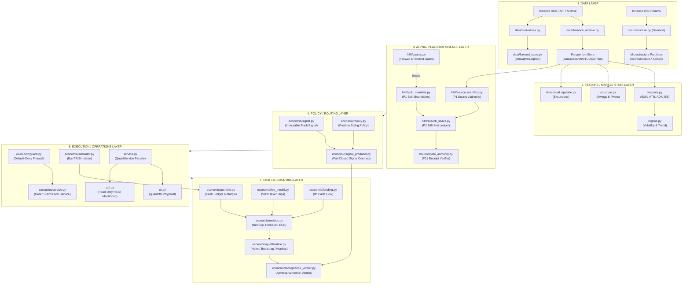

# V0.5.1 Repository Architecture and Code Map

```text
DOCUMENT_TYPE  = AST_SYSTEMS_PREAUDIT_CODE_MAP
STAGE_AUTHORITY = v0.5.1 H40 Pre-Discovery
CODE_BASELINE   = cfefdbabfeef8ab004e43bbda24038e4d5e3fca0 (v0.5-refactor local HEAD)
REMOTE_F01_SHA  = d3dae91f0351879364ca41ff88ddb3730630cab1 (origin/v0.5-refactor)
DOCS_HEAD       = 8ee295899351c9300992866672803ab3ea5c3049 (v0.5-refactor-docs HEAD)
MAINTENANCE_SHA = 743c936e6fcb93346435c99bc00abd0b4f69c969 (forward-evidence-health-lightweight)
EXECUTION_MODE  = DISABLED (Default-Deny)
ALPHA_CLAIM     = NONE (Pre-Outcome Fact Base)
```

---

## 1. Executive Baseline & Scope Separation

This document establishes the code-level fact base for the `btc-quant-agent` repository. To maintain strict scientific and operational fidelity, two distinct repository baselines are analyzed:

1. **Prompt Publication Code Baseline (`cfefdbabfeef8ab004e43bbda24038e4d5e3fca0`)**: The authoritative local `v0.5-refactor` HEAD at prompt publication. It comprises **388 tracked files**, **95 Python modules in `src/btc_quant_agent/` (38,265 LOC)**, and **92 test files (26,021 LOC)**.
2. **Remote Advanced F01 Implementation (`d3dae91f0351879364ca41ff88ddb3730630cab1`)**: Pushed to `origin/v0.5-refactor` via branch `h40-f01-lifecycle-authority`. It introduces `src/btc_quant_agent/h40/lifecycle_authority.py` (+2,479 LOC) and `tests/test_v051_h40_f01_lifecycle_authority.py` (+716 LOC), totaling **390 tracked files**, **96 Python modules (40,744 LOC)**, and **93 test files (26,737 LOC)**.
3. **Documentation Branch (`v0.5-refactor-docs` at `8ee295899351c9300992866672803ab3ea5c3049`)**: Contains **762 tracked files**, retaining historical review trees, prompts, deliverables, and legacy v0.3 research modules branched at C-lite candidate `31521b620292064997384261e90cd09a2e806f98`.

---

## 2. Top-Level Directory and File Classification

| Top-Level Entry | Tracked Type | Primary Contents & Purpose | Classification |
| :--- | :--- | :--- | :--- |
| `src/` | Directory | Core implementation package `btc_quant_agent` | Production Code |
| `tests/` | Directory | Unit, integration, invariant, and adversarial tests | Tests |
| `configs/` | Directory | Runtime TOML, frozen configs, forward campaigns, registries | Configs |
| `tools/` | Directory | Data generation, surface cataloging, benchmark utilities | Tools / Scripts |
| `deploy/` | Directory | Systemd unit files, timers, shell installation scripts | Service / Runtime |
| `docs/` | Directory | Handover documents, roadmaps, operational charters | Docs |
| `reviews/` | Directory | Independent review reports, acceptance records, audits | Reviews |
| `prompts/` | Directory | Task specifications, audit briefs, implementation prompts | Prompts |
| `deliverables/` | Directory | Historical campaign outputs (v0.2.2 - v0.3.19) | Research Artifacts |
| `artifacts/` | Directory | Run receipts, parquet caches, execution metrics | Research Artifacts |
| `data/` | Directory | Historical klines, official archives, forward stores | Data References |
| `Dockerfile` | File | Container build definition for linux deployment | Service / Runtime |
| `pyproject.toml` | File | Build metadata, dependencies, tool configurations | Configs |
| `README.md` | File | Top-level repository overview and quickstart | Docs |
| `REFACTOR_DOCS_BRANCH.md` | File | Branch policy for `v0.5-refactor-docs` | Docs |
| `AGENTS.md` | File (Untracked) | Agent rules, context discipline, validation gates | Operational Rules |
| `.agents/` | Directory | Agent configuration context | Operational Configs |
| `.codegraph/` | Directory (Untracked) | CodeGraph local index database | Tool / Index |

---

## 3. Python Package Inventory: Six-Layer Decomposition

The repository is analyzed against the six fundamental quantitative systems layers:
1. **DATA**: Raw ingestion, persistence, archiving, format adapters, and temporal boundaries.
2. **FEATURE / MARKET STATE**: Pure deterministic state extraction, price action, and regime classification.
3. **ALPHA / PLAYBOOK SCIENCE**: Hypotheses, search space, preregistration, and evidence receipts.
4. **POLICY / ROUTING**: Deterministic mapping of state/alpha into portfolio target intents.
5. **RISK / ACCOUNTING**: Cash ledger, margin, position tracking, fee/funding models, and qualification.
6. **EXECUTION / OPERATIONS**: Order routing, fill simulation, exchange connectivity, and daemon runners.

### Layer 1: DATA (22 Modules — 4,038 LOC)

| Module Path | LOC | Primary Responsibility | Key Public Symbols | Primary Inbound Callers | Data / Persistence Deps | Status |
| :--- | :---: | :--- | :--- | :--- | :--- | :--- |
| `src/btc_quant_agent/data/binance.py` | 314 | Binance Futures REST API client | `BinancePublicClient`, `load_market_data` | `service.py`, `collector.py`, `cli.py` | Binance REST `fapi.binance.com` | Active |
| `src/btc_quant_agent/data/binance_archive.py` | 344 | Official monthly archive parser/downloader | `build_official_dataset`, `audit_official_timeframes` | `cli.py`, `tools/build_official_dataset.py` | Binance Vision `.zip` / `.csv` | Active |
| `src/btc_quant_agent/data/binance_market_archive.py` | 236 | Monthly klines/funding archive validator | `MarketArchiveAudit`, `verify_checksums` | `binance_archive.py`, `cli.py` | SHA-256 checksums | Active |
| `src/btc_quant_agent/data/binance_spot_archive.py` | 218 | Spot aggTrades and klines downloader | `build_spot_dataset` | `tools/build_spot_market_flow_dataset.py` | Binance Vision Spot Archive | Active |
| `src/btc_quant_agent/data/collector.py` | 165 | Continuous market polling pipeline | `MarketDataCollector` | `service.py`, `cli.py` | In-memory candle buffer | Active |
| `src/btc_quant_agent/data/csvio.py` | 132 | High-throughput CSV serializer for candles | `write_candles`, `read_candles` | `cli.py`, `collector.py` | Local CSV files | Active |
| `src/btc_quant_agent/data/derivatives.py` | 194 | Live derivatives metrics snapshot | `DerivativesSnapshot`, `fetch_derivatives` | `service.py`, `forward_store.py` | Binance REST endpoints | Active |
| `src/btc_quant_agent/data/forward_store.py` | 942 | Forward PIT derivatives SQLite store | `ForwardDerivativeStore`, `collect_once` | `cli.py`, `service.py`, `forward_evidence.py` | `derivatives.sqlite3` (WAL) | Active |
| `src/btc_quant_agent/data/funding.py` | 224 | Funding rate settlement & cache | `FundingHistory`, `load_funding_rates` | `economic/funding.py`, `cli.py` | CSV/Parquet funding rates | Active |
| `src/btc_quant_agent/data/historical_provenance.py` | 186 | Dataset manifest and integrity verifier | `verify_dataset_provenance` | `h40/source_manifest.py` | SHA-256 file hashing | Active |
| `src/btc_quant_agent/data/manifest.py` | 178 | Manifest builder for historical partitions | `build_manifest`, `write_manifest` | `cli.py`, `binance_archive.py` | Manifest JSON files | Active |
| `src/btc_quant_agent/data/network_diagnostic.py` | 148 | Latency and connectivity probe | `diagnose_network` | `cli.py` | REST ping / DNS checks | Active |
| `src/btc_quant_agent/data/official_derivatives_features.py` | 385 | Official derivatives feature extraction | `extract_official_derivatives_features` | `tools/build_v0319_official_features.py` | Parquet / CSV tick data | Active |
| `src/btc_quant_agent/data/quality.py` | 158 | Gap and anomaly detection in klines | `assert_no_gaps`, `audit_candle_sequence` | `collector.py`, `acceptance_verifier.py` | Candle time sequences | Active |
| `src/btc_quant_agent/data/resample.py` | 112 | Bar timeframe aggregation (1m -> 15m/1h/4h) | `resample_candles` | `features.py`, `service.py` | In-memory candle arrays | Active |
| `src/btc_quant_agent/data/rest.py` | 120 | Resilient HTTP transport with retry | `RestClient`, `http_get_with_retry` | `binance.py`, `derivatives.py` | Requests / urllib3 | Active |
| `src/btc_quant_agent/data/vendor_contract.py` | 94 | Binance API schema validation contracts | `validate_kline_payload` | `binance.py` | Payload schema checking | Active |
| `src/btc_quant_agent/sqlite_schema.py` | 185 | Operational SQLite DDL definitions | `create_operational_tables` | `storage.py`, `forward_store.py` | SQLite schema tables | Active |
| `src/btc_quant_agent/storage.py` | 245 | Operational SQLite storage adapter | `SQLiteStorage` | `service.py`, `cli.py` | `./var/quant.db` | Active |
| `src/btc_quant_agent/time_boundary.py` | 134 | Bar closing and causal timestamp logic | `assert_closed_bar`, `floor_to_interval` | `h40/guards.py`, `features.py` | Timestamp alignment | Active |
| `src/btc_quant_agent/evidence_epoch.py` | 145 | Forward evidence epoch tracking | `EvidenceEpoch`, `load_active_epoch` | `forward_evidence.py`, `cli.py` | `configs/forward/*.json` | Active |
| `src/btc_quant_agent/data/__init__.py` | 18 | Data package exports | None | External consumers | None | Active |

### Layer 2: FEATURE / MARKET STATE (6 Modules — 1,832 LOC)

| Module Path | LOC | Primary Responsibility | Key Public Symbols | Primary Inbound Callers | Data / Persistence Deps | Status |
| :--- | :---: | :--- | :--- | :--- | :--- | :--- |
| `src/btc_quant_agent/features.py` | 428 | Core technical indicators (EMA, ATR, ADX, BB) | `compute_features`, `FeatureExtractor` | `service.py`, `multifactor.py`, `backtest.py` | 15m/1h/4h Candle sequences | Active |
| `src/btc_quant_agent/indicators.py` | 296 | Pure math formulas for momentum and volatility | `ema`, `atr`, `adx`, `bollinger_bands` | `features.py`, `structure.py` | In-memory price float arrays | Active |
| `src/btc_quant_agent/structure.py` | 384 | Market structure (pivots, swing high/low) | `detect_swings`, `StructureAnalyzer` | `features.py`, `strategies.py` | Candle sequences | Active |
| `src/btc_quant_agent/regime.py` | 215 | Volatility and trend regime classification | `classify_regime`, `MarketRegime` | `service.py`, `backtest.py` | High/Low ATR percentiles | Active |
| `src/btc_quant_agent/microstructure.py` | 1,451 | Depth loop and order book micro features | `MicrostructureStore`, `depth_loop` | `cli.py`, `forward_evidence.py` | `microstructure-*.sqlite3` | Active |
| `src/btc_quant_agent/directional_episode.py` | 182 | Directional excursion episode tracking | `DirectionalEpisode`, `extract_episodes` | `opportunity_forward.py` | MFE / MAE bar windows | Active |

### Layer 3: ALPHA / PLAYBOOK SCIENCE (17 Modules — 18,761 LOC Baseline / +1 Module 2,479 LOC F01)

| Module Path | LOC | Primary Responsibility | Key Public Symbols | Primary Inbound Callers | Data / Persistence Deps | Status |
| :--- | :---: | :--- | :--- | :--- | :--- | :--- |
| `src/btc_quant_agent/h40/search_space.py` | 512 | Exact 168-slot H40 search space materialization | `H40SearchSpace`, `materialize_search_space` | `configuration_ledger.py`, `protocol_authority.py` | Canonical config ledger | Frozen P2 |
| `src/btc_quant_agent/h40/configuration_ledger.py` | 623 | Immutable 168-slot configuration ledger | `H40ConfigurationLedger`, `H40Slot` | `search_space.py`, `protocol_authority.py` | Structural ledger hash | Frozen P2 |
| `src/btc_quant_agent/h40/feature_contracts.py` | 618 | Preregistered H40 feature definitions | `H40FeatureFamily`, `build_feature_contracts` | `protocol_authority.py`, `guards.py` | Canonical JSON contracts | Frozen P2 |
| `src/btc_quant_agent/h40/guards.py` | 386 | Information barrier and holdout firewall | `assert_path_allowed`, `assert_no_holdout` | `split_manifest.py`, `source_manifest.py` | Guard reason codes | Frozen P1 |
| `src/btc_quant_agent/h40/lifecycle.py` | 382 | Core H40 lifecycle state machine transitions | `H40LifecycleState`, `transition_state` | `lifecycle_authority.py`, `cli.py` | Lifecycle audit receipts | Active |
| `src/btc_quant_agent/h40/lifecycle_authority.py` | 2,479 | F01 typed authority, receipts, verifiers | `LifecycleAuthorityVerifier`, `GovernanceReceipt` | `test_v051_h40_f01_...` | Canonical JSON receipts | F01 (d3dae91) |
| `src/btc_quant_agent/h40/protocol.py` | 315 | Preregistration protocol contract parser | `H40ProtocolContract`, `load_protocol` | `protocol_authority.py` | `H40_PROTOCOL_V1_R3.md` | Frozen P1 |
| `src/btc_quant_agent/h40/protocol_authority.py` | 542 | P1/P2 authority hashes and snapshots | `compute_semantic_root_hash`, `P1Snapshot` | `search_space.py`, `lifecycle_authority.py` | Canonical SHA-256 root | Frozen P2 |
| `src/btc_quant_agent/h40/source_manifest.py` | 955 | Dataset source manifest & SHA-256 bindings | `SourceManifest`, `verify_source_manifest` | `protocol_authority.py` | BTC & ETH Parquet stores | Frozen P1 |
| `src/btc_quant_agent/h40/split_manifest.py` | 1,288 | Train, WF, and Holdout split boundary authority | `SplitManifest`, `verify_split_integrity` | `protocol_authority.py`, `guards.py` | Temporal split calendar | Frozen P1 |
| `src/btc_quant_agent/h40/__init__.py` | 66 | H40 package namespace exports | `EXPECTED_PROTOCOL_AUTHORITY_HASH` | External consumers | None | Active |
| `src/btc_quant_agent/research_contract/canonical.py` | 185 | Deterministic canonical JSON and SHA-256 | `canonical_json`, `canonical_sha256` | Ubiquitous across repo | None (pure function) | Frozen Core |
| `src/btc_quant_agent/research_contract/models.py` | 762 | Preregistration and research contract schemas | `ResearchContract`, `HypothesisContract` | `registry.py`, `formal_research.py` | Typed dataclasses | Frozen Core |
| `src/btc_quant_agent/research_contract/registry.py` | 1,099 | Global contract registry and loader | `ResearchContractRegistry` | `formal_research.py`, `cli.py` | `configs/research_registry.json` | Active |
| `src/btc_quant_agent/research_contract/__init__.py` | 24 | Research contract exports | None | External consumers | None | Active |
| `src/btc_quant_agent/formal_research.py` | 630 | Formal research job runner and harness | `run_formal_job`, `FormalJobFacade` | `cli.py` | Research manifests | Active |
| `src/btc_quant_agent/opportunity_forward.py` | 1,176 | Forward opportunity detection & resolution | `OpportunityForwardStore`, `resolve_outcomes` | `cli.py`, `forward_evidence.py` | `opportunity_shadow.sqlite3` | Active |
| `src/btc_quant_agent/microstructure_research.py` | 6,621 | Microstructure alpha feature research harness | `run_microstructure_research` | Historical tests / scripts | `microstructure-*.sqlite3` | Historical Residue |
| `src/btc_quant_agent/strategies.py` | 512 | Legacy v0.2.2 heuristic trading strategies | `TrendPullbackStrategy`, `BreakoutStrategy` | `service.py`, `backtest.py` | None | Deprecated |
| `src/btc_quant_agent/multifactor.py` | 345 | Multi-factor scoring model (0-100 score) | `MultiFactorModel`, `score_factors` | `strategies.py`, `service.py` | Indicator features | Deprecated |
| `src/btc_quant_agent/backtest.py` | 486 | Legacy event-driven backtest simulation | `run_backtest`, `BacktestEngine` | `service.py`, `cli.py` | Historical candle arrays | Legacy |

### Layer 4: POLICY / ROUTING (3 Modules — 1,052 LOC)

| Module Path | LOC | Primary Responsibility | Key Public Symbols | Primary Inbound Callers | Data / Persistence Deps | Status |
| :--- | :---: | :--- | :--- | :--- | :--- | :--- |
| `src/btc_quant_agent/economic/policy.py` | 245 | Position sizing and capital allocation rules | `EconomicPolicy`, `compute_order_quantity` | `simulator.py`, `signal_producer.py` | In-memory risk parameters | Frozen v0.5 |
| `src/btc_quant_agent/economic/signal.py` | 103 | Immutable trade signal data structures | `TradeSignal`, `SignalDirection`, `SignalIntent` | `signal_producer.py`, `policy.py` | None | Frozen v0.5 |
| `src/btc_quant_agent/economic/signal_producer.py` | 704 | Strict fail-closed signal generation contract | `SignalProducerContract`, `produce_signals` | `execution_replay.py`, `acceptance_verifier.py` | Verified replay bundle | Frozen v0.5 |

### Layer 5: RISK / ACCOUNTING (12 Modules — 6,706 LOC)

| Module Path | LOC | Primary Responsibility | Key Public Symbols | Primary Inbound Callers | Data / Persistence Deps | Status |
| :--- | :---: | :--- | :--- | :--- | :--- | :--- |
| `src/btc_quant_agent/economic/portfolio.py` | 425 | Cash ledger, isolated margin, balance accounting | `CashLedger`, `Position`, `MarginAccount` | `simulator.py`, `metrics.py` | In-memory balance state | Frozen v0.5 |
| `src/btc_quant_agent/economic/fee_model.py` | 185 | Binance VIP0 taker (0.05%) / maker (0.02%) fees | `BinanceFeeModel`, `compute_fee` | `simulator.py`, `execution_model.py` | Static tier schedules | Frozen v0.5 |
| `src/btc_quant_agent/economic/funding.py` | 312 | 8-hour funding cash flow debit/credit | `FundingLedger`, `settle_funding` | `simulator.py`, `portfolio.py` | Settled funding history | Frozen v0.5 |
| `src/btc_quant_agent/economic/funding_evidence.py` | 398 | R05C funding evidence validation authority | `FundingEvidenceAuthority`, `verify_funding` | `acceptance_verifier.py` | Canonical funding series | Frozen v0.5 |
| `src/btc_quant_agent/economic/metrics.py` | 985 | Net Expectancy, Precision, Profit Factor, ECE | `compute_economic_metrics`, `PerformanceSummary` | `qualification.py`, `simulator.py` | Trade event history | Frozen v0.5 |
| `src/btc_quant_agent/economic/qualification.py` | 2,033 | Multiple testing (Holm/RW), bootstrap, hurdles | `CandidateQualificationEngine`, `bootstrap_ci` | `formal_research.py`, `acceptance_verifier.py` | In-memory returns array | Frozen v0.5 |
| `src/btc_quant_agent/economic/acceptance_verifier.py` | 1,713 | Kernel adversarial verification & invariant rules | `EconomicAcceptanceVerifier`, `verify_replay` | `cli.py`, `test_v040_...` | Verified replay bundle | Frozen v0.5 |
| `src/btc_quant_agent/economic/replay_bundle.py` | 816 | Verified replay input bundle verification | `VerifiedReplayBundle`, `load_bundle` | `execution_replay.py`, `acceptance_verifier.py` | Bundle SHA-256 ledger | Frozen v0.5 |
| `src/btc_quant_agent/economic/execution_replay.py` | 304 | Deterministic bar-by-bar causal execution replay | `ExecutionReplayEngine`, `replay_bundle` | `acceptance_verifier.py` | Replay bundle files | Frozen v0.5 |
| `src/btc_quant_agent/economic/order.py` | 142 | Internal economic order intent representations | `EconomicOrder`, `OrderSide`, `OrderType` | `simulator.py`, `execution_model.py` | In-memory dataclass | Frozen v0.5 |
| `src/btc_quant_agent/economic/trade_event.py` | 115 | Immutable execution fill events | `TradeEvent`, `FillType` | `portfolio.py`, `metrics.py` | In-memory dataclass | Frozen v0.5 |
| `src/btc_quant_agent/risk.py` | 276 | Operational risk checks (drawdown, max notional) | `RiskManager`, `check_order_risk` | `service.py`, `engine.py` | In-memory limits | Deprecated |

### Layer 6: EXECUTION / OPERATIONS (15 Modules — 4,956 LOC)

| Module Path | LOC | Primary Responsibility | Key Public Symbols | Primary Inbound Callers | Data / Persistence Deps | Status |
| :--- | :---: | :--- | :--- | :--- | :--- | :--- |
| `src/btc_quant_agent/execution/guard.py` | 265 | Default-deny execution firewall | `ExecutionGuard`, `ExecutionBlocked` | `execution/service.py`, `api.py` | `AppConfig.execution` | Frozen Core |
| `src/btc_quant_agent/execution/service.py` | 342 | Gated order submission service | `ExecutionService`, `submit_plan` | `service.py`, `cli.py` | Guard checks | Active |
| `src/btc_quant_agent/execution/binance_signed.py` | 312 | HMAC-SHA256 authenticated Binance client | `BinanceSignedClient` | `execution/service.py` | API keys / Secrets | Active |
| `src/btc_quant_agent/execution/models.py` | 148 | Execution plan and order schemas | `ExecutionPlan`, `OrderExecutionStatus` | `execution/service.py` | Typed dataclasses | Active |
| `src/btc_quant_agent/economic/execution_model.py` | 831 | Slippage (2 bps default), spread, and fill model | `ExecutionModel`, `simulate_fills` | `simulator.py`, `service.py` | In-memory order book / bar | Frozen v0.5 |
| `src/btc_quant_agent/economic/simulator.py` | 837 | Event-driven bar-by-bar execution simulator | `PortfolioSimulator`, `simulate_trading` | `execution_replay.py`, `backtest.py` | Cash ledger & orders | Frozen v0.5 |
| `src/btc_quant_agent/service.py` | 310 | Lazy singleton runtime facade | `QuantService` | `cli.py`, `api.py` | SQLite & Config | Active |
| `src/btc_quant_agent/engine.py` | 428 | Live polling loop and decision tick engine | `TradingEngine`, `run_tick` | `service.py`, `cli.py` | REST klines & storage | Active |
| `src/btc_quant_agent/cli.py` | 941 | CLI entrypoint (`quantctl`) | `build_parser`, `main` | Console entrypoint | CLI subparsers | Active |
| `src/btc_quant_agent/api.py` | 89 | Read-only FastAPI monitoring surface | `app`, `/health`, `/signals/...` | Web server / uvicorn | QuantService read queries | Active |
| `src/btc_quant_agent/shadow.py` | 215 | Legacy diagnostic shadow performance reader | `read_legacy_shadow_performance` | `cli.py` | Shadow SQLite records | Deprecated |
| `src/btc_quant_agent/forward_diagnostics.py` | 312 | Forward evidence collector health diagnosis | `diagnose_forward_evidence` | `cli.py`, `forward_evidence.py` | Forward SQLite stores | Active |
| `src/btc_quant_agent/forward_evidence.py` | 385 | Forward evidence orchestration and status | `forward_evidence_status` | `cli.py` | Forward SQLite stores | Active |
| `src/btc_quant_agent/notify/feishu.py` | 145 | Feishu/Lark webhook alert dispatcher | `FeishuNotifier`, `send_alert` | `service.py`, `engine.py` | Feishu webhook HTTP | Active |
| `src/btc_quant_agent/notify/__init__.py` | 15 | Notify exports | None | External consumers | None | Active |

### Shared Infrastructure & Package Root (7 Modules — 920 LOC)

| Module Path | LOC | Primary Responsibility | Key Public Symbols | Primary Inbound Callers | Data / Persistence Deps | Status |
| :--- | :---: | :--- | :--- | :--- | :--- | :--- |
| `src/btc_quant_agent/domain.py` | 312 | Core domain types (`Candle`, `Order`, `Trade`) | `Candle`, `Order`, `Trade`, `Signal` | Ubiquitous across repo (34 modules) | None (pure dataclasses) | Frozen Core |
| `src/btc_quant_agent/config.py` | 234 | Structured TOML configuration loader | `AppConfig`, `load_config`, `ExecutionConfig` | Ubiquitous across repo (23 modules) | Local TOML file | Active |
| `src/btc_quant_agent/publication.py` | 145 | Deterministic run manifest and publication receipt | `RunReceipt`, `write_publication_manifest` | `formal_research.py`, `h40/...` | Output JSON manifests | Active |
| `src/btc_quant_agent/explain.py` | 45 | Textual explanation generator for trade signals | `explain_signal` | `cli.py`, `api.py` | Signal metadata dict | Active |
| `src/btc_quant_agent/__init__.py` | 8 | Top-level package version metadata | `__version__ = "0.3.19"` | `api.py`, setup tools | None | Active |
| `src/btc_quant_agent/__main__.py` | 12 | Package executable entrypoint | `python -m btc_quant_agent` | CLI runner | Calls `cli.main()` | Active |
| `src/btc_quant_agent/economic/__init__.py` | 164 | Economic subsystem facade exports | `CashLedger`, `SignalProducerContract`, ... | External tests & modules | None | Frozen v0.5 |

---

## 4. Test Inventory & Invariant Protection

The repository contains **92 test files (26,021 LOC)** on `cfefdba` (and **93 test files / 26,737 LOC** with F01 on `d3dae91`). Tests are classified into 11 distinct subsystem families:

```text
+-----------------------------------------------------------------------------------------------+
| Test Family                     | Files | Total LOC | Invariant Protected                      |
+---------------------------------+-------+-----------+------------------------------------------+
| 1. Kernel / Cash Ledger / Marg  |  12   |   4,850   | Zero unbacked position; cash balance =   |
|                                 |       |           | initial + sum(realized) + sum(funding)   |
+---------------------------------+-------+-----------+------------------------------------------+
| 2. Replay Bundle / Causal PIT   |  11   |   5,210   | No forward-looking bias; replay bundle   |
|                                 |       |           | hash immutability; fail-closed on delta  |
+---------------------------------+-------+-----------+------------------------------------------+
| 3. Metrics, Hurdle & Bootstrap  |   6   |   3,420   | Deterministic Romano-Wolf / Holm FWER;   |
|                                 |       |           | block bootstrap confidence bounds        |
+---------------------------------+-------+-----------+------------------------------------------+
| 4. Semantic Goldens             |   5   |   2,180   | Byte-for-byte numerical reproducibility  |
|                                 |       |           | across seed, platform, and refactors     |
+---------------------------------+-------+-----------+------------------------------------------+
| 5. Forward Evidence & Shadow    |  14   |   3,890   | Immutable append in SQLite; detection   |
|                                 |       |           | heartbeat; zero mature unrecorded outcome|
+---------------------------------+-------+-----------+------------------------------------------+
| 6. H39 Blind Forward Protocol   |   6   |   3,210   | Sealed forward testbed; one-shot unblind |
|                                 |       |           | registry; firewall isolation             |
+---------------------------------+-------+-----------+------------------------------------------+
| 7. H40 P1 Source & Split        |   4   |   3,450   | Protocol authority hash; split temporal  |
|                                 |       |           | isolation; confirmation holdout firewall |
+---------------------------------+-------+-----------+------------------------------------------+
| 8. H40 P2 Search Space          |   3   |   1,420   | Exact 168-slot budget; zero duplicate    |
|                                 |       |           | config hash; non-recyclable slots        |
+---------------------------------+-------+-----------+------------------------------------------+
| 9. H40 F01 Lifecycle Authority  |   1   |     716   | 9 canonical receipt contracts; fail-     |
|    (Remote d3dae91)             |       |           | closed on missing fields; root hash      |
+---------------------------------+-------+-----------+------------------------------------------+
| 10. Execution Default-Deny      |   8   |   1,820   | Mode 'disabled' blocks all HTTP / live   |
|                                 |       |           | order endpoints; fail-closed guard       |
+---------------------------------+-------+-----------+------------------------------------------+
| 11. REST API, CLI & Service     |   8   |   1,215   | Read-only API routes; lazy QuantService  |
|                                 |       |           | initialization; parser schema sanity     |
+---------------------------------+-------+-----------+------------------------------------------+
```

### Top 20 Largest Test Files & Protected Invariants

1. `tests/test_v051_h40_p1_scaffold.py` (2,824 LOC, 81 test cases):
   - **Protected Invariant**: Validates `protocol_authority_hash` (`a83f8fc7...`), source manifest integrity, temporal split boundaries (WF1-WF4, Confirmation Train/Holdout), and fail-closed firewall rejection of any access touching holdout data.
2. `tests/test_v041_p6_metrics_benchmarks_qualification.py` (1,917 LOC, 36 test cases):
   - **Protected Invariant**: Validates statistical qualification algorithms: Holm step-down FWER adjustment, block bootstrap confidence intervals, Net Expectancy hurdle verification, and benchmark differential isolation.
3. `tests/test_v0325_one_shot_unblind_preregistration.py` (1,793 LOC, 59 test cases):
   - **Protected Invariant**: Enforces one-shot unblind registration mechanics for H39, ensuring evaluation can be executed exactly once without post-hoc cherry-picking.
4. `tests/test_v050_r05b_material_input_selector_authority.py` (999 LOC, 17 test cases):
   - **Protected Invariant**: Ensures that material input selectors cannot introduce hidden features or non-preregistered columns into the economic kernel.
5. `tests/test_v0323_blind_validation.py` (930 LOC, 26 test cases):
   - **Protected Invariant**: Enforces isolation of blind forward validation stores from historical training routines.
6. `tests/test_v050_r05c_funding_evidence_authority.py` (811 LOC, 29 test cases):
   - **Protected Invariant**: Validates R05C funding rate evidence, ensuring funding cash flows are strictly bound to canonical settled timestamps.
7. `tests/test_v051_h40_p2_search_space.py` (785 LOC, 22 test cases):
   - **Protected Invariant**: Validates that all 168 search space slots (120 single-family + 48 depth-two pairs) are fully materialized, deterministically ordered, and match `structural_ledger_hash` (`483f6850...`).
8. `tests/test_v051_h40_f01_lifecycle_authority.py` (716 LOC, 35 test cases, on `d3dae91`):
   - **Protected Invariant**: Validates all 9 canonical lifecycle receipt contracts, deterministic `run_authority_id` generation, transition matrix rules, and root hash binding (`d8c24b87...`).
9. `tests/test_v042_b04_verified_replay_input_bundle.py` (716 LOC, 20 test cases):
   - **Protected Invariant**: Validates that replay input bundles contain complete bar, quote, and funding sequences matching cryptographic checksums.
10. `tests/test_v0322_microstructure_research.py` (690 LOC, 16 test cases):
    - **Protected Invariant**: Verifies depth-event replay and order book reconstruction from microstructure partitions.
11. `tests/test_v050_r05a_ag03_producer_contract_immutability.py` (689 LOC, 16 test cases):
    - **Protected Invariant**: Verifies Astra Gate finding AG-03: ensures signal producer contracts are immutable and fail-closed against signature modifications.
12. `tests/test_v041_p2_p3_causal_execution.py` (635 LOC, 19 test cases):
    - **Protected Invariant**: Guarantees causal time ordering: an order placed at bar $T$ can only be filled at bar $T+1$ or later under conservative worst-case fill assumptions.
13. `tests/test_v042_b04r_replay_bundle_acceptance_repair.py` (634 LOC, 16 test cases):
    - **Protected Invariant**: Enforces repair of bundle loading routines to prevent silent omission of funding cash-flow records.
14. `tests/test_v042_b04r4_random_benchmark_authority_boundary.py` (626 LOC, 9 test cases):
    - **Protected Invariant**: Asserts that random matched benchmarks cannot alter the underlying candidate evaluation ledger or contaminate baseline rankings.
15. `tests/test_v050_r05a_ag04_health_read_only_inspection.py` (614 LOC, 18 test cases):
    - **Protected Invariant**: Verifies Astra Gate finding AG-04: health inspection commands must be strictly read-only and cannot mutate WAL/SHM or initialize writable tables.
16. `tests/test_v041_acceptance_repair_causal_risk.py` (605 LOC, 18 test cases):
    - **Protected Invariant**: Validates portfolio cash ledger consistency during forced liquidations and margin calls.
17. `tests/test_v042_a04_semantic_goldens.py` (605 LOC, 14 test cases):
    - **Protected Invariant**: Replays full historical market scenarios and verifies exact matching against serialized golden JSON outputs.
18. `tests/test_v042_b04r2_authority_acceptance_repair.py` (576 LOC, 13 test cases):
    - **Protected Invariant**: Asserts fail-closed behavior when candidate replay bundles lack signed manifest receipts.
19. `tests/test_v0324_blind_accumulation_operations.py` (570 LOC, 16 test cases):
    - **Protected Invariant**: Verifies uninterrupted forward data accumulation without schema drift or sequence gaps.
20. `tests/test_v0326_h39_blocker_repairs.py` (545 LOC, 29 test cases):
    - **Protected Invariant**: Ensures that repaired H39 evaluation components do not leak forward returns into testbed selection routines.

---

## 5. Tool, Script, and CLI Inventory

### 5.1 CLI Parser Convergence: `quantctl`

On the authoritative implementation branch `v0.5-refactor` (`cfefdba`), `src/btc_quant_agent/cli.py` was refactored in R02 (commit `936cb72`) to eliminate duplicate legacy commands and enforce lazy service construction.

The table below maps the active `quantctl` command structure:

| Command Path | Implementation Handler | Subsystem Layer | Data / Persistence Accessed | Mutating? |
| :--- | :--- | :--- | :--- | :---: |
| `quantctl scan` | `service.scan_market()` | Feature / Execution | Binance REST (market klines) | No |
| `quantctl signal latest` | `service.get_latest_signal()` | Policy / Routing | SQLite `signals` table | No |
| `quantctl signal show` | `service.get_signal(id)` | Policy / Routing | SQLite `signals` table | No |
| `quantctl explain` | `explain_signal()` | Shared Infra | In-memory signal dict | No |
| `quantctl decision` | `service.record_decision()` | Policy / Routing | SQLite `decisions` table | Yes |
| `quantctl performance` | `read_legacy_shadow_performance()` | Risk / Accounting | SQLite shadow records | No |
| `quantctl health` | `service.check_health()` | Operations | System status & config | No |
| `quantctl execution status` | `execution_service.get_status()` | Execution | In-memory execution state | No |
| `quantctl execution plan-entry` | `execution_service.plan_entry()` | Execution | Blocked by `ExecutionGuard` | Blocked |
| `quantctl execution submit` | `execution_service.submit()` | Execution | Blocked by `ExecutionGuard` | Blocked |
| `quantctl execution plan-close` | `execution_service.plan_close()` | Execution | Blocked by `ExecutionGuard` | Blocked |
| `quantctl execution submit-close`| `execution_service.submit_close()`| Execution | Blocked by `ExecutionGuard` | Blocked |
| `quantctl execution cancel` | `execution_service.cancel()` | Execution | Blocked by `ExecutionGuard` | Blocked |
| `quantctl execution reconcile` | `execution_service.reconcile()` | Execution | Binance REST account query | No |
| `quantctl download` | `write_candles()` | Data | Binance REST -> CSV files | Yes (Disk) |
| `quantctl derivatives collect-once`| `collect_once()` | Data | Binance REST -> `derivatives.sqlite3` | Yes (DB) |
| `quantctl derivatives run` | `run_forward_scheduler()` | Operations | Continuous 15m polling | Yes (DB) |
| `quantctl derivatives status` | `scheduler_status()` | Operations | Read `derivatives.sqlite3` | No |
| `quantctl derivatives export` | `export_derivatives_csv()` | Data | `derivatives.sqlite3` -> CSV | Yes (Disk) |
| `quantctl derivatives audit` | `audit_derivatives_store()` | Data | Full scan `derivatives.sqlite3` | No |
| `quantctl derivatives diagnose-network`| `diagnose_network()` | Operations | External DNS/HTTP probe | No |
| `quantctl opportunity-forward collect-once`| `collect_opportunity_once()`| Science | REST -> `opportunity_shadow.sqlite3` | Yes (DB) |
| `quantctl opportunity-forward resolve`| `resolve_opportunity_outcomes()`| Science | Evaluate mature MFE/MAE | Yes (DB) |
| `quantctl opportunity-forward status`| `opportunity_scheduler_status()`| Operations | Read `opportunity_shadow.sqlite3` | No |
| `quantctl opportunity-forward report`| `generate_opportunity_report()` | Operations | Read `opportunity_shadow.sqlite3` | No |
| `quantctl opportunity-forward audit` | `audit_opportunity_store()` | Science | Integrity scan of shadow store | No |
| `quantctl forward-evidence status` | `forward_evidence_status()` | Operations | Read forward SQLite stores | No |
| `quantctl forward-evidence health` | `forward_operations_health()` | Operations | Lightweight read-only probe | No |
| `quantctl forward-evidence doctor` | `forward_evidence_doctor()` | Operations | Deep scan of forward stores | No |
| `quantctl forward-evidence audit` | `forward_evidence_audit()` | Operations | Full archive checksum check | No |
| `quantctl forward-evidence recover-services`| `recover_forward_services()`| Operations | Systemd daemon recovery | Yes (OS) |
| `quantctl microstructure-forward run`| `run_daemon()` | Data / Operations | WebSocket -> `microstructure-*.sqlite3`| Yes (DB) |
| `quantctl microstructure-forward status`| `MicrostructureStore.status()` | Operations | Read partition stats cache | No |
| `quantctl microstructure-forward audit`| `MicrostructureStore.audit()` | Operations | Deep scan partition SQLite | No |
| `quantctl h39 validation-status` | `h39_status()` | Science (H39) | Guarded metadata read | No |
| `quantctl h39 validation-readiness`| `h39_readiness()` | Science (H39) | Check precondition flags | No |
| `quantctl h39 validation-accumulate`| `h39_accumulate()` | Science (H39) | Accumulate forward bar | Yes (DB) |
| `quantctl h39 scheduled-accumulate`| `h39_scheduled()` | Science (H39) | Cron execution | Yes (DB) |
| `quantctl h39 verify-integrity` | `h39_verify_integrity()` | Science (H39) | SHA-256 verification | No |
| `quantctl h39 backup-ledger` | `h39_backup()` | Operations | Copy DB to `backups/` | Yes (Disk) |
| `quantctl h39 freeze-cutoff` | `h39_freeze()` | Science (H39) | Write freeze marker | Yes (DB) |
| `quantctl h39 one-shot-unblind` | `h39_unblind()` | Science (H39) | One-shot unblind execution | Sealed |
| `quantctl h39 generate-deliverables`| `h39_deliverables()` | Science (H39) | Write summary reports | Sealed |
| `quantctl research-registry validate`| `ResearchRegistry.validate()` | Science | Validate JSON registry schema | No |
| `quantctl research-registry status` | `ResearchRegistry.status()` | Science | Summary of registered alphas | No |
| `quantctl research-registry show` | `ResearchRegistry.show()` | Science | Inspect single component JSON | No |
| `quantctl build-official-dataset` | `build_official_dataset()` | Data | Binance Vision -> Parquet | Yes (Disk) |
| `quantctl audit-official-timeframes`| `audit_official_timeframes()` | Data | Check month-by-month gaps | No |
| `quantctl daemon` | `run_daemon_loop()` | Operations | 15m polling engine tick loop | Yes (DB) |

### 5.2 Standalone Tools in `tools/`

| Tool Script | LOC | Subsystem & Role | Implementation Dependencies | Primary Output |
| :--- | :---: | :--- | :--- | :--- |
| `tools/catalog_surfaces.py` | 512 | Surface catalog generator | AST inspection of `src/`, `tests/` | `surface_catalog.json` |
| `tools/build_official_dataset.py` | 120 | Official Binance monthly archive builder | `src/btc_quant_agent/data/binance_archive.py` | `data/research/BTCUSDT/1m/` Parquet |
| `tools/build_cross_asset_hourly_dataset.py` | 145 | Cross-asset 1h basket aggregator | `src/btc_quant_agent/data/binance.py` | `data/research/cross_asset_1h/*.parquet` |
| `tools/build_spot_market_flow_dataset.py` | 98 | Spot aggTrades processor | `src/btc_quant_agent/data/binance_spot_archive.py` | `data/research/BTCUSDT_SPOT/1m/` Parquet |
| `tools/build_v0319_official_features.py` | 385 | Official derivatives feature extraction | `src/btc_quant_agent/data/official_derivatives_features.py` | Feature Parquet caches |
| `tools/package_v0318_deliverables.py` | 165 | Historical artifact packager | Filesystem copy & tar | Release zip archives |
| `tools/benchmark_research.py` | 110 | Benchmark comparison runner | `src/btc_quant_agent/economic/qualification.py` | Performance comparisons |
| `tools/smoke_excursion_clamp.py` | 85 | Math test for excursion bounds | `src/btc_quant_agent/directional_episode.py` | Numerical validation logs |

---

## 6. Configuration Inventory

The repository maintains **18 active configuration files on `cfefdba`** (and **15 additional historical protocol JSONs on `v0.5-refactor-docs`**):

```text
configs/
├── default.toml                                            [Operational / Strategy Default]
├── frozen/
│   └── v0.2.2.toml                                         [Historical Frozen Baseline]
├── research_registry.json                                  [Scientific Eligibility Authority]
├── research/
│   ├── v0.3.2_mechanism_protocol.json                      [Historical Mechanism Protocol]
│   └── v0.3.22_microstructure_h39_protocol.json            [H39 Preregistration Protocol]
└── forward/
    ├── derivatives_evidence_epochs.json                    [Active Epoch Registry]
    ├── opportunity_forward_campaigns.json                  [Opportunity Campaign Registry]
    ├── v0.3.13_opportunity_shadow_campaign.json            [Diagnostic Shadow Config]
    ├── v0.3.14_derivatives_evidence_epoch.json             [Historical Epoch 001]
    ├── v0.3.15_microstructure_capture_campaign.json        [Active Microstructure Daemon Config]
    ├── v0.3.16_derivatives_evidence_epoch.json             [Historical Epoch 002]
    ├── v0.3.16_derivatives_evidence_epoch_002.json         [Historical Epoch 002 Rev]
    ├── v0.3.16_microstructure_reliability_protocol.json    [Historical Reliability Protocol]
    ├── v0.3.17_opportunity_successor_campaign.json         [Historical Opportunity Successor]
    ├── v0.3.20_derivatives_evidence_epoch.json             [Historical Epoch 003]
    ├── v0.3.20_opportunity_successor_campaign.json         [Historical Opportunity Successor]
    ├── v0.3.21_derivatives_evidence_epoch.json             [Active Forward Derivatives Epoch]
    └── v0.3.21_opportunity_successor_campaign.json         [Active Opportunity Campaign]
```

### Config Parameter Semantic Classification

| Configuration Key / Section | Declared Value | Domain Role | Authority Sensitivity |
| :--- | :--- | :--- | :--- |
| `[execution].mode` | `"disabled"` | Operational Safeguard | **CRITICAL**: Default-deny order submission firewall. |
| `[execution].auto_execute` | `false` | Operational Safeguard | **CRITICAL**: Must remain false across all environments. |
| `[execution].allow_live` | `false` | Operational Safeguard | **CRITICAL**: Must remain false across all environments. |
| `[risk].taker_fee_rate` | `0.0005` (5 bps) | Economic Accounting | Frozen VIP0 taker fee standard. |
| `[risk].slippage_bps_per_side` | `2.0` (2 bps) | Economic Accounting | Conservative execution fill degradation baseline. |
| `[risk].risk_per_trade` | `0.005` (0.5%) | Risk Constraint | Maximum capital at risk per trade. |
| `[runtime].strategy_version` | `"0.3.11"` | Operational Metadata | **DEPRECATED/DRIFT**: Diverges from v0.5 codebase state. |
| `[runtime].validation_status` | `"EXPERIMENTAL"` | Operational Metadata | Reflects pre-validation research state. |
| `[strategy].factor_score_min` | `72.0` | Heuristic Alpha | Legacy v0.2.2 multi-factor hurdle. |
| `research_registry.json` | Components array | Scientific Governance | **CRITICAL**: Formal record of rejected/active hypotheses. |

---

## 7. Architectural Diagrams & Structural Analysis

### 7.1 System Component Architecture

The Mermaid diagram below visualizes the current subsystem coupling and unidirectional dependency flow across the six layers:



### 7.2 Major Runtime Data Flows

```text
1. HISTORICAL RESEARCH & QUALIFICATION FLOW:
   Raw Binance Archive (.zip)
     │
     ▼
   [data/binance_archive.py]  ─── PIT & Checksum Verification
     │
     ▼
   Canonical Parquet Store (1m Closed Bars)
     │
     ▼
   [h40/source_manifest.py]   ─── SHA-256 Authority Binding (P1)
     │
     ▼
   [h40/split_manifest.py]    ─── Strict Calendar Partitioning (Train / WF1-4 / Sealed Holdout)
     │
     ▼
   [features.py & h40/feature_contracts.py] ─── Deterministic Feature Computation
     │
     ▼
   [economic/signal_producer.py] ─── Fail-Closed Candidate Signals
     │
     ▼
   [economic/simulator.py]    ─── Causal Fill Simulation (Worst-Case 2bps Slippage + VIP0 Fees)
     │
     ▼
   [economic/portfolio.py]    ─── Cash Ledger, Funding Debits & Realized PnL
     │
     ▼
   [economic/qualification.py] ─── Multiple Testing Adjustments (Holm FWER), Bootstrap CI
     │
     ▼
   [h40/lifecycle_authority.py] ─── Cryptographic Verification & State Receipt Generation

2. FORWARD EVIDENCE COLLECTION FLOW:
   Binance Futures WebSocket (depth@100ms + aggTrade)
     │
     ▼
   [microstructure.py :: depth_loop] ─── In-Memory Order Book State Maintenance
     │
     ▼
   [MicrostructureStore]      ─── Atomic Append to microstructure-YYYY-MM-DD.sqlite3 (WAL)
     │
     ▼
   Partition Finalizer (.json) ─── Daily SHA-256 Partition Sealing
     │
     ▼
   [forward_evidence.py :: health] ─── Lightweight Read-Only Inspection (mode=ro&immutable=1)
```

---

## 8. Structural Hotspots and Coupling Metrics

Static dependency analysis across the 95 Python modules on `cfefdba` reveals clear architectural hotspots:

### 8.1 Highest Fan-In (Most Depended-Upon Modules)

1. `src/btc_quant_agent/domain.py` (**Fan-In = 34**):
   - Fundamental types (`Candle`, `Order`, `Trade`, `Signal`). Ubiquitous across data, features, economic kernel, and runtime. High stability, zero external dependencies.
2. `src/btc_quant_agent/config.py` (**Fan-In = 23**):
   - Global configuration models (`AppConfig`, `StrategyConfig`, `ExecutionConfig`). Depended upon by CLI, services, and research harnesses.
3. `src/btc_quant_agent/research_contract/canonical.py` (**Fan-In = 16**):
   - Canonical JSON encoding and cryptographic SHA-256 calculation. Foundational to all authority hashes and receipts.
4. `src/btc_quant_agent/data/binance.py` (**Fan-In = 10**):
   - Primary market REST client. Directly imported by collectors, service facades, and CLI tools.
5. `src/btc_quant_agent/economic/signal.py` (**Fan-In = 9**):
   - Typed representation of trade decisions and intents.

### 8.2 Highest Fan-Out (Most Dependent Modules)

1. `src/btc_quant_agent/economic/qualification.py` (**Fan-Out = 16**):
   - Heavy coordinator linking portfolio math, fee models, metrics, bootstrap routines, hypothesis contracts, and statistical testing.
2. `src/btc_quant_agent/formal_research.py` (**Fan-Out = 15**):
   - Orchestration facade for formal research jobs. Integrates loaders, contracts, features, and publication manifests.
3. `src/btc_quant_agent/cli.py` (**Fan-Out = 14**):
   - Console command hub. Imports services, stores, diagnostics, and research facades.
4. `src/btc_quant_agent/economic/acceptance_verifier.py` (**Fan-Out = 11**):
   - Top-level verification engine for economic kernel invariants.
5. `src/btc_quant_agent/engine.py` (**Fan-Out = 11**):
   - Live tick execution loop integrating collectors, strategy evaluators, risk managers, and storage adapters.

### 8.3 Coupling & Cycle Verification

- **Circular Dependencies**: **0 detected cycles**. The module graph forms a strict Directed Acyclic Graph (DAG).
- **Layer Crossing Hotspots**:
  - `src/btc_quant_agent/service.py` spans Layer 1 (Storage), Layer 2 (Features), Layer 3 (Legacy Strategies), Layer 5 (Risk), and Layer 6 (Execution). It acts as a monolith facade that should be decomposed into targeted service interfaces in v0.6.
  - `src/btc_quant_agent/data/funding.py` historically imported `FundingEvent` from `backtest.py` (Blocker 01 in `surface_catalog.json`), coupling Layer 1 directly to Layer 3.
  - `src/btc_quant_agent/microstructure_research.py` (6,621 LOC) represents an un-refactored monolith combining data ingestion, feature generation, hypothesis testing, and reporting.

---

## 9. Branch State Summary Table

| Metric / Dimension | Baseline `cfefdba` (`v0.5-refactor`) | Remote `d3dae91` (`origin/v0.5-refactor`) | Docs `8ee2958` (`v0.5-refactor-docs`) | Maintenance `743c936` (`health-lightweight`) |
| :--- | :---: | :---: | :---: | :---: |
| **Tracked Files** | 388 | 390 | 762 | 394 |
| **`src/` Python Files** | 95 | 96 | 104 | 95 |
| **`src/` Total LOC** | 38,265 | 40,744 | 43,787 | 38,924 |
| **`tests/` Test Files** | 92 | 93 | 92 | 93 |
| **`tests/` Total LOC** | 26,021 | 26,737 | 26,021 | 26,310 |
| **H40 Implementation** | P1/P2 Scaffolded | F01 Implemented | Un-pruned v0.3 tree | P1/P2 Scaffolded |
| **Forward Health** | Deep historical audit | Deep historical audit | Deep historical audit | Lightweight read-only |
| **API Endpoints** | 6 (Read-Only) | 6 (Read-Only) | 14 (Mutating + Read) | 6 (Read-Only) |
| **CLI Commands** | 39 (Converged) | 39 (Converged) | 65 (Un-pruned) | 39 (Converged) |
| **Working Tree State** | Clean (Worktree) | Clean (Worktree) | Current Session Head | Clean (Worktree) |
