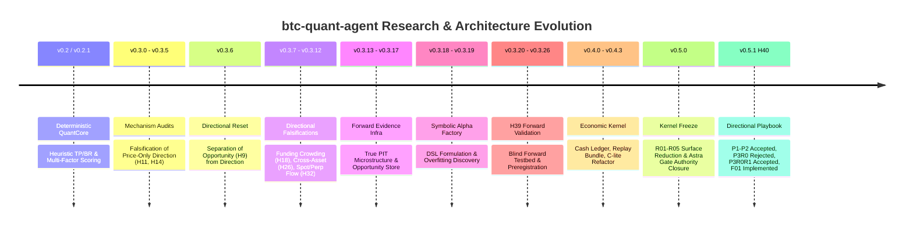
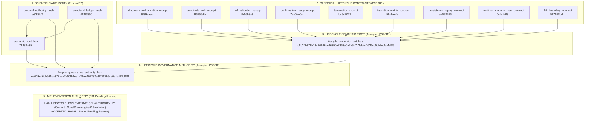
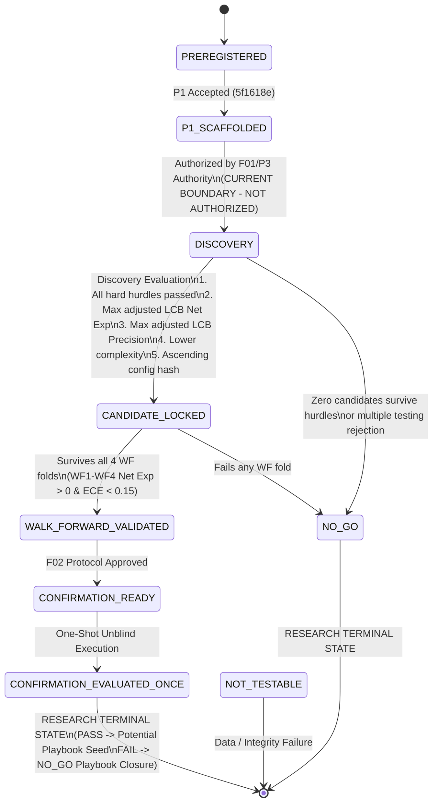

# V0.5.1 Research History, Authority, and Stage Map

```text
DOCUMENT_TYPE   = RESEARCH_AUTHORITY_SYSTEMS_MAP
STAGE_AUTHORITY  = v0.5.1 H40 Pre-Discovery
PROTOCOL_VERSION = H40_PROTOCOL_V1_R3R4
LIFECYCLE_STAGE  = F01_IMPLEMENTATION_PENDING_INDEPENDENT_REVIEW
DISCOVERY_STATUS = NOT_AUTHORIZED / PRE-OUTCOME
CONFIRMATION     = SEALED
FINAL_HOLDOUT    = SEALED
```

---

## 1. Executive Summary & Research Trajectory

The `btc-quant-agent` project represents a rigorous multi-year progression from naive heuristic technical strategies toward a mathematically grounded, cryptographically bound, fail-closed quantitative research platform. 

The core historical finding that reshaped the entire architecture is:

> **Price-only heuristic directional edges (trend pullback, breakout continuation) fail formal multiple-testing qualification on historical data, while opportunity/volatility expansion patterns reliably predict excursion magnitude but not direction.**

This realization triggered the separation of the system into an immutable **Economic Research Kernel**, a formal **Evidence Authority Protocol**, and an ongoing selective directional campaign (**H40**), pointing directly toward a **Validated Playbook + Trading Policy Engine** design.

---

## 2. Comprehensive Research Campaign History



### Detailed Campaign Register

| Stage / Campaign | Question Tested | Information Set | Algorithm / Strategy | Empirical Result / Verdict | Why Advanced or Stopped | Active Code vs Historical Residue | Lessons for Playbook Architecture |
| :--- | :--- | :--- | :--- | :--- | :--- | :--- | :--- |
| **v0.2 / v0.2.1** | Can EMA slopes, ATR channels, and multi-factor scores produce directional edge? | 15m/1h/4h OHLCV | `TrendPullbackStrategy`, `BreakoutStrategy`, 0-100 factor score | Non-reproducible; curve-fit to bull trends | Lacked out-of-sample discipline, cost modeling, and multiple-testing controls | Active: `features.py`, `indicators.py`. Residue: `strategies.py`, `multifactor.py` | Heuristics without rigorous accounting create illusion of alpha. |
| **v0.3.1 - v0.3.5** | Do traditional technical patterns have statistical edge after transaction costs? | 1m closed klines, volume, ATR | Funnel analysis, causal entry directionality, breakout qualification | **FALSIFIED** (H11, H14, H15, H16, H17) | Directional predictive power is indistinguishable from random walk ($p > 0.40$). | Historical artifacts in `artifacts/research/v0.3.[1-5]_*` | Simple technical patterns cannot be traded directionally without conditioning. |
| **v0.3.6 Directional Reset** | Can pattern detection be decoupled into Opportunity vs Direction? | 1m OHLCV, swing highs/lows | Opportunity detector + directional episode labeling | **SUPPORTED MOVEMENT** (H9) / **FALSIFIED DIRECTION** (H14) | Decoupled opportunity detection from direction prediction. Established H9. | Active: `directional_episode.py`, `structure.py`. Historical: `directional_architecture_research.py` | **Milestone**: Patterns identify volatility expansion (where to look), not direction (what to do). |
| **v0.3.7 - v0.3.8 Funding** | Does extreme funding crowding predict subsequent directional reversals? | Settled 8h funding rates + 1m klines | Funding percentile ranking ($Q_{10}, Q_{90}$) conditioned on trend | **INCONCLUSIVE / UNSTABLE** (H18, H20, H23, H24) | Weak predictive power was serial-dependent and non-stationary across regimes. | Historical: `funding_crowding_research.py`, `funding_stability_research.py` | Funding is valuable as risk/cost drag and condition filter, but not standalone alpha. |
| **v0.3.9 Cross-Asset** | Does altcoin momentum breadth (ETH, SOL, BNB, ADA) lead BTC moves? | 1h klines for 5 major assets | Cross-asset breadth index ($XAB_{4h}$) | **FALSIFIED** (H26, H27, H28) | Altcoins lag or reflect simultaneous beta; zero leading causal edge on BTC. | Active: `data/research/cross_asset_1h/`. Historical: `cross_asset_breadth_research.py` | ETH confirmation is useful only as conservative concurrence, not predictive leader. |
| **v0.3.10 Mean Reversion** | Does Bollinger 2-sigma mean reversion work in low-volatility ranges? | 15m klines, BB(20, 2) | Range mean-reversion with dynamic ATR bands | **FALSIFIED / NOT CANDIDATE** (H29, H30, H31) | Net expectancy was negative after 5 bps taker fees and adverse selection. | Historical: `range_mean_reversion_research.py` | Mean-reversion without maker queue priority suffers severe adverse execution drag. |
| **v0.3.12 Spot/Perp Flow** | Does spot vs perp taker volume delta predict short-term direction? | AggTrades from Binance Spot & Perp | Taker buy ratio divergence, cumulative volume delta (CVD) | **INCONCLUSIVE** (H32, H33, H34) | Edge decayed rapidly (<5 minutes), well inside 15m decision window. | Historical: `spot_perp_flow_research.py` | Microstructure signals require sub-second execution or conditional aggregation. |
| **v0.3.13 - v0.3.17 Forward Infra** | Can true out-of-sample forward evidence be recorded immutably? | Live WS depth, aggTrade, REST funding | `MicrostructureStore`, `OpportunityForwardStore` (SQLite WAL) | **OPERATIONAL SUCCESS** | Replaced backtest speculation with tamper-evident forward event recording. | Active: `data/forward/BTCUSDT/`, `opportunity_forward.py`, `microstructure.py` | True forward evidence prevents post-hoc selection bias. |
| **v0.3.18 - v0.3.19 Symbolic Alpha** | Can symbolic expression search discover non-linear alpha formulas? | DSL over 40+ price/derivatives primitives | AST mutation, genetic search, Romano-Wolf / Holm testing | **OVERFIT DISCOVERY** | Unconstrained symbolic search over historical data overfits despite multiple-testing penalties. | Pruned in v0.5 R01: `src/btc_quant_agent/symbolic_alpha/` removed from active code | Bounded, preregistered search spaces with strict budgets are mandatory. |
| **v0.3.20 - v0.3.26 H39** | Can a preregistered candidate survive blind forward validation? | Forward evidence accumulated from 2026-08-31 | One-shot unblind preregistration, sealed ledger | **SEALED / COMPLETED** | Established the cryptographic one-shot unblind protocol. Sealed in `h39_validation/`. | Active: `h39_baseline.py`, `h39_input.py`, `h39_statistics.py`. Sealed: `h39_validation/` | Research outcomes must remain sealed behind a cryptographic firewall. |
| **v0.4.0 - v0.4.3 Economic Kernel** | Can simulation math be unified into a mathematically exact cash ledger? | Verified replay bundles, funding cash flows | Event-driven simulator, VIP0 fee model, cash accounting | **ACCEPTED KERNEL** | Built the formal economic qualification kernel; eliminated non-causal fill bugs. | Active: `src/btc_quant_agent/economic/` (12 modules, 6,706 LOC, frozen) | Foundation of quantitative truth: zero position unbacked by cash accounting. |
| **v0.5.0 Refactor Freeze** | Can the codebase be stripped of legacy residue while preserving the kernel? | Full repository surface | R01 (Surface reduction), R02 (API/CLI), R05 (Astra Gate closure) | **ACCEPTED v0.5 FROZEN KERNEL** | Reduced surface by ~45%, closed AG-01..AG-04, froze core economic contracts. | Local branch `v0.5-refactor` at `cfefdba` | Production code must remain minimal, deterministic, and auditable. |
| **v0.5.1 H40 Campaign** | Does a bounded, selective medium-horizon directional edge exist on BTC? | BTC & ETH closed klines, settled funding | 168-slot preregistered search space (5 families + 4 depth-two pairs) | **PRE-DISCOVERY (ACTIVE)** | P1, P2, P3R0R1 accepted; F01 implemented on remote `d3dae91`. Pre-outcome. | Active: `src/btc_quant_agent/h40/` (10 modules, 8,985 LOC) | Validated playbooks must operate within bounded, non-recyclable budgets. |

---

## 3. Cryptographic Authority Graph

The H40 research program enforces a strict hierarchy of cryptographic hashes. Every level of authority binds its predecessors into immutable preimages:



### Exact Hash Ledger and Authority Scope

| Authority Symbol | Canonical SHA-256 Hash Digest | Accepted Artifact & Commit | What It Authorizes | What It DOES NOT Authorize |
| :--- | :--- | :--- | :--- | :--- |
| `protocol_authority_hash` | `a83f8fc7a5ca7109fb8cd7fed114d87c3b2c968b5145c11cada203aa5111d1ce` | `V0.5.1_H40_P2_FINAL_INDEPENDENT_ACCEPTANCE.md` (`5f1618e`) | Validates P1 source manifest, split manifest, and protocol preregistration identities. | Does not authorize candidate selection, outcome calculation, or execution. |
| `semantic_root_hash` | `71889a35f227ed734272b712851174a69bf9dbb12ea3f87cd84c26e7c66f6af1` | `V0.5.1_H40_P2_FINAL_INDEPENDENT_ACCEPTANCE.md` (`5f1618e`) | Authorizes the exact 168-slot configuration search space, feature contracts, and statistical decision rules. | Does not authorize running Discovery, ranking candidates, or accessing holdout. |
| `structural_ledger_hash`| `483f68502b57972deae071c7bd4587ca3e57ccaa72bd99fb0de07b4f0ab8c85f` | `V0.5.1_H40_P2_FINAL_INDEPENDENT_ACCEPTANCE.md` (`5f1618e`) | Freezes the exact sequence and configuration hashes of all 168 search slots. | Does not permit slot recycling, parameter tweaking, or search budget expansion. |
| `lifecycle_semantic_root_hash` | `d8c24b878b18426666ce46390e7363a0a2a5d7d3eb4d7636cc5cb2ecfaf4e9f5` | `V0.5.1_H40_P3R0R1_SOL_CUMULATIVE_ACCEPTANCE.md` (`9a6811c`) | Binds the 9 canonical lifecycle receipt contracts into a single cryptographic root. | Does not authorize Discovery execution or post-outcome state transitions. |
| `lifecycle_governance_authority_hash` | `ee619e16bb665ba377baa2a50f92ea1c36ee207282e3f7757b54a0a1adf7b828` | `V0.5.1_H40_P3R0R1_SOL_CUMULATIVE_ACCEPTANCE.md` (`9a6811c`) | Authorizes F01 code implementation of the lifecycle authority mechanics. | **DOES NOT AUTHORIZE P3, DISCOVERY, BACKTEST, OR CANDIDATE SELECTION**. |
| `discovery_selection_correction_contract_hash` | `f84c97050c7db813263e5ffda6b1c556af0b7b0e2876bb8616640d2c9d67084b` | `V0.5.1_H40_P3R0R1_LIFECYCLE_EVIDENCE_AUTHORITY_REPAIR.md` (`89b0143`) | Authorizes within-family Romano-Wolf max-statistic corrections and cross-family Holm FWER. | Rejects global $M=18$ FWER and slot-index final ties. |

---

## 4. Current H40 Lifecycle State Machine

The H40 lifecycle defines 9 formal states governing research progression. The state machine is strictly non-reentrant and fail-closed:



### State Definitions & Operational Semantics

1. **`PREREGISTERED`**:
   - Initial state. The protocol hypothesis, search space rules, and hurdles are committed in markdown and frozen.
2. **`P1_SCAFFOLDED` (CURRENT ACCEPTED BASELINE)**:
   - Source data manifests and temporal split calendars are verified and bound to `protocol_authority_hash`. Search space is materialized.
3. **`DISCOVERY` (UNAUTHORIZED)**:
   - Evaluation on `TRAIN` split (`2021-01-31` to `2022-10-31`). Computes candidate metrics across 168 slots. Requires independent F01 acceptance.
4. **`CANDIDATE_LOCKED`**:
   - Exactly one candidate configuration is selected via the deterministic 5-step tie-break hierarchy. Runner-up promotion is explicitly forbidden.
5. **`WALK_FORWARD_VALIDATED`**:
   - The locked candidate is replayed across `WF1`, `WF2`, `WF3`, and `WF4`. Must survive all four folds without parameter retuning.
6. **`CONFIRMATION_READY`**:
   - Waiting state. All historical validation is locked. Confirmation testbed is verified ready for one-shot unblind.
7. **`CONFIRMATION_EVALUATED_ONCE`**:
   - One-shot evaluation on `CONFIRMATION_HOLDOUT` (`2025-02-01` to `2026-02-01`). Executed exactly once.
8. **`NO_GO` (RESEARCH TERMINAL STATE)**:
   - Candidate failed hurdles, multiple testing, WF validation, or confirmation. The hypothesis family is closed permanently.
9. **`NOT_TESTABLE`**:
   - Data corruption, timestamp violation, or broken precondition preventing formal evaluation.

### Critical Operational Distinctions

- **Research Terminal State vs. Project Terminal State**:
  - `NO_GO` terminates the H40 research campaign, but does **not** terminate the project. In the v0.6 playbook architecture, a `NO_GO` cleanly closes that specific condition playbook and shifts research to other regimes.
- **Validated Candidate vs. Tradable Strategy**:
  - A candidate surviving Confirmation is a *validated scientific hypothesis*, **not** an authorized trading strategy.
- **Trading Strategy vs. Execution Authorization**:
  - Execution authorization requires operational risk certification, exchange connectivity, order lifecycle testing, and manual multi-key sign-off. Execution remains `mode = "disabled"` by default.

---

## 5. Git History & High-Impact Architecture Transitions

A targeted analysis of Git history reveals the key commits where major architectural pivots occurred:

| Commit SHA | Date | Author | Message / High-Impact Transition | Subsystem Affected | Architectural Effect | Still Active? |
| :--- | :---: | :---: | :--- | :--- | :--- | :---: |
| `440b08e` | 2026-09-08 | Sol | `refactor(r01): remove audited historical research and symbolic surfaces` | Production Code Surface | Stripped 9 legacy research modules and `symbolic_alpha/` from `src/` | Yes (on `v0.5-refactor`) |
| `8999241` | 2026-09-08 | Sol | `refactor(r02): reduce api surface to read-only monitoring` | API Surface | Removed all mutating POST execution routes from `api.py` (14 -> 6 routes) | Yes (on `v0.5-refactor`) |
| `936cb72` | 2026-09-08 | Sol | `refactor(r02): converge cli entrypoints and lazy service construction` | CLI Surface | Pruned legacy/duplicate commands in `cli.py` (65 -> 39 commands) | Yes (on `v0.5-refactor`) |
| `cf69d52` | 2026-09-12 | Sol | `docs(h40): record R3R4 final cumulative acceptance` | H40 Protocol Authority | Ratified H40 Protocol V1 R3R4 with 168-slot exact budget | Yes |
| `5f1618e` | 2026-09-16 | Sol | `docs(h40): record final independent P2 acceptance` | H40 P2 Authority | Accepted P2 search space; froze `protocol_authority_hash` and `semantic_root_hash` | Yes |
| `4809fbb` | 2026-09-18 | Sol | `docs(h40): review P3R0 lifecycle authority closure` | H40 P3R0 Review | **REJECTED P3R0**: Raised 10 blocker findings (P3R0-SOL-01..10) | Historical Review |
| `89b0143` | 2026-09-19 | Sol | `docs(h40): repair P3R0 lifecycle evidence authority` | H40 P3R0R1 Repair | Repaired 10 findings; defined 9 canonical child receipts and `lifecycle_semantic_root_hash` | Yes |
| `9a6811c` | 2026-09-19 | Sol | `docs(h40): accept P3R0R1 lifecycle authority and authorize F01` | H40 Governance | Ratified `lifecycle_governance_authority_hash` (`ee619e16...`); authorized F01 code | Yes |
| `cfefdba` | 2026-09-19 | Sol | `fix(r01): restore code-branch surface invariant by removing prompts dir` | Code Branch Cleanliness | **Prompt Publication Baseline HEAD** for `v0.5-refactor` | Yes (Baseline) |
| `d3dae91` | 2026-09-20 | GLM | `feat(h40): implement F01 lifecycle evidence authority` | Production Code (H40) | Implemented `src/btc_quant_agent/h40/lifecycle_authority.py` (+2,479 LOC) | Yes (Remote origin) |
| `743c936` | 2026-09-19 | Gemini | `fix(forward-evidence): make health check lightweight read-only and bound daemon memory` | Operations / Health | Replaced 35 GB full scan with lightweight read-only SQLite probe | Unmerged Branch |
| `364baa2` | 2026-09-20 | Sol | `docs(roadmap): record validated playbook trading policy direction` | Strategic Roadmap | Defined v0.6 Validated Playbook + Trading Policy Engine direction | Yes |
