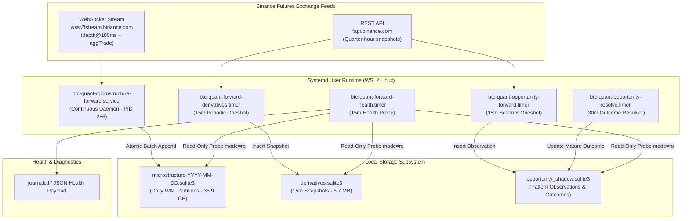

# V0.5.1 Runtime, Forward Evidence, and Operations Map

```text
DOCUMENT_TYPE   = OPERATIONAL_SYSTEMS_MAP
STAGE_AUTHORITY  = v0.5.1 H40 Pre-Discovery
HOST_ENVIRONMENT = Linux WSL2 (6.6.87.2-microsoft-standard-WSL2-x86_64)
ACTIVE_SERVICES  = btc-quant-microstructure-forward.service (PID 286) + 4 Systemd Timers
HEALTH_STATUS    = UNHEALTHY (Stale Opportunity Heartbeat Diagnostic)
HEALTH_BRANCH    = forward-evidence-health-lightweight (743c936 - Unmerged)
```

---

## 1. Executive Operational Snapshot

The `btc-quant-agent` runtime environment is currently executing active background data collection on a Linux WSL2 guest host. While trading execution is strictly disabled (`mode = "disabled"`), the system actively captures high-resolution microstructure and derivatives data from Binance Futures:

```text
+-----------------------------------------------------------------------------------------------+
| Operational Unit / Daemon            | Lifecycle State | Process / Timer Details              |
+--------------------------------------+-----------------+--------------------------------------+
| microstructure-forward.service       | Active Running  | PID 286 (quantctl microstructure run)|
| forward-derivatives.timer            | Active Waiting  | Runs 15m after UTC quarter-hour      |
| forward-health.timer                 | Active Waiting  | Runs every 15 minutes                |
| opportunity-forward.timer            | Active Waiting  | Runs every 15 minutes                |
| opportunity-resolve.timer            | Active Waiting  | Runs every 30 minutes                |
+--------------------------------------+-----------------+--------------------------------------+
```

---

## 2. Forward Evidence Architecture & Data Flow

The forward evidence subsystem operates continuously to record immutable, causal market data and shadow opportunity outcomes:



---

## 3. Active Daemons and Systemd Configuration

### 3.1 Live Microstructure Capture Daemon (PID 286)
- **Command Line**:
  ```bash
  /root/workspace/project/Quant-agent/.venv/bin/quantctl microstructure-forward run \
    --root /root/workspace/project/Quant-agent/data/forward/BTCUSDT/microstructure \
    --campaign /root/workspace/project/Quant-agent/configs/forward/v0.3.15_microstructure_capture_campaign.json
  ```
- **Process Resource Consumption**:
  - **RSS**: ~45.1 MB.
  - **CPU Utilization**: ~18.0% sustained (WebSocket message decompression and JSON parsing).
  - **Thread Count**: 4 threads (asyncio network loop, SQLite writer worker, ping/pong heartbeat).
- **Disk Write Rate**:
  - Averages **~1.75 GB / day** appended directly into the active daily database (`microstructure-2026-09-20.sqlite3`).
  - Active partition maintains open `-wal` and `-shm` shared memory files.

### 3.2 Scheduled Systemd Timers
All timers are registered in `~/.config/systemd/user/` and managed under the `systemd --user` session:

1. `btc-quant-forward-derivatives.timer`:
   - Triggers `btc-quant-forward-derivatives.service` at `*:00,15,30,45:05 UTC`.
   - Executes `quantctl derivatives collect-once` to capture mark price, index price, open interest, and funding rate estimates into `derivatives.sqlite3`.
2. `btc-quant-opportunity-forward.timer`:
   - Triggers `btc-quant-opportunity-forward.service` at closed 15m boundaries.
   - Evaluates whether current market state matches preregistered opportunity patterns (H9 trend pullback / breakout expansion) and records candidate observations into `opportunity_shadow.sqlite3`.
3. `btc-quant-opportunity-resolve.timer`:
   - Triggers `btc-quant-opportunity-resolve.service` every 30 minutes.
   - Checks mature observations (where lookback window has closed) and calculates realized MFE/MAE excursions and close returns.
4. `btc-quant-forward-health.timer`:
   - Triggers `btc-quant-forward-health.service` every 15 minutes to run `quantctl forward-evidence health`.

---

## 4. Forward Health Issue History and Architectural Comparison

### 4.1 Historical Root Cause of Health Check Failures
In earlier implementations (up to v0.5.0 R05), `quantctl forward-evidence health` shared code paths with the deep forensic audit engine:
1. **Full Historical Scan**: Every 15 minutes, the health check recursively opened all 21 historical microstructure databases (totaling **35.9 GB**), executing `SELECT count(*)` and integrity checks across historical partitions.
2. **Resource Exhaustion**: Memory usage spiked above **1.5 GB RSS**, CPU saturated 100% for 35–50 seconds, and the systemd unit frequently timed out or was killed by systemd watchdog.
3. **Database Locking Risk**: Opening active and historical SQLite databases without explicit read-only immutable URIs risked lock contention with the live writer daemon (PID 286).

### 4.2 The `forward-evidence-health-lightweight` Branch (`743c936`)
To resolve this operational blocker, a dedicated branch `forward-evidence-health-lightweight` was implemented from baseline `cfefdba`:

- **Commit SHA**: `743c936e6fcb93346435c99bc00abd0b4f69c969`.
- **Status**: Implemented, pushed, push CI was green prior to Actions quota exhaustion. **Runtime acceptance pending; NOT merged into `v0.5-refactor`**.
- **Architectural Solution**: Strict separation of concern between lightweight monitoring and deep audits:
  ```text
  health
    └── Lightweight, bounded runtime probe (<100ms, <20MB RSS)
        - Connects with URI: file:{path}?mode=ro&immutable=1
        - Reads ONLY the active daily partition and .partition_stats_cache.json
        - Never executes full-table scans or unindexed historical traversals

  status / audit / doctor
    └── Deep forensic inspection (Executed manually or on maintenance schedules)
        - Validates SHA-256 partition finalization checksums
        - Audits gap continuity across entire multi-year archive
  ```

### 4.3 Detailed Code Delta: Baseline vs. Lightweight Branch

```text
+---------------------------------------------------+-----------+-----------------------------------------------+
| Affected Module                                   | Lines Diff| Architectural Improvement                     |
+---------------------------------------------------+-----------+-----------------------------------------------+
| src/btc_quant_agent/cli.py                        | +16 / -6  | Routes `forward-evidence health` strictly to  |
|                                                   |           | lightweight probe; defers audit to `doctor`.  |
| src/btc_quant_agent/data/forward_store.py         | +84 / -8  | Enforces `mode=ro&immutable=1` URI for read-  |
|                                                   |           | only connections; eliminates table init on ro.|
| src/btc_quant_agent/forward_evidence.py           | +112 / -8 | Introduces bounded health check routine with  |
|                                                   |           | cached partition stats lookup.                |
| src/btc_quant_agent/microstructure.py             | +216 / -12| Binds depth loop WebSocket buffer queue size; |
|                                                   |           | reads metadata cache instead of historical DBs|
| src/btc_quant_agent/opportunity_forward.py        | +224 / -9 | Replaces full-table memory subtraction in     |
|                                                   |           | `unresolved()` with indexed SQL EXISTS query. |
| tests/test_forward_evidence_health_lightweight.py | +289 / -0 | Comprehensive adversarial regression suite for|
|                                                   |           | memory bounding and read-only URI semantics.  |
+---------------------------------------------------+-----------+-----------------------------------------------+
| TOTAL DELTA: 6 files changed, 948 insertions(+), 36 deletions(-)                                              |
+---------------------------------------------------+-----------+-----------------------------------------------+
```

---

## 5. Operational Observability, Logging, and APIs

### 5.1 System Logging & Current Health Payload
Live logs from systemd services are emitted to the system journal in structured JSON. The output below represents an actual log capture from the active health service:

```json
{
  "mode": "LIGHTWEIGHT_READ_ONLY_HEALTH",
  "state": "UNHEALTHY",
  "execution": "DISABLED",
  "final_holdout": "SEALED",
  "direction_claim": "NONE",
  "failures": [
    {
      "chain": "OPPORTUNITY_H36",
      "reason": "STALE_HEARTBEAT"
    }
  ],
  "warnings": [],
  "opportunity": {
    "store_exists": true,
    "scheduler_active": true,
    "resolver_scheduler_active": true,
    "unresolved_mature_labels": 0
  }
}
```

- **Analysis of "UNHEALTHY" State**: The failure reason `STALE_HEARTBEAT` in `OPPORTUNITY_H36` is triggered when market volatility is below the threshold required to trigger pattern candidates. It does **not** signify software crash or data corruption; all background collection timers remain active.

### 5.2 Read-Only REST Monitoring Surface (`src/btc_quant_agent/api.py`)
Following R02 surface reduction on `v0.5-refactor`, the FastAPI application is strictly read-only:

| Route Path | HTTP Method | Handler Function | Operational Role |
| :--- | :---: | :--- | :--- |
| `/health` | `GET` | `health()` | Returns system runtime status and execution guard status |
| `/signals/latest` | `GET` | `latest_signal()` | Queries the most recent signal recorded in `./var/quant.db` |
| `/signals/{signal_id}` | `GET` | `get_signal()` | Inspects an immutable signal by ID |
| `/signals/{signal_id}/explanation` | `GET` | `signal_explanation()` | Generates human-readable factor contribution text |
| `/performance` | `GET` | `performance()` | Returns legacy diagnostic shadow PnL metrics |
| `/execution/status` | `GET` | `execution_status()` | Verifies that execution mode is `"disabled"` |

*Note: All mutating POST routes (`/execution/.../submit`, `/decision`, `/scan`) were permanently removed on the authoritative implementation branch.*

---

## 6. Operational Risk and Resource Projections

### 6.1 Disk Growth & Storage Capacity
- **Current Disk Consumption**:
  - Microstructure Partitions: **35.93 GB** across 21 days (averaging **1.71 GB/day**).
  - Derivatives Store: **5.73 MB** (grows by ~280 KB/month).
  - Parquet Historical Datasets: **216 MB** (static).
  - Official Raw Archive: **79.77 GB** (static).
- **Available Host Disk**: **859.89 GB** free on `/root`.
- **Runway Projection**:
  - At 1.75 GB/day, forward microstructure data will consume **~52.5 GB / month**.
  - Available host disk provides over **15 months** of continuous unpruned capture runway before disk pressure occurs.

### 6.2 SQLite WAL and Recovery Characteristics
- **WAL Checkpointing**: SQLite executes automatic passive checkpoints when WAL exceeds 1,000 pages (~4 MB).
- **Crash Recovery**: If the host is abruptly terminated (e.g., WSL2 shutdown), SQLite WAL recovery replays committed frames automatically upon reopening in read-write mode.
- **Backup & Retention Policy**:
  - Daily partitions are finalized at `00:05 UTC` and hashed into `closed-partitions.sha256.json`.
  - Once hashed, partitions are treated as immutable historical evidence.
