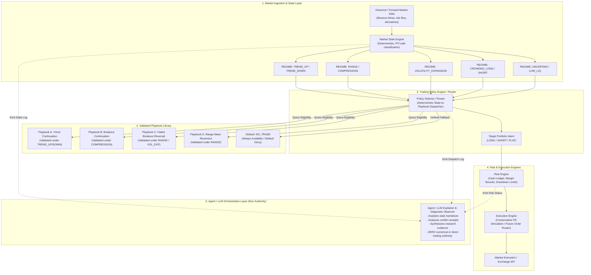
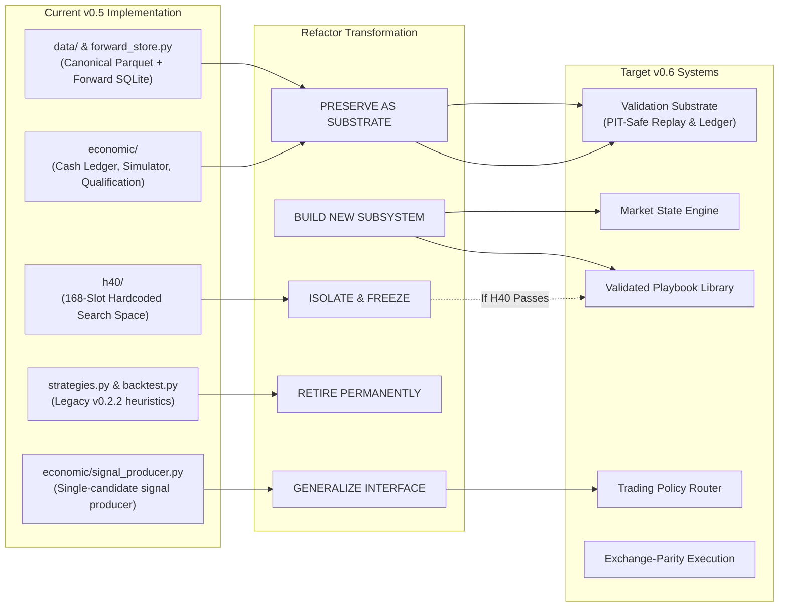

# V0.5.1 Validated Playbook and Trading Policy Architecture Fit

```text
DOCUMENT_TYPE   = STRATEGIC_FIT_AND_CAPABILITIES_GAP_AUDIT
STAGE_AUTHORITY  = v0.5.1 H40 Pre-Discovery
DIRECTION_INPUT  = docs/roadmap/V0.6_VALIDATED_PLAYBOOK_TRADING_POLICY_DIRECTION.md (Commit 364baa2)
TARGET_ARCH      = Validated Playbook Library + Deterministic Trading Policy Engine
AUDIT_PERSPECTIVE= Systems Architecture Fact Base for Astra
```

---

## 1. Executive Summary & Strategic Premise

The strategic direction defined in `docs/roadmap/V0.6_VALIDATED_PLAYBOOK_TRADING_POLICY_DIRECTION.md` establishes a vital architectural thesis:

> **Do not search forever for one universal alpha formula, and do not trust an unvalidated "AI trader" to subjectively read the market.**  
> **Build a library of condition-specific validated edges (playbooks), then route among them with an auditable, deterministic Trading Policy Engine.**

This audit assesses how well the existing `btc-quant-agent` codebase supports this evolution. The current v0.5 frozen kernel provides an outstanding **validation substrate** (PIT safety, causal simulation, exact cash ledger accounting, multiple-testing correction, and cryptographic receipts). However, the repository currently hardcodes hypothesis evaluation around a single campaign (H40), lacking the generalized abstractions required for multi-playbook routing.

---

## 2. Target Architecture & Current-to-V0.6 Migration Map

### 2.1 Target Architecture (V0.6 Playbook + Policy Engine)



### 2.2 Current-to-V0.6 Migration Boundary Map



---

## 3. Detailed Fit Analysis of Current Subsystems

| Current Subsystem | Reusability Classification | Technical Justification | What is Missing or Conflicting |
| :--- | :--- | :--- | :--- |
| **Economic Kernel** (`src/btc_quant_agent/economic/`) | **Directly Reusable** | Mathematically rigorous: cash ledger (`portfolio.py`), fee model (`fee_model.py`), funding cash-flow settlement (`funding.py`), and qualification hurdles (`qualification.py`). | Lacks multi-asset portfolio netting and live margin liquidation buffer simulation. |
| **Forward Evidence Infrastructure** (`data/forward/`, `microstructure.py`) | **Directly Reusable** | True out-of-sample forward recording. Unbiased WebSocket depth and tick capture already active. | Routine health check requires merging `forward-evidence-health-lightweight` to prevent full scans. |
| **Research Contract Canonicalization** (`research_contract/canonical.py`) | **Directly Reusable** | Pure canonical JSON serialization and SHA-256 calculation. Foundational for hashing playbooks. | None. Fully generalizable. |
| **Feature / Market State Extraction** (`features.py`, `structure.py`, `regime.py`) | **Reusable with Generalization** | Core math (EMA, ATR, swing detection) is sound and causal. | Features are calculated ad-hoc rather than emitted as a structured, strongly-typed `MarketStateSnapshot`. |
| **Signal Producer & Policy** (`economic/signal_producer.py`, `policy.py`) | **Reusable with Generalization** | Fail-closed signal generation contract and position sizing math. | Assumes a single global strategy rather than evaluating multiple candidate playbooks dynamically. |
| **H40 Implementation** (`src/btc_quant_agent/h40/`) | **H40-Specific (Isolate)** | The 168-slot budget, specific directional families (D1-D5), and protocol authority hashes are specific to H40. | Hardcodes H40 campaign parameters. Must not be contaminated with v0.6 redesign before H40 reaches a research terminal state. |
| **Legacy Heuristics** (`strategies.py`, `multifactor.py`, `backtest.py`) | **Historical & Removable** | Falsified v0.2.2 heuristics. Superseded by the economic kernel. | Confusing code residue; creates false impression of active trading authority. |
| **Market State Engine** | **Missing for v0.6** | No dedicated engine explicitly classifies and emits market states (e.g. `COMPRESSION`, `TREND_UP`, `RANGE`). | Must be designed as a first-class deterministic state classifier. |
| **Validated Playbook Interface** | **Missing for v0.6** | No polymorphic `Playbook` abstraction binding an edge hypothesis, condition pre-requisites, and execution model. | Needs formal definition. |
| **Deterministic Policy Router** | **Missing for v0.6** | No router that matches `MarketStateSnapshot` to eligible playbooks with conflict resolution. | Needs formal definition. |

---

## 4. In-Depth Future Core Engine Evaluation

### 4.1 Market State Engine
- **Capability Assessment**:
  - The repository already computes the necessary raw primitives:
    - *Trend*: EMA slopes (7/25/99), directional movement (`features.py`).
    - *Range / Compression*: ATR percentile ranking, Bollinger Band squeeze (`regime.py`, `indicators.py`).
    - *Expansion / Breakout*: Swing high/low level penetration (`structure.py`, `opportunity_forward.py`).
    - *Crowding*: Settled funding rate percentiles ($Q_{10}, Q_{90}$) (`h40/feature_contracts.py`).
    - *Cross-Asset*: BTC vs. ETH momentum confirmation / divergence (`h40/feature_contracts.py`).
- **Critical Risk — Hidden Degrees of Freedom**:
  - If regime boundaries (e.g., defining what constitutes `RANGE` vs. `TREND`) are calibrated post-hoc across the entire dataset, the researcher introduces hidden selection bias.
  - *Architectural Requirement*: Regime definitions must be frozen, preregistered, and validated out-of-sample exactly like alpha hypotheses.

### 4.2 Validated Playbook Library
- **Reusable Preregistration Structures**:
  - The formal research framework (`research_contract/models.py`, `formal_research.py`) and H40's receipt architecture provide the blueprint:
    1. Preregistration of bounded search space.
    2. Multiple-testing adjustment (Holm / Romano-Wolf).
    3. Candidate lock receipt.
    4. Walk-forward verification receipt.
    5. Sealed confirmation unblind.
- **H40 Generalization**:
  - The 168-slot hardcoded ledger in `h40/configuration_ledger.py` must be abstracted into a generic `PlaybookSearchSpace` supporting variable parameter matrices.

### 4.3 Deterministic Policy Selector
- **Core Abstraction**:
  - Must operate as a pure deterministic mapping:
    $$\text{Policy}(\text{MarketState}, \{\text{Eligible Playbooks}\}, \text{Current Portfolio}) \rightarrow \text{Target Intent}$$
- **First-Class `NO_TRADE` Default**:
  - `NO_TRADE` must remain the primary default state. Trading intent is authorized only when:
    1. Exactly one playbook is eligible, OR multi-playbook priority rules resolve unambiguously.
    2. Expected excursion covers transaction drag (5 bps fee + 2 bps slippage + funding stress).
    3. Portfolio risk limits and cash margin constraints are fully satisfied.
    4. Data freshness and source authority are verified.

### 4.4 Risk and Execution Parity Gaps
- While the economic simulator (`economic/simulator.py`) is mathematically causal, real exchange parity is still missing:
  - **Queue Priority Modeling**: Limit orders are simulated assuming execution upon touch or bar close; queue position and partial fill depletion are unmodeled.
  - **Cancellation Latency**: The system assumes instantaneous order cancellation without race-condition modeling against incoming fills.
  - **Isolated vs. Cross Margin Realities**: Liquidation cascade and maintenance margin curves are approximated linearly.

### 4.5 Agent / LLM Integration Boundary
- **Hard Architectural Boundary**:
  - The LLM must **never** be given numerical authority or direct trading dispatch capability.
- **Authorized LLM Responsibilities**:
  - *Contextual Explanations*: Explaining why a specific playbook was selected or why `NO_TRADE` was triggered.
  - *Evidence Synthesis*: Summarizing multi-page walk-forward and bootstrap receipts for human review.
  - *Operational Diagnostics*: Triage of systemd daemon warnings and network latency events.

---

## 5. Missing Capabilities Inventory

The table below catalogs every capability required before the system can safely transition across lifecycle milestones:

```text
+---------------------------------------------------------------------------------------------------+
| System Capability Domain          | Milestone Required | Current Code Status                      |
+-----------------------------------+--------------------+------------------------------------------+
| 1. Cryptographic F01 Acceptance   | Before Discovery   | Implemented on d3dae91; pending review   |
| 2. Lightweight Forward Health     | Before Discovery   | Implemented on 743c936; pending merge    |
| 3. Market State Engine Abstraction| Before v0.6 Alpha  | Primitives exist; ununified interface    |
| 4. Validated Playbook Framework   | Before v0.6 Alpha  | H40 campaign hardcoded; needs generality |
| 5. Deterministic Policy Router    | Before v0.6 Alpha  | Missing (ad-hoc single signal producer)  |
| 6. Multi-Playbook Netting Risk    | Before Shadow      | Missing (single position accounting only)|
| 7. Exchange WebSocket Order Feeds | Before Paper       | Missing (market feeds only; no user WS)  |
| 8. Order Lifecycle State Machine  | Before Paper       | Stubbed in execution/models.py           |
| 9. Account Balance Reconciliation | Before Paper       | REST poll stubbed; no automated sync     |
| 10. Hardware Security Module / HSM| Before Tiny-Live   | Missing (plaintext API keys in env/TOML) |
| 11. Multi-Key Trade Authorization | Before Tiny-Live   | Missing (single API secret assumption)   |
| 12. Exchange Latency Arbitrage    | Before Tiny-Live   | Missing (15m polling engine architecture)|
+---------------------------------------------------------------------------------------------------+
```

---

## 6. What Actually Produces or Could Produce Edge

To ensure financial and economic clarity, this section answers the core questions of quantitative edge based on repository evidence:

### 1. What Information Does the Project Consume?
- **Price/Volume**: 1m closed klines for BTCUSDT (Futures & Spot) and 1h klines for major altcoins (ETH, ADA, BNB, LTC, XRP).
- **Derivatives State**: 8h settled funding rates, real-time open interest, mark/index basis divergence, and 15m funding rate predictions.
- **Microstructure Flow**: 100ms top-of-book depth updates, bid/ask spread, order book imbalance, and aggressive taker trade volume (CVD).

### 2. What Transformations and Features Does It Compute?
- **Trend/Momentum**: Dual EMAs (7/25, 25/99), ATR channels, ADX trend strength, 15m/1h/4h log returns.
- **Pattern Geometry**: Swing high/low pivots, trend pullback retest tolerances, breakout excursion bounds.
- **Cross-Asset Confirmation**: BTC return minus ETH return divergence, 4h breadth index.
- **Microstructure**: Order book liquidity depth ratios, cumulative volume delta, tick flow toxicity.

### 3. What Has Been Formally Tested vs. What Failed?
- **Failed Directional Hypotheses**:
  - Price-only trend pullback and breakout continuation: **FALSIFIED** (H11, H14).
  - Standalone funding crowding direction: **INCONCLUSIVE / UNSTABLE** (H18, H20, H23).
  - Cross-asset altcoin momentum breadth: **FALSIFIED** (H26, H27, H28).
  - Low-volatility Bollinger 2-sigma mean reversion: **FALSIFIED** (H29, H30, H31).
  - Spot vs. perp taker volume divergence: **INCONCLUSIVE** (H32, H33, H34).
  - Unconstrained symbolic alpha DSL formulas: **OVERFIT / DISCARDED**.

### 4. What Remains Open as a Potential Source of Edge?
- **Opportunity Magnitude (H9)**: Strong empirical support that specific market geometries reliably predict *excursion amplitude* (volatility expansion).
- **Conditional Direction (H40 Search Space)**:
  - Direction conditioned on volatility expansion.
  - Direction conditioned on cross-asset confirmation (BTC confirmed by ETH).
  - Direction conditioned on extreme funding stress / liquidation interactions.

### 5. What is Merely Infrastructure and Produces No Alpha?
- Parquet partition loaders, SQLite WAL daemons, canonical SHA-256 hash trees, FastAPI read-only endpoints, systemd timers, and Feishu alert webhooks. These ensure operational correctness and eliminate bias, but generate zero alpha on their own.

### 6. Where is Net Expectancy Evaluated and How Do Costs Enter?
- Evaluated strictly in `src/btc_quant_agent/economic/qualification.py` using outputs from `economic/metrics.py`.
- **Cost Deductions**:
  $$\text{Net Return} = \text{Gross Price Return} - \text{Taker Fees (5 bps per side)} - \text{Slippage (2 bps per side)} - \text{Funding Debits}$$
- Trades failing to achieve positive net expectancy after these deductions fail qualification closed.

### 7. How Does `NO_TRADE` Enter?
- In `src/btc_quant_agent/economic/signal_producer.py` and `policy.py`, if candidate features fail to clear the 0.55 probability threshold (or Platt logistic calibration hurdle), the signal direction is explicitly emitted as `FLAT` (`NO_TRADE`).
- In the future v0.6 policy engine, `NO_TRADE` is the guaranteed fallback for unclassified regimes, conflicting playbooks, or inadequate risk buffers.
