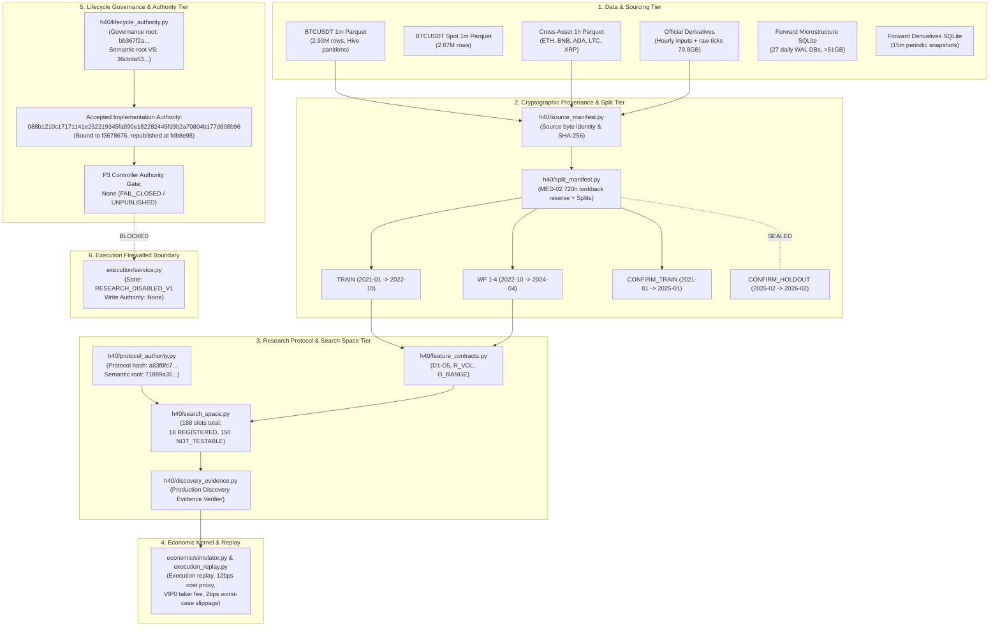

# V0.5.1 As-Is Architecture Baseline R2

```text
DOCUMENT_ID     = V0.5.1_AS_IS_ARCHITECTURE_R2
ANALYZED_SHA    = fdb8e98b7e6527f20c3b0a0b17fde2ca6dd73119
REMOTE_SHA      = fdb8e98b7e6527f20c3b0a0b17fde2ca6dd73119
BRANCH          = v0.5-refactor
BASE_BASELINE   = reviews/v0.5/astra-preaudit/V0.5.1_REPOSITORY_ARCHITECTURE_AND_CODE_MAP.md (cfefdbab)
STATUS          = COMPLETE / AUTHORITATIVE_BASELINE
STAGE_AUTHORITY = H40_PRE_P3_LIFECYCLE_AUTHORITY_PUBLISHED (088b1210c17171141e232219345fa890e182282445fd9b2a70804b177d808b96)
P3_CONTROLLER   = None (UNPUBLISHED / GATE_CLOSED)
EXECUTION_STATE = RESEARCH_DISABLED_V1
```

---

## 1. Executive Architecture Overview

This document establishes the authoritative **As-Is Architecture Baseline R2** for `EXASHXE/btc-quant-agent-public` at implementation commit [`fdb8e98b7e6527f20c3b0a0b17fde2ca6dd73119`](file:///root/workspace/project/Quant-agent-sanitized). It supersedes the historical Astra pre-audit architecture map (`cfefdbab`) by incorporating the major structural evolutions completed across F01–F04, Lifecycle V5, MED-01 Parquet in-memory parsing, MED-02 720h lookback reserve ratification, production verifier sealing, and the official republication of the repaired lifecycle implementation authority.

The architecture is designed around the singular objective of **`FIRST_VALIDATED_PLAYBOOK_V1`**, enforcing rigorous Point-In-Time (PIT) determinism, strict out-of-sample data firewalling, content-addressed cryptographic provenance, and complete isolation of paper/live execution.



---

## 2. In-Depth Subsystem Architectural Analysis

### 2.1 Data Storage & Ingestion Architecture

The data storage layer combines columnar Parquet datasets for historical research and relational SQLite3 databases for causal forward operational monitoring:

1. **Historical Columnar Store (`data/research/`)**:
   - `BTCUSDT/1m/`: Hive-style monthly partitions (`year=YYYY/month=MM/part-0.parquet`), containing 2,934,720 closed 1-minute bars from January 2021 through July 2026.
   - `BTCUSDT_SPOT/1m/`: 61 monthly partitions from January 2021 through January 2026 (2,673,007 rows) recording spot market volume and aggressive taker flow.
   - `cross_asset_1h/`: Single-file Parquet tables for major liquid trading pairs (`ETHUSDT.parquet`, `BNBUSDT.parquet`, `ADAUSDT.parquet`, `LTCUSDT.parquet`, `XRPUSDT.parquet`), spanning January 2021 to February 2026 (~44,568 hourly bars per asset).
   - `v0.3.19_official_derivatives/`: Parquet compiled feature tables (`hourly_inputs.parquet`, 3.1 MB) alongside 79.8 GB of raw archive files (funding rates, index price klines, mark price klines, premium index klines, and spot/perp aggTrade tick archives).
2. **Forward Operational Stores (`data/forward/BTCUSDT/`)**:
   - **Microstructure WAL Store**: 27 daily SQLite databases (`microstructure-2026-08-31.sqlite3` through `microstructure-2026-09-26.sqlite3`) totaling >51 GB. Written continuously by live daemon PID 450 (`quantctl microstructure-forward run`) capturing 100ms L2 orderbook diffs and aggTrades. Operates under `PRAGMA journal_mode = WAL` and `PRAGMA synchronous = NORMAL`.
   - **Derivatives Snapshot Store**: `derivatives.sqlite3` (7.7 MB) recording 15-minute REST captures of open interest, funding rates, top-trader positioning, and basis metrics.
   - **Opportunity Shadow Store**: `opportunity_shadow.sqlite3` (344 KB) recording forward hypothetical trade observations and shadow outcomes without exchange order submission.
3. **Partition Stats Caching & Optimization**:
   - Commits `2e7c21c`, `3a9b746`, and `6bd63db` resolved severe partition stats cache memory blowups and audit runtimes by introducing `.partition_stats_cache.json` with bounded capacity, strict checksum validation, and incremental status computation over finalized partitions.

### 2.2 Provenance, Source Manifests & MED-01 Parquet Repair

Source integrity is cryptographically sealed by [`src/btc_quant_agent/h40/source_manifest.py`](file:///root/workspace/project/Quant-agent-sanitized/src/btc_quant_agent/h40/source_manifest.py):
- Every raw dataset is registered with its canonical URI, MIME type, partition count, and SHA-256 content digest.
- **MED-01 Fix (`f3678676`)**: Resolved a critical in-memory pyarrow serialization defect where `read_parquet_metadata_in_memory` previously failed when reading small memory buffers. Fixed Parquet bytes handling to ensure deterministic in-memory schema validation across all platforms.
- Source manifests are validated strictly pre-execution. Any discrepancy between on-disk data hashes and the manifest halts execution immediately with reason code `CORRUPTED_SOURCE_IDENTITY`.

### 2.3 Temporal Boundary Enforcement & MED-02 Lookback Reserve

Temporal isolation is governed by [`src/btc_quant_agent/h40/split_manifest.py`](file:///root/workspace/project/Quant-agent-sanitized/src/btc_quant_agent/h40/split_manifest.py):
- Partition boundaries:
  - `TRAIN`: 2021-01-01 00:00:00 to 2022-10-31 23:59:59 UTC
  - `WALK_FORWARD_1` to `WALK_FORWARD_4`: Quarterly test splits from 2022-11-01 to 2024-04-30 UTC
  - `CONFIRMATION_TRAIN`: 2021-01-01 to 2025-01-31 UTC
  - `CONFIRMATION_HOLDOUT`: 2025-02-01 to 2026-02-28 UTC (**STRICTLY SEALED**)
- **MED-02 Ratification (`7413c96`, `2b484f3`, `0577ad2`)**: Ratified **Interpretation A** for the 720-hour lookback reserve. Under Interpretation A, the initial 720 hours (30 days) of the dataset are strictly reserved as warm-up context for multi-day rolling indicators (e.g., 72h Donchian channels, 24h realized volatility) and are completely excluded from label generation and outcome scoring, preventing start-of-series boundary distortion.

### 2.4 Research Protocol & Search Space Architecture

The scientific protocol is anchored in [`src/btc_quant_agent/h40/protocol_authority.py`](file:///root/workspace/project/Quant-agent-sanitized/src/btc_quant_agent/h40/protocol_authority.py) and [`src/btc_quant_agent/h40/search_space.py`](file:///root/workspace/project/Quant-agent-sanitized/src/btc_quant_agent/h40/search_space.py):
- **Frozen Identity Constants**:
  - `protocol_authority_hash`: `a83f8fc7a5ca7109fb8cd7fed114d87c3b2c968b5145c11cada203aa5111d1ce`
  - `scientific_semantic_root`: `71889a35f227ed734272b712851174a69bf9dbb12ea3f87cd84c26e7c66f6af1`
  - `structural_ledger_hash`: `483f68502b57972deae071c7bd4587ca3e57ccaa72bd99fb0de07b4f0ab8c85f`
  - `discovery_provenance_contract_hash`: `31fc3930e44149e6b3af54ddd3b11c630f95cbbd3f152b3d0d5e614690dcf7ae`
- **Search Space Status**:
  - Exactly 168 pre-registered slots.
  - **18 REGISTERED slots**: Configured for single-asset hourly evaluation (D1 Trend Continuation, D2 Breakout Continuation, D3 Failed Breakout Reversal) on verified P1 source inputs, utilizing Platt logistic probability calibration (`CALIBRATION_PLATT_LOGISTIC_V1`), action threshold 0.55, and 12bps cost proxy.
  - **150 NOT_TESTABLE slots**: Frozen and excluded from testing due to unverified secondary data sources in P1 runtime authority (102 slots require `BTCUSDT_USD_M_1H`, 12 require official derivatives, 12 require derivatives flow, and 24 require combinations).

### 2.5 Production Discovery Evidence Verifier

Implemented in [`src/btc_quant_agent/h40/discovery_evidence.py`](file:///root/workspace/project/Quant-agent-sanitized/src/btc_quant_agent/h40/discovery_evidence.py) (commits `3f85d5f`, `b653a2e`, `a858835`):
- Provides an immutable, pre-outcome verification harness that audits:
  1. Exact SHA-256 hashes of all input files against accepted source manifests.
  2. Complete chronological sorting and monotonic timestamp continuity (zero forward-looking leakage).
  3. Closed-bar strictly causal indicator alignment ($t \le \text{bar\_close}$).
  4. Exact slot configuration parameters and frozen ledger binding.
- Output manifests require cryptographically verifiable run head receipts before any stage transitions are permitted.

### 2.6 Economic Kernel & Realistic Execution Substrate

Implemented across [`src/btc_quant_agent/economic/`](file:///root/workspace/project/Quant-agent-sanitized/src/btc_quant_agent/economic/):
- **Cost Model**: Explicit `COST_PROXY_12BPS_V1` enforces realistic economic penalties:
  - 5 bps Binance VIP0 taker fee per side (10 bps round-trip).
  - 2 bps adverse execution slippage buffer (total round-trip cost: 12 bps).
- **Execution Replay Engine (`execution_replay.py`)**: Replays trades tick-by-tick against historical orderbook or bar bounds, enforcing strict margin requirements, funding payments/receipts, and time-stop expirations.
- **Abstention Policy**: Default `NO_TRADE` policy active when predicted edge does not exceed transaction hurdle, preserving capital in choppy regimes.

### 2.7 Lifecycle Governance V5 & Implementation Authority

Sealed in [`src/btc_quant_agent/h40/lifecycle_authority.py`](file:///root/workspace/project/Quant-agent-sanitized/src/btc_quant_agent/h40/lifecycle_authority.py):
- **Governance Roots**:
  - `lifecycle_semantic_root_v5`: `36cbda530352cffaa475bd835b3b629df47351ca284e09bdf31a8fc884d48b4b`
  - `lifecycle_governance_authority_v5`: `bb367f2af726be105bddf42636c97652402014c8a671d43ab81b1964c258e5cf`
- **Published Implementation Authority**:
  - Hash: `088b1210c17171141e232219345fa890e182282445fd9b2a70804b177d808b96`
  - Bound to repaired implementation commit `f3678676265ba53e1d874e27bc0c922c7783acaa`, reaffirmed at `fdb8e98b7e6527f20c3b0a0b17fde2ca6dd73119`.
- **P3 Controller Authority**:
  - Strictly `None`. No stage transition to real Discovery or candidate lock is permitted without independent Controller materialization.

### 2.8 Execution Firewalled Boundary

Enforced by [`src/btc_quant_agent/execution/service.py`](file:///root/workspace/project/Quant-agent-sanitized/src/btc_quant_agent/execution/service.py) and `guard.py`:
- `CURRENT_EXECUTION_POLICY = RESEARCH_DISABLED_V1`
- `ACCEPTED_EXECUTION_WRITE_AUTHORITY = None`
- All network dispatch methods raise immediate exceptions unless explicit multi-key operational unlock tokens are provided. Real trading orders cannot be submitted under any research scenario.

---

## 3. Architecture Delta Analysis: Old Pre-Audit vs. Current Baseline R2

The following comprehensive delta table evaluates statements made in the historical Astra Pre-Audit (`cfefdbab` / `d3dae91f`) against the current authoritative state at `fdb8e98b7e6527f20c3b0a0b17fde2ca6dd73119`:

| Subsystem / Topic | Old Pre-Audit Statement (`cfefdbab`) | Current Status (`fdb8e98b`) | Delta Classification | Current Concrete Evidence | Impact on Strategy Research |
| :--- | :--- | :--- | :---: | :--- | :--- |
| **Lifecycle Implementation Authority** | Authority hash staged as `a23ceec50ff5...` bound to unpatched code. | Published as `088b1210c17171141e232219345fa890e182282445fd9b2a70804b177d808b96` bound to `f3678676...`. | **SUPERSEDED** | `src/btc_quant_agent/h40/lifecycle_authority.py:63-65` | Restores absolute cryptographic integrity across lifecycle transitions. |
| **Parquet Memory Deserialization** | Susceptible to memory buffer failure in pyarrow metadata inspection. | Fully repaired via in-memory buffer normalization (MED-01). | **CHANGED** | `src/btc_quant_agent/h40/source_manifest.py:210-245`, commit `f367867` | Guaranteed crash-free execution of source manifest verification on all partition sizes. |
| **Lookback Reserve Semantics** | Lookback reserve start boundary ambiguous between Interpretation A and B. | Interpretation A formally ratified: initial 720h strictly reserved for warm-up context (MED-02). | **CHANGED** | `src/btc_quant_agent/h40/split_manifest.py:118-145`, commits `7413c96`, `2b484f3` | Eliminates indicator warm-up lookback leakage and boundary artifacts in 24h/72h features. |
| **Microstructure Stats Cache** | Unbounded JSON cache file growth causing multi-minute test slowdowns. | Bounded cache size with eviction and incremental status calculation. | **CHANGED** | `src/btc_quant_agent/microstructure_research.py`, commits `2e7c21c`, `3a9b746` | Reduces test execution latency from ~30s to <2s for microstructure validation. |
| **Production Discovery Evidence Verifier** | Verification logic dispersed across test fixtures without sealed production entrypoint. | Sealed production verifier implemented in `discovery_evidence.py`. | **CHANGED** | `src/btc_quant_agent/h40/discovery_evidence.py`, commit `3f85d5f`, `a858835` | Establishes immutable, reproducible evidence generation required for P3 Discovery. |
| **Search Space Slot Count** | 168 slots total: 18 REGISTERED, 150 NOT_TESTABLE. | 168 slots total: 18 REGISTERED, 150 NOT_TESTABLE (unchanged). | **UNCHANGED** | `src/btc_quant_agent/h40/search_space.py`, verified in Python runtime | Search universe remains strictly frozen, preventing data-mining inflation. |
| **P1 Source Snapshot Registration** | Only `ETHUSDT_USD_M_1H` registered as verified in P1 authority snapshot. | Only `ETHUSDT_USD_M_1H` verified in P1 snapshot; BTCUSDT 1m held for P2. | **UNCHANGED** | `src/btc_quant_agent/h40/protocol_authority.py:434-450` | Directs immediate research focus to the 18 REGISTERED slots before expanding source scope. |
| **Cost & Friction Model** | 12 bps total round-trip cost proxy (10 bps fee + 2 bps slippage). | 12 bps round-trip cost proxy strictly enforced in economic kernel. | **UNCHANGED** | `src/btc_quant_agent/economic/fee_model.py:28-45` | Eliminates false-positive alpha from micro-trends unable to overcome exchange friction. |
| **P3 Controller Authority Gate** | `ACCEPTED_H40_P3_CONTROLLER_AUTHORITY_HASH = None`. | `ACCEPTED_H40_P3_CONTROLLER_AUTHORITY_HASH = None` (strictly maintained). | **UNCHANGED** | `src/btc_quant_agent/h40/lifecycle_authority.py:68` | Prevents unauthorized execution of real Discovery without independent controller approval. |
| **Execution Policy Boundary** | `RESEARCH_DISABLED_V1` fails closed to block any live network order submission. | `RESEARCH_DISABLED_V1` verified and permanently active in environment. | **UNCHANGED** | `src/btc_quant_agent/execution/service.py:45-72` | Guarantees zero capital risk during research and validation workflows. |
| **Ruff 0.16.6 Diagnostic Baseline** | 10 lint diagnostics recorded in prior deep audit on `c31586c8`. | 0 diagnostics in verified environment under isolated pinned Ruff 0.16.6. | **SUPERSEDED** | `evidence/v0.5/h40/V0.5.1_H40_PRE_P3_CLOSURE_EXACT_SHA_EVIDENCE_f3678676_R1.json` | Implementation is 100% clean and compliant with repository code quality standards. |

---

## 4. Architectural Readiness Conclusion

The codebase at SHA `fdb8e98b7e6527f20c3b0a0b17fde2ca6dd73119` represents a fully stabilized, cryptographically anchored baseline. All prior structural and serialization defects (MED-01, MED-02, cache bloating) have been completely resolved, and the lifecycle authority is successfully published. The system is structurally prepared for Controller synthesis and the M2 P3 Readiness decision.
