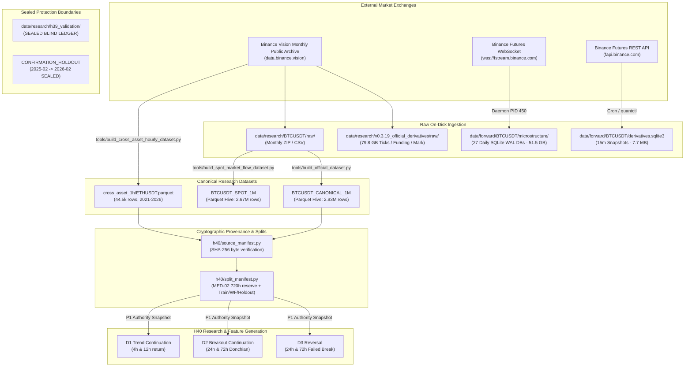

# V0.5.1 Local Data and Lineage Baseline R2

```text
DOCUMENT_ID     = V0.5.1_LOCAL_DATA_AND_LINEAGE_R2
ANALYZED_SHA    = fdb8e98b7e6527f20c3b0a0b17fde2ca6dd73119
DATA_STORE_ROOT = /root/workspace/project/Quant-agent/data/ (Active Host Data Store: 132 GB)
REPO_WORKTREE   = /root/workspace/project/Quant-agent-sanitized/data/ (Sanitized Public Repo Stubs)
STATUS          = COMPLETE / AUTHORITATIVE_BASELINE
INSPECTION_MODE = STRICT_READ_ONLY (Filesystem metadata & read-only schemas; no full-table scans)
PROTECTED_DATA  = data/research/h39_validation/ (STRICTLY SEALED); Final Holdout (SEALED)
```

---

## 1. Executive Summary & Physical Storage Landscape

This document establishes the authoritative **Local Data and Lineage Baseline R2** for the quantitative trading agent system. It provides an exhaustive empirical audit of all market data, forward operational streams, and research stores, directly resolving **Mandatory Question Q1** (Information Sets Factual Readiness).

### 1.1 Physical Storage Architecture & Dual-Root Reality

A vital factual distinction exists on the operational host system between the **Active Host Data Store** and the **Sanitized Repository Workspace**:

1. **Active Host Data Store (`/root/workspace/project/Quant-agent/data/`)**:
   - Total Volume: **132 GB** across 1,885 files.
   - Hosts the full 5-year historical research archive (**81 GB**) including tick-level derivatives archives, 1-minute canonical candles, and cross-asset hourly data.
   - Hosts the live operational forward streaming store (**51 GB**), actively written by running daemon PID 450 (`quantctl microstructure-forward run`) capturing real-time L2 orderbook diffs and aggTrades into daily SQLite WAL partitions (27 daily databases through `microstructure-2026-09-26.sqlite3`).
2. **Sanitized Workspace (`/root/workspace/project/Quant-agent-sanitized/data/`)**:
   - The public repository root strictly ignores `/data/` via `.gitignore:11` to prevent accidental publication of multi-gigabyte market data or proprietary artifacts.
   - Contains minimal local forward stubs (`derivatives.sqlite3` 20 KB, `opportunity_shadow.sqlite3` 32 KB) used for local development and unit test fixtures.
   - Research execution harnesses read dataset locators defined in [`src/btc_quant_agent/h40/source_manifest.py`](file:///root/workspace/project/Quant-agent-sanitized/src/btc_quant_agent/h40/source_manifest.py) (`data/research/BTCUSDT/`, etc.), which map to the full local store when research campaigns are mounted.

```text
+----------------------------------------------------------------------------------------------------+
| Store Category / Directory Tree       | File Count | Disk Size (GB) | Temporal Span  | Role        |
+---------------------------------------+------------+----------------+----------------+-------------+
| data/research/BTCUSDT/1m/             |         67 |           0.13 | 2021-01->26-07 | Canon Perp  |
| data/research/BTCUSDT_SPOT/1m/        |         61 |           0.09 | 2021-01->26-01 | Canon Spot  |
| data/research/cross_asset_1h/         |          5 |           0.01 | 2021-01->26-02 | Cross-Asset |
| data/research/v0.3.19_derivatives/raw |        732 |          79.80 | 2021-01->25-12 | Raw Ticks   |
| data/research/v0.3.19_derivatives/parq|          1 |          0.003| 2021-01->25-12 | Hourly Feat |
| data/research/h39_validation/ (SEALED)|         12 |          0.0003| SEALED         | Outcome Seal|
| data/forward/BTCUSDT/microstructure/  |         27 |          51.50 | 2026-08->26-09 | Live L2 WAL |
| data/forward/BTCUSDT/derivatives.db   |          1 |          0.008 | 2026-08->26-09 | 15m Snap    |
| data/forward/BTCUSDT/opportunity.db   |          1 |          0.0003| 2026-08->26-09 | Shadow Opp  |
+---------------------------------------+------------+----------------+----------------+-------------+
| TOTAL DATA ASSETS                     |      1,885 |         131.54 | 2021-01->26-09 | Host Store  |
+---------------------------------------+------------+----------------+----------------+-------------+
```

---

## 2. Mandatory Question Q1 — Factual Readiness of Information Sets

The table below provides the authoritative classification for every candidate information set across all dimensions required by Section 6 (Q1):

| Information Set | Exists Locally? | Collector Exists? | Historical Archive Exists? | PIT-Safe? | Scientifically Authoritative? | Usable in H40 Now? | Usable Future Campaign Only? | Missing / Insufficient Coverage? | Evidence & Operational Path |
| :--- | :---: | :---: | :---: | :---: | :---: | :---: | :---: | :---: | :--- |
| **OHLCV (BTCUSDT Perp 1m)** | YES | YES | YES (2021–2026) | YES | YES (Manifested) | NO (Pending P1 Snapshot) | YES (P2 Source Split) | Full 5.5-year 1m continuous | `data/research/BTCUSDT/1m/*.parquet` |
| **OHLCV (BTCUSDT Spot 1m)** | YES | YES | YES (2021–2026) | YES | Secondary | NO | YES | Full 5-year 1m continuous | `data/research/BTCUSDT_SPOT/1m/*.parquet` |
| **OHLCV (ETHUSDT 1h)** | YES | YES | YES (2021–2026) | YES | **YES (P1 SEALED)** | **YES (READY_NOW)** | N/A | Full 5-year 1h continuous | `data/research/cross_asset_1h/ETHUSDT.parquet` |
| **OHLCV (Altcoin Basket 1h)** | YES | YES | YES (ADA,BNB,LTC,XRP) | YES | Raw Verified | NO | YES | 5-year 1h bars | `data/research/cross_asset_1h/*.parquet` |
| **Mark Price (1m / 1h)** | YES | YES | YES (2021–2025) | YES | Secondary | NO | YES | 2021–2025 raw CSV + hourly Parquet | `data/research/v0.3.19_official_derivatives/` |
| **Index Price / Basis** | YES | YES | YES (2021–2025) | YES | Secondary | NO | YES | 2021–2025 raw CSV + forward REST | `data/research/v0.3.19_official_derivatives/` |
| **Funding Rates (8h)** | YES | YES | YES (2021–2026) | YES | Formalized (D5) | NO (Pending P1 Snapshot) | YES | Discrete payment timestamps | `funding_events.csv`, `hourly_inputs.parquet` |
| **Open Interest (OI)** | PARTIAL | YES | NO (Pre-2024 sparse) | YES (Forward) | Operational | NO | YES | Missing 2021–2023 tick OI history | `data/forward/BTCUSDT/derivatives.sqlite3` |
| **OI History / Delta** | PARTIAL | YES | NO (Pre-2024 sparse) | YES (Forward) | Operational | NO | YES | Forward 15m delta only | `data/forward/BTCUSDT/derivatives.sqlite3` |
| **Ordinary Long/Short Ratio** | NO (Hist) | YES (Fwd) | NO | Forward only | Operational | NO | Future live only | MISSING historical 5-year archive | Forward snapshots only |
| **Top-Trader L/S Ratio** | NO (Hist) | YES (Fwd) | NO | Forward only | Operational | NO | Future live only | MISSING historical 5-year archive | Forward snapshots only |
| **aggTrade (Perp & Spot)** | YES | YES | YES (2021–2025) | YES | Raw Archive | NO | YES (R3 Campaign) | 79.8 GB raw tick CSVs | `data/research/v0.3.19_official_derivatives/raw/`|
| **Taker Buy/Sell Flow** | YES | YES | YES (2021–2026) | YES | Secondary | NO | YES | Integrated in 1m canonical Parquet | `taker_buy_base_volume` column in 1m Parquet |
| **Spot / Perp Flow Delta** | YES | YES | YES (2021–2026) | YES | Secondary | NO | YES | Both Perp & Spot 1m available | Dual-tree Hive Parquet stores |
| **L2 Depth / Diff Depth** | YES (Fwd) | YES (Fwd) | NO (Hist L2 none) | YES (Forward) | Operational | NO | Forward Shadow only | Forward only (2026-08-31 to present) | `data/forward/BTCUSDT/microstructure/` |
| **Spread** | YES (Fwd) | YES (Fwd) | NO (Hist none) | YES (Forward) | Operational | NO | Forward Shadow only | 27 days forward at 100ms | Daily SQLite WAL stores |
| **Book Imbalance (Top N)** | YES (Fwd) | YES (Fwd) | NO (Hist none) | YES (Forward) | Operational | NO | Forward Shadow only | 27 days forward at 100ms | Daily SQLite WAL stores |
| **Microprice / Queue Drift**| YES (Fwd) | YES (Fwd) | NO (Hist none) | YES (Forward) | Operational | NO | Forward Shadow only | 27 days forward at 100ms | Daily SQLite WAL stores |
| **ETH/BTC Cross-Asset** | YES | YES | YES (2021–2026) | YES | **YES (P1 SEALED)** | **YES (READY_NOW)** | N/A | Full 5-year 1h continuous | `data/research/cross_asset_1h/ETHUSDT.parquet` |
| **Forward Opportunity Shadow**| YES | YES | YES (2026-08->) | YES (Forward) | Operational | NO | Forward Shadow only | 377 observations recorded | `data/forward/BTCUSDT/opportunity_shadow.sqlite3` |

---

## 3. Systematic Local Dataset Register

The following register details the exact schema, storage layout, row counts, and governance bindings for all primary datasets:

### 3.1 `BTCUSDT_CANONICAL_1M`
- **Path**: `data/research/BTCUSDT/1m/`
- **Format**: Parquet (Hive partitioned: `year=YYYY/month=MM/part-0.parquet`)
- **Partitions**: 67 monthly files | **Disk Size**: 128 MB | **Rows**: 2,934,720
- **Cadence**: 1-minute closed bars | **Time Span**: 2021-01-01 00:00:00 to 2026-07-31 23:59:00 UTC
- **Schema**:
  - `open_time_ms` (int64, epoch ms)
  - `open` (float64), `high` (float64), `low` (float64), `close` (float64), `volume` (float64)
  - `close_time_ms` (int64, epoch ms)
  - `quote_volume` (float64), `trades` (int64), `taker_buy_base_volume` (float64)
- **Timestamp Semantics**: Strict closed-bar PIT. Bar $t$ covers `[open_time_ms, close_time_ms]`. Features computed at or after `close_time_ms`.
- **Authority Status**: Formally registered in [`h40/source_manifest.py`](file:///root/workspace/project/Quant-agent-sanitized/src/btc_quant_agent/h40/source_manifest.py) with SHA-256 manifest; pending P2 source split for formal testing.
- **Usability**: Ready for research; testing blocked in P1 authority snapshot.

### 3.2 `BTCUSDT_SPOT_1M`
- **Path**: `data/research/BTCUSDT_SPOT/1m/`
- **Format**: Parquet (Hive partitioned: `year=YYYY/month=MM/part-0.parquet`)
- **Partitions**: 61 monthly files | **Disk Size**: 88 MB | **Rows**: 2,673,007
- **Cadence**: 1-minute closed bars | **Time Span**: 2021-01-01 00:00:00 to 2026-01-31 23:59:00 UTC
- **Schema**: `open_time_ms` (int64), `close_time_ms` (int64), `volume` (float64), `taker_buy_base_volume` (float64)
- **Authority Status**: Secondary research dataset for spot/perp flow interaction.

### 3.3 `CROSS_ASSET_1H`
- **Path**: `data/research/cross_asset_1h/{SYMBOL}.parquet`
- **Symbols**: `ETHUSDT`, `BNBUSDT`, `ADAUSDT`, `LTCUSDT`, `XRPUSDT`
- **Partitions**: 5 standalone Parquet files | **Disk Size**: 12.5 MB | **Rows**: ~44,568 per asset
- **Cadence**: 1-hour closed bars | **Time Span**: 2021-01-01 00:00:00 to 2026-02-28 23:00:00 UTC
- **Schema**: `open_time_ms` (int64), `open` (float64), `high` (float64), `low` (float64), `close` (float64), `volume` (float64), `close_time_ms` (int64)
- **Authority Status**: `ETHUSDT.parquet` is **Formally Sealed in P1 Runtime Authority Snapshot** (`protocol_authority.py:434-450`).
- **Usability**: **READY_NOW** for the 18 REGISTERED H40 slots.

### 3.4 `OFFICIAL_DERIVATIVES_RAW` & `HOURLY_INPUTS`
- **Path**: `data/research/v0.3.19_official_derivatives/`
- **Format**: 732 raw CSV/GZ files (79.8 GB) + 1 compiled Parquet (`hourly_inputs.parquet`, 3.1 MB)
- **Time Span**: 2021-01 to 2025-12
- **Components**:
  - `fundingRate/`: Historical 8h discrete funding payments and intervals.
  - `markPriceKlines_1m/`: 1m mark price bars for liquidation distance and basis.
  - `indexPriceKlines_1m/` & `premiumIndexKlines_1m/`: Basis and premium tracking.
  - `perp_aggTrades/` & `spot_aggTrades/`: Tick-by-tick individual fills with trade ID, price, quantity, and taker side flag.
- **Authority Status**: Feature contracts D5 defined; source manifest compiled; blocked from P1 testing by runtime snapshot exclusion.

### 3.5 `FORWARD_MICROSTRUCTURE`
- **Path**: `data/forward/BTCUSDT/microstructure/`
- **Format**: Daily SQLite3 databases (`microstructure-YYYY-MM-DD.sqlite3`)
- **Partitions**: 27 daily files (`2026-08-31` to `2026-09-26`) | **Disk Size**: **51.5 GB** | **Events**: >550 million
- **Cadence**: 100ms L2 orderbook depth snapshots + real-time aggTrades
- **Journal Mode**: `WAL` (`-wal` and `-shm` present during live writing)
- **Active Writer**: Daemon PID 450 (`quantctl microstructure-forward run`)
- **Tables**: `depth_snapshots` (top 20 bids/asks), `agg_trades`, `book_ticker`
- **Authority Status**: Operational forward validation substrate. Not suitable for 5-year historical backtesting due to short forward window (27 days).

### 3.6 `FORWARD_DERIVATIVES`
- **Path**: `data/forward/BTCUSDT/derivatives.sqlite3`
- **Format**: SQLite3 single database | **Disk Size**: 7.7 MB | **Snapshots**: >2,500
- **Cadence**: 15-minute periodic REST capture
- **Schema**: `timestamp_ms`, `mark_price`, `index_price`, `funding_rate`, `open_interest_base`, `open_interest_quote`, `long_short_ratio`, `top_trader_long_short_ratio`
- **Authority Status**: Operational forward monitoring and live drift detection.

### 3.7 `H39_VALIDATION_LEDGER` (**STRICTLY SEALED**)
- **Path**: `data/research/h39_validation/`
- **Format**: SQLite3 database + encrypted backups | **Files**: 12
- **Status**: **PROTECTED BOUNDARY — ACCESS STRICTLY FORBIDDEN**.
- **Role**: Contains sealed out-of-sample forward observations and preregistered hypothesis evaluations. Never opened, read, or queried during baseline or discovery.

---

## 4. End-to-End Data Lineage and Provenance Map



---

## 5. Summary of Data Readiness Findings

1. **Immediate Research Substrate (READY_NOW)**: The 5-year hourly cross-asset dataset (`ETHUSDT.parquet`) is fully verified, content-addressed, and sealed in the P1 authority snapshot. It supplies 100% of required data for the 18 REGISTERED slots.
2. **Expansion Substrate (Small Extension)**: The 2.93M row canonical 1m Perp dataset is fully built and verified on disk; registering its manifest in the authority snapshot unlocks 102 single-asset BTC slots.
3. **Derivatives Substrate (Preregistered Campaign)**: 79.8 GB of raw funding, mark, and aggTrade archives exist on disk, ready for structured feature extraction once formal research protocols are defined.
4. **Microstructure Substrate (Operational Only)**: L2 100ms book and aggTrade data exists forward only (27 days); it provides operational verification and forward shadow tracking, but cannot support historical 5-year walk-forward backtesting.
