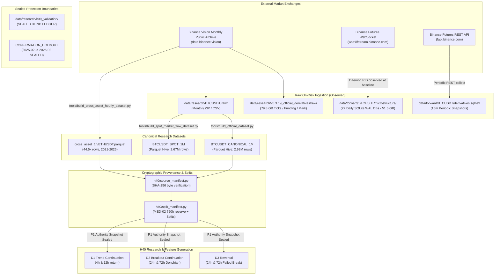

# V0.5.1 Local Data and Lineage Baseline R2 — Revision 1

```text
DOCUMENT_ID     = V0.5.1_LOCAL_DATA_AND_LINEAGE_R2_R1
ANALYZED_SHA    = fdb8e98b7e6527f20c3b0a0b17fde2ca6dd73119
STATUS          = FACTUAL_BASELINE_PENDING_CONTROLLER_REVIEW
AUTHORITY_LEVEL = NON_SCIENTIFIC_AUTHORITY
SUPERSEDES      = reviews/v0.5/baseline-r2/V0.5.1_LOCAL_DATA_AND_LINEAGE_R2.md (5604a79)
BLOCKER_REF     = reviews/v0.5/V0.5.1_ARCHITECTURE_AND_DATA_BASELINE_R2_CONTROLLER_REVIEW_BLOCKER.md
EVIDENCE_TYPE   = LOCAL_EXECUTOR_OBSERVED_AT_BASELINE_TIME
SEALED_DATA     = data/research/h39_validation/ (STRICTLY SEALED); Final Holdout (SEALED)
```

---

## 1. Local Data Observation Qualification

All filesystem observations, disk measurements, file counts, and process states documented herein represent:

```text
LOCAL_EXECUTOR_OBSERVED_AT_BASELINE_TIME
```

These data points reflect empirical host-local conditions observed during baseline execution on 2026-09-27. They provide valuable contextual engineering evidence, but do **not** constitute formal scientific, protocol, source, implementation, or P3 Controller authority. Transient process IDs (such as PID 450) are recorded strictly as historical operational observations, not durable architectural constants.

---

## 2. Storage Architecture & Dual-Root Infrastructure

An essential empirical distinction exists between the **Active Host Data Store** and the **Sanitized Repository Workspace**:

1. **Active Host Data Store (`/root/workspace/project/Quant-agent/data/`)**:
   - Total Volume: **131.54 GB** across 1,885 files (observed at baseline time).
   - Contains the 5-year historical research archive (**80.04 GB**) including 1m canonical Parquet, spot Parquet, cross-asset hourly Parquet, and 79.8 GB of raw derivatives ticks/funding CSVs.
   - Contains the operational forward streaming store (**51.50 GB**), comprising 27 daily SQLite WAL partitions (`microstructure-2026-08-31.sqlite3` through `microstructure-2026-09-26.sqlite3`).
   - At baseline execution time, an active forward collector process (`quantctl microstructure-forward run`, observed as PID 450) was continuously streaming 100ms L2 orderbook diffs and aggTrades into the current daily WAL database.
2. **Sanitized Public Repository Workspace (`/root/workspace/project/Quant-agent-sanitized/data/`)**:
   - The git repository root permanently ignores `/data/` via `.gitignore:11`.
   - Contains minimal forward database stubs (`derivatives.sqlite3` 20 KB, `opportunity_shadow.sqlite3` 32 KB) used for local development and test fixtures.
   - In production discovery execution, datasets are located via paths specified in [`src/btc_quant_agent/h40/source_manifest.py`](file:///root/workspace/project/Quant-agent-sanitized/src/btc_quant_agent/h40/source_manifest.py).

```text
+---------------------------------------+------------+----------------+----------------+-------------------------------------+
| Store Category / Directory Tree       | File Count | Disk Size (GB) | Temporal Span  | Role                                |
+---------------------------------------+------------+----------------+----------------+-------------------------------------+
| data/research/BTCUSDT/1m/             |         67 |           0.13 | 2021-01->26-07 | Canonical Perp 1m Parquet           |
| data/research/BTCUSDT_SPOT/1m/        |         61 |           0.09 | 2021-01->26-01 | Canonical Spot 1m Parquet           |
| data/research/cross_asset_1h/         |          5 |           0.01 | 2021-01->26-02 | Cross-Asset 1h Parquet (ETH, etc.)  |
| data/research/v0.3.19_derivatives/raw |        732 |          79.80 | 2021-01->25-12 | Raw Derivatives Ticks / Funding     |
| data/research/v0.3.19_derivatives/parq|          1 |          0.003| 2021-01->25-12 | Compiled Hourly Features            |
| data/research/h39_validation/ (SEALED)|         12 |          0.0003| SEALED         | Outcome Seal (FORBIDDEN TO ACCESS)  |
| data/forward/BTCUSDT/microstructure/  |         27 |          51.50 | 2026-08->26-09 | Live 100ms L2 WAL Daily Partitions  |
| data/forward/BTCUSDT/derivatives.db   |          1 |          0.008 | 2026-08->26-09 | 15m Periodic Derivatives REST Snap  |
| data/forward/BTCUSDT/opportunity.db   |          1 |          0.0003| 2026-08->26-09 | Forward Shadow Trade Observations   |
+---------------------------------------+------------+----------------+----------------+-------------------------------------+
| TOTAL LOCAL ASSETS (OBSERVED)         |      1,885 |         131.54 | 2021-01->26-09 | Host-Local Storage Substrate        |
+---------------------------------------+------------+----------------+----------------+-------------------------------------+
```

---

## 3. Mandatory Question Q1 — Factual Readiness of Information Sets (Reconciled)

| Information Set | Exists Locally? | Collector Exists? | Historical Archive Exists? | PIT-Safe? | Authority Status in P1 Snapshot | Usability in H40 Current Population | Usability in Future Preregistered Campaign | Evidence & Storage Path |
| :--- | :---: | :---: | :---: | :---: | :---: | :---: | :---: | :--- |
| **OHLCV (BTCUSDT Perp 1m)** | YES | YES | YES (2021–2026) | YES | **NOT_TESTABLE** (Not in P1 Snap) | NO (Requires Adapter & Source Closure) | YES (P2 Expansion) | `data/research/BTCUSDT/1m/*.parquet` |
| **OHLCV (BTCUSDT Spot 1m)** | YES | YES | YES (2021–2026) | YES | Secondary Research | NO | YES | `data/research/BTCUSDT_SPOT/1m/*.parquet` |
| **OHLCV (ETHUSDT 1h)** | YES | YES | YES (2021–2026) | YES | **ACCEPTED (P1 Sealed)** | **READY_NOW** (Powers 18 Slots) | N/A | `data/research/cross_asset_1h/ETHUSDT.parquet` |
| **OHLCV (Altcoin Basket 1h)** | YES | YES | YES (ADA,BNB,LTC,XRP) | YES | Raw Verified | NO | YES | `data/research/cross_asset_1h/*.parquet` |
| **Mark Price (1m / 1h)** | YES | YES | YES (2021–2025) | YES | Secondary Research | NO | YES (R2 Expansion) | `data/research/v0.3.19_official_derivatives/` |
| **Index Price / Basis** | YES | YES | YES (2021–2025) | YES | Secondary Research | NO | YES (R2 Expansion) | `data/research/v0.3.19_official_derivatives/` |
| **Funding Rates (8h)** | YES | YES | YES (2021–2026) | YES | D5 Contract Defined | NO (Requires P1 Source Seal & Reconstruct)| YES (R2 Expansion) | `funding_events.csv`, `hourly_inputs.parquet` |
| **Open Interest (OI)** | PARTIAL | YES | NO (Pre-2024 sparse) | YES (Fwd) | Operational Evidence | NO | Future Forward Only | `data/forward/BTCUSDT/derivatives.sqlite3` |
| **OI History / Delta** | PARTIAL | YES | NO (Pre-2024 sparse) | YES (Fwd) | Operational Evidence | NO | Future Forward Only | `data/forward/BTCUSDT/derivatives.sqlite3` |
| **Ordinary Long/Short Ratio** | NO (Hist) | YES (Fwd) | NO | Forward only | Operational Evidence | NO | Future Forward Only | Forward 15m snapshots only |
| **Top-Trader L/S Ratio** | NO (Hist) | YES (Fwd) | NO | Forward only | Operational Evidence | NO | Future Forward Only | Forward 15m snapshots only |
| **aggTrade (Perp & Spot)** | YES | YES | YES (2021–2025) | YES | Raw Archive | NO | YES (R3 Expansion) | `data/research/v0.3.19_official_derivatives/raw/`|
| **Taker Buy/Sell Flow** | YES | YES | YES (2021–2026) | YES | Secondary Research | NO | YES | Column in 1m Parquet (`taker_buy_base_vol`) |
| **Spot / Perp Flow Delta** | YES | YES | YES (2021–2026) | YES | Secondary Research | NO | YES | Dual Hive Parquet stores |
| **L2 Depth / Diff Depth** | YES (Fwd) | YES (Fwd) | NO (Hist none) | YES (Fwd) | Operational Evidence | NO | Future Forward Shadow | `data/forward/BTCUSDT/microstructure/` |
| **Spread / Microprice** | YES (Fwd) | YES (Fwd) | NO (Hist none) | YES (Fwd) | Operational Evidence | NO | Future Forward Shadow | Daily SQLite WAL stores |
| **ETH/BTC Cross-Asset** | YES | YES | YES (2021–2026) | YES | D4 Contract Defined | NO (Requires Adapter & Reconstruct) | YES (R1 Expansion) | `data/research/cross_asset_1h/ETHUSDT.parquet` |
| **Forward Shadow Evidence** | YES | YES | YES (2026-08->) | YES (Fwd) | Operational Evidence | NO | Future Forward Shadow | `data/forward/BTCUSDT/opportunity_shadow.sqlite3` |

---

## 4. End-to-End Data Lineage Architecture


